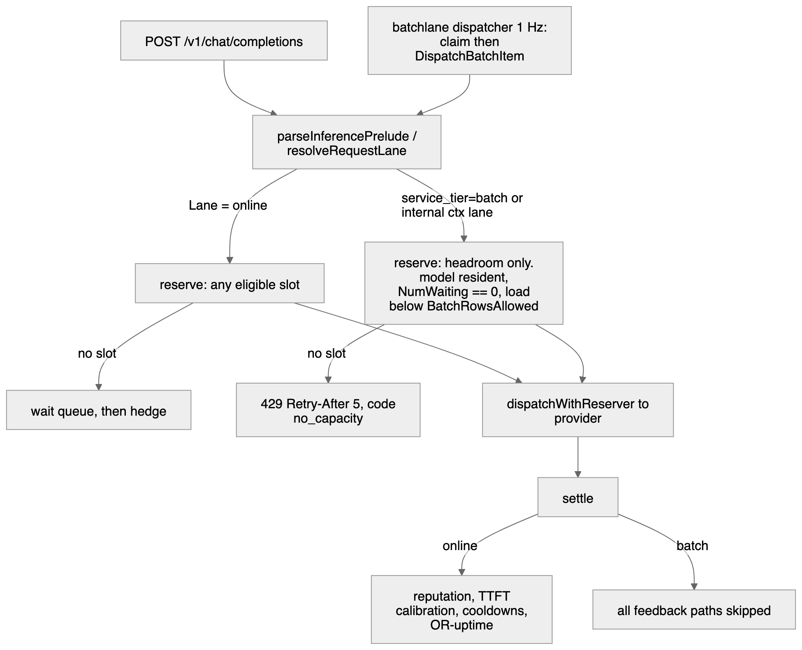

# Batch lane

> Last updated: 2026-09-05 · commit `6a7000ee4`

The batch lane sells the slot capacity the online quality cap already leaves
empty. A 1 Hz dispatcher inside the coordinator claims 24-hour batch items and
runs them through the ordinary dispatch funnel with one trait flipped, so a
batch request can only land where an online request would not have waited.
Inputs and results sit on coordinator disk as ciphertext. The provider binary
and the WebSocket protocol are unchanged: a provider never learns that a
request is batch.

## Context

Fleet utilization is low and headroom is perishable — an engine step with an
empty row is throughput that cannot be banked. The lane converts that headroom
into revenue without touching the quality contract online traffic is served
under, by making batch placement strictly subordinate: one row of every slot
stays reserved for online, any waiting row closes the slot to batch, and a
batch attempt feeds none of the signals that decide where online traffic goes.
Motivation and measurements: [`../design/tidal-batch-lane.md`](../design/tidal-batch-lane.md).

## Components

| Concern | Package / file | Entry point |
|---|---|---|
| Batch API (`/v1/files`, `/v1/batches`) | `coordinator/api/batch_files.go`, `coordinator/api/batch_handlers.go` | `handleBatchFileUpload`, `handleBatchCreate` |
| Input validation | `coordinator/api/batch_jsonl.go` | `parseBatchJSONL`, `parseInlineRequests` |
| Output assembly, retention | `coordinator/api/batch_assembler.go` | `FinalizeBatchIfDone`, `PurgeExpiredBatchFiles` |
| Metadata persistence | `coordinator/store/batch_types.go`, `memory_batch.go`, `postgres_batch.go` | `BatchStore`, `BatchItemStore`, `BatchFileStore` |
| Sealed blobs on disk | `coordinator/store/sealedblob/` | `Store.PutPlain`, `PutTo`, `Open`, `Raw` |
| Lane trait and reservation filter | `coordinator/registry/request_traits.go`, `coordinator/registry/batch_lane.go`, `coordinator/registry/scheduler.go` | `LaneBatch`, `BatchRowsAllowed`, `buildCandidateGateLocked` |
| Dispatch entry, `service_tier` | `coordinator/api/batch_dispatch.go`, `coordinator/api/inference_preprocess.go` | `DispatchBatchItem`, `resolveRequestLane` |
| Control loop | `coordinator/batchlane/` | `Dispatcher.Tick`, `AIMD.Update`, `Laxity` |
| Metering | `coordinator/payments/pricing.go`, `coordinator/api/provider.go` | `LaneMultiplier`, `CalculateCostForLane` |
| Process wiring | `coordinator/cmd/coordinator/batch_lane.go` | `startBatchDispatcher` |

`batchlane` imports `store` and `registry` and never `api`; `api` imports
`batchlane`. The adapters between them live in `main`, the only package that
may import both.

## Mechanism: one tick

`Dispatcher.Tick(ctx, now)` runs every `DefaultTick`. It is synchronous apart
from the dispatch goroutines, which report back through a channel drained at
the start of the next tick, and nothing in the package calls `time.Now()`.

| Step | What it does | Constants |
|---|---|---|
| drain | Settle the previous tick's outcomes | — |
| observe | EWMA the decode rate and KV pressure per slot; `Waiting` is read raw | `EWMAAlpha = 0.5` |
| AIMD | Per-slot target: halve on pressure, `+1` when there is provable room, hold between the watermarks. Fleet budget is `Σtarget − inflight` | `KVHigh = 0.85`, `KVLow = 0.70` |
| laxity | Rank open batches: `laxity = (expires_at − now) − remaining/rate`, `urgency = clamp(1 − laxity/6h, 0, 1)`, `priority = round(100 − urgency×99)` | `EscalationHorizon = 6h`, `PriorityMax = 100`, `PriorityMin = 1` |
| claim | Spend the budget highest priority first, `line_no` order within a batch, only from `in_progress` batches that are not past their window | `completionWindow = 24h` |
| dispatch | One goroutine per claimed item under the batch's `CancelFunc`, through `DispatchBatchItem` | `BatchFirstContentBase = 120s` |
| settle | Seal the result, `FinishItem`, `FinalizeBatchIfDone` | `DefaultMaxAttempts = 3` |
| sweep | Expire batches past their window, drain cancelled ones, run retention | `DefaultPurgeInterval = 1m`, `DefaultOrphanInterval = 1h` |

The AIMD decrease fires on `Waiting > 0`, or a measured `DecodeTPS` below the
router's own quality floor (`Registry.QualityCapFloorTPS`, 15 tok/s by
default), or `KV > KVHigh`. An **unmeasured** decode rate (0) is not read as a
slow one, which would otherwise pin every fresh provider's target at the floor
and the lane would never start. A slot that publishes no KV budget at all
(`KVKnown` false) is treated as below `KVLow` and takes the additive increase:
the remaining terms are enough backpressure on their own — a slot running out
of KV starts queueing, and `Waiting` is not smoothed — so the lane still starts
and still backs off on a fleet that publishes no budget
(`coordinator/batchlane/control.go`, `AIMD.Update`).

When a batch's urgency reaches `FloorUrgency = 0.9` and the budget is zero, a
per-batch token bucket at `FloorItemsPerSec = 0.2` grants it one item anyway.
The floor does not raise the AIMD target: the reservation path still refuses a
slot with no headroom, so the floor can only spend capacity that exists.

The budget is fleet-wide, not per slot. The dispatcher decides **how many**
batch rows may be in flight; **where** each lands is the reservation path's
decision.

## Invariants

1. **One row of every slot is reserved for online.**
   `Registry.BatchRowsAllowed` is the router's own resolved admission cap for
   the (provider, model) pair minus one, floored at zero — not a second
   capacity formula (`coordinator/registry/batch_lane.go`,
   `batchRowsAllowedLocked` calling
   `effectiveMaxConcurrencyForModelResolvedLocked`). A pair whose cap is 1 has
   no batch allowance at all.
2. **Batch takes only warm, quiet, under-cap slots.** The gate in
   `buildCandidateGateLocked` (`coordinator/registry/scheduler.go`) refuses a
   `LaneBatch` candidate unless the model is already resident on the slot,
   `NumWaiting == 0`, and live occupancy is below the allowance. Occupancy is
   `batchSlotOccupancy` — `max(pendingLoadForModelLocked, backendRunning)` —
   the same synchronously debited number the online admission cap is enforced
   against, so several reservations inside one tick cannot all read a stale
   heartbeat count.
3. **Batch never queues and never hedges.** `api/dispatch.go` answers 429 +
   `Retry-After: 5` instead of enqueuing; `registry.ErrBatchLaneNotQueueable`
   is the structural backstop; `tryAcquireBackupHedge` returns
   `hedgeSuppressBatchLane` and `skipSpeculativeBackup` suppresses the
   speculative launch.
4. **A batch attempt feeds no online signal.** Every site below early-returns
   on `pr.Traits.Lane == registry.LaneBatch`.
5. **Nothing on disk or in Postgres is plaintext prompt content.** The three
   batch tables are metadata only; bodies and results live in
   `coordinator/store/sealedblob/` keyed by row id.
6. **No log line carries a prompt, a result, a `custom_id`, a filename or a
   metadata value.** Log fields are ids, counts, targets and a bounded error
   vocabulary (`no_capacity`, `cancelled`, `request_failed`).
7. **`FinishItem` is idempotent** and moves `counts_completed` /
   `counts_failed` in the same transaction as the item transition, so a late
   result on a terminal item is a no-op.

### Excluded feedback paths (invariant 4)

| Signal | Site |
|---|---|
| Coordinator wait queue | `coordinator/api/dispatch.go`; `coordinator/registry/queue.go` (`ErrBatchLaneNotQueueable`) |
| Hedge budget and speculative backup | `coordinator/api/dispatch_plan_wiring.go`, `coordinator/api/dispatch.go` |
| Provider reputation (success, failure, latency EWMA) | `coordinator/api/provider.go`, `coordinator/api/dispatch.go` |
| TTFT calibration and the TTFT admission shadow | `coordinator/registry/scheduler.go`, `coordinator/registry/dispatch_plan.go`, `coordinator/registry/ttft_shadow.go` |
| Capacity cooldowns, budget clamp, capacity-503 window, breakers | `coordinator/api/consumer.go` (`noteInferenceError`), `coordinator/api/provider.go` |
| OpenRouter uptime series and `inference.request_outcome` | `coordinator/api/or_uptime.go` |

A closed batch slot is reported with its own gate reason,
`GateBatchHeadroom` (`"batch_headroom"`), so co-serving telemetry can tell it
apart from a slot that is simply full.

## Sealed at rest

The blob store is NaCl Box under a long-lived X25519 key derived from the
coordinator mnemonic with HKDF info
`eigeninference-coordinator-batchstore-v1` — its own domain, distinct from the
sender-encryption key. Files are `0600`, the directory `0700`, writes are
temp-file + `fsync` + rename.

| Object | Sealed to | Deleted |
|---|---|---|
| Uploaded input file (`file-…`) | batch-store key | immediately on `POST /v1/batches`, once the per-item copies exist; the row is marked purged. An upload that never becomes a batch: 7 days after creation |
| Item request body (`bitem_…-in`) | batch-store key | when the batch finalizes (`FinalizeBatchIfDone`) |
| Item result (`bitem_…`) | batch-store key, or the consumer's `result_public_key` | `BatchOutputRetention` = 7 days after the batch leaves the open list |
| Assembled output / error file (`file-…`) | batch-store key | `PurgeExpiredBatchFiles`, 7 days after creation, swept once a minute |
| Orphan item blobs (no row references them) | — | hourly sweep, only when older than the retention window; a pass stops at `maxOrphanDeletes = 1000` unlinks or `maxOrphanScan = 2000` store probes, whichever comes first, and the next pass continues |

Plaintext exists only inside `runItem` (`coordinator/batchlane/dispatcher.go`)
for the duration of one dispatch: the body is opened, handed to
`DispatchBatchItem`, and the result is sealed before `FinishItem` runs. It is
never stored on the `Dispatcher` and never copied into an `Outcome`.

With `result_public_key` set the batch records `sealed_to: "consumer"`, results
are written with `PutTo`, and the coordinator can no longer `Open` them — only
`Raw` them for download. This is a guarantee about storage, not about routing:
the coordinator still decrypts each request in memory to route it, exactly as
it does online ([`security/encryption.md`](security/encryption.md)).

### Stated limits

- The batch-store key is derived from the **same root secret** as the
  sender-encryption key. Compromise of the mnemonic exposes both.
- The key lives in coordinator memory, and the blobs on the coordinator's own
  disk. Anyone with root on the CVM host can read both. The seal defends
  against disk images, backups and snapshots, not against the host.
- There is no rotation mechanism. A new key means a redeploy with a new
  mnemonic, after which existing blobs are unreadable.
- `EIGENINFERENCE_BATCH_DEV_INSECURE_KEY=true` substitutes a process-local
  random key for local development, logged as a WARN. Blobs written under it
  are unreadable after a restart. Its only gate is the absence of a mnemonic:
  `NewBatchBlobStore` (`coordinator/api/batch_config.go`) reaches that branch
  solely on `ErrNoMnemonic`, so a configured mnemonic makes the flag a no-op
  and nothing else — no build tag, no environment check — stops a
  mnemonic-less production deployment from setting it. Accepted residual on
  `T-052` in [`../threat-model.yaml`](../threat-model.yaml).
- With no mnemonic and no dev key the lane is off: `NewBatchBlobStore` returns
  nil, every batch route answers `503` `batch_unavailable`, and
  `startBatchDispatcher` does not start.
- The online first-content deadline is, for a non-streaming request, a
  deadline on the *whole* generation. The coordinator hashes and SE-signs a
  completion before releasing it, so a non-streaming response reaches the
  client as one frame and no content exists to satisfy the deadline until the
  last token is decoded. A long online completion can therefore be rejected
  with `429` `rate_limit_exceeded` ("all providers at capacity … timeout
  waiting for first response") while the same request on the batch lane, which
  has no first-content deadline, returns a full answer. This is pre-existing
  coordinator behaviour that the lane neither introduced nor changed; it is
  recorded here because it makes an online-vs-batch comparison at large
  `max_tokens` measure the deadline rather than the lanes.

## Failure modes

| Condition | Behaviour |
|---|---|
| No slot has headroom | `DispatchBatchItem` returns `ErrCode: "no_capacity"`; the claim is released **without** charging an attempt and the item is re-offered next tick |
| Caller's context ends (shutdown, cancellation) | `ErrCode: "cancelled"`, settled like `no_capacity` — no attempt charged |
| Provider terminal | `ErrCode: "request_failed"`; retried to `DefaultMaxAttempts`, then the item is `failed` with the fixed message "The request could not be completed by any provider." |
| Permanent fault (unusable API key, unreadable body, unsealable result) | Failed on the first outcome instead of burning the attempt budget |
| Coordinator restart mid-flight | `RequeueInflightItems` moves in-flight rows back to `pending`; the in-memory retry tally is forgotten, costing at most `MaxAttempts − 1` extra attempts per item and never losing one |
| Batch cancelled while items run | The batch's context is cancelled, `CancelOpenItems` runs immediately, and a late result lands on a non-in-flight item and is ignored |
| 24 h elapsed with items open | `ExpireOpenItems`, batch → `expired`, error file lists them with code `batch_expired` |
| Crash between sealing an item body and committing its rows | The orphan sweep finds the blob (no row references it, older than retention) and deletes it |

Known gaps, each tracked as a follow-up in the design record:

- The result-blob deletion schedule is in memory. After a restart those blobs
  stay on disk until a store read for terminal batches is added; the assembled
  files still expire, because their rows carry the timestamp.
- The balance reservation taken before dispatch is still computed at the full
  online price; the batch multiplier applies at settlement and the excess is
  refunded. A batch therefore holds more of a consumer's balance than it will
  finally cost ([`../reference/pricing-model.md#batch-lane`](../reference/pricing-model.md#batch-lane)).

## Code map

| Concern | File / symbol |
|---|---|
| Lane trait | `coordinator/registry/request_traits.go` (`Lane`, `LaneBatch`) |
| Row allowance, slot snapshot, decode floor | `coordinator/registry/batch_lane.go` (`BatchRowsAllowed`, `BatchSlots`, `QualityCapFloorTPS`) |
| Reservation filter | `coordinator/registry/scheduler.go` (`buildCandidateGateLocked`, `batchSlotOccupancy`) |
| Gate reason | `coordinator/registry/gate_reason.go` (`GateBatchHeadroom`) |
| Control law | `coordinator/batchlane/control.go` (`EWMA`, `AIMD`, `TokenBucket`) |
| Deadline math | `coordinator/batchlane/laxity.go` (`Laxity`, `Urgency`, `Priority`, `ObservedRate`) |
| Registry adapter | `coordinator/batchlane/registry_view.go` (`NewRegistryView`) |
| Tick loop | `coordinator/batchlane/dispatcher.go` (`Tick`, `settle`, `sweep`, `retention`) |
| Dispatch entry, first-content deadline | `coordinator/api/batch_dispatch.go` (`DispatchBatchItem`), `coordinator/modelpolicy/first_content_deadline.go` (`BatchFirstContentBase`) |
| Blob store and key derivation | `coordinator/store/sealedblob/blob.go` (`DeriveKey`, `HKDFInfo`) |
| Blob store configuration | `coordinator/api/batch_config.go` (`ReadBatchConfig`, `NewBatchBlobStore`) |
| Process wiring | `coordinator/cmd/coordinator/batch_lane.go` (`startBatchDispatcher`) |

## Related

- [`../consumer/batch-api.md`](../consumer/batch-api.md): how to use the lane.
- [`../reference/api-contracts.md`](../reference/api-contracts.md): routes and JSON shapes.
- [`../reference/pricing-model.md#batch-lane`](../reference/pricing-model.md#batch-lane): the lane multiplier, the minimum-charge rule, and the `/v1/pricing` fields.
- [`../reference/configuration.md`](../reference/configuration.md#batch-lane): the three environment variables.
- [`routing.md`](routing.md) and [`scheduling.md`](scheduling.md): the online admission cap the allowance is derived from.
- [`security/encryption.md`](security/encryption.md): the hop-by-hop privacy model.
- [`../design/tidal-batch-lane.md`](../design/tidal-batch-lane.md): the design record.
