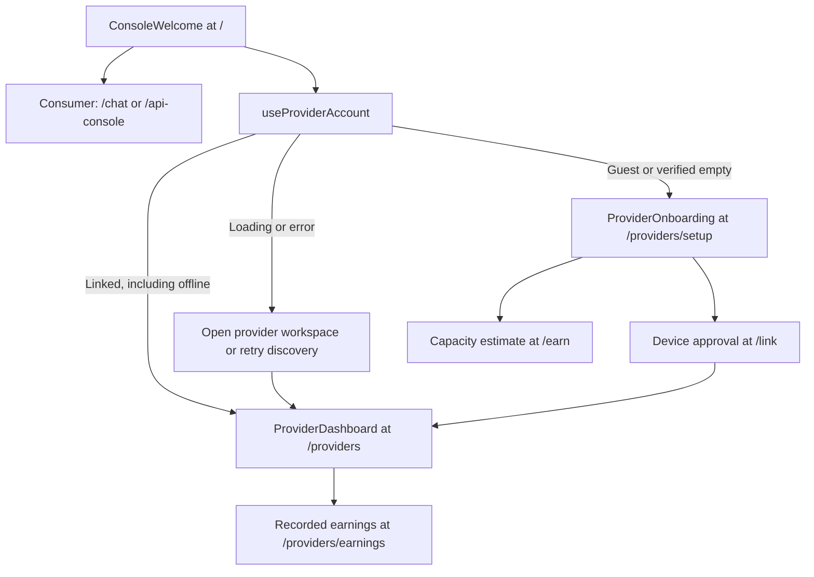

# Console UI (`console-ui/`)

> Last updated: 2026-09-04 · commit `dbd12f295`

The console at `console.darkbloom.dev` is a Next.js 16 App Router / React 19 application (`console-ui/package.json`) that gives consumers a chat client, model catalog, network stats, billing, API-key management, and provider linking. The browser never calls the coordinator for authenticated work: every page fetches same-origin `/api/*` route handlers, which resolve the coordinator URL server-side and forward the caller's own credential. This page explains how those pieces fit; the coordinator routes they call are specified in [`../../reference/api-contracts.md`](../../reference/api-contracts.md). The internal, read-only operator dashboard is a separate app — see [`admin-ui.md`](admin-ui.md).

## Context

The console exists so a person can use Darkbloom without writing code: sign in, get a key, chat, buy credits, link a Mac, watch the fleet. Two facts shape its architecture:

1. **Two credentials, two audiences.** The coordinator authenticates every request with `Authorization: Bearer <token>` and distinguishes a Privy session JWT from an `sk-db-…` API key by shape ([`../../consumer/authentication.md`](../../consumer/authentication.md)). Management routes (keys, fleet, earnings, device approval, Stripe Connect) are Privy-only; inference and balance reads want an API key. The console therefore carries both and picks one per call (see [Two credential paths](#two-credential-paths)).
2. **A server-side relay, not a secret holder.** The route handlers under `console-ui/src/app/api/` hold no secret of their own (`console-ui/src/lib/server/coordinator.ts` reads exactly one environment variable, `NEXT_PUBLIC_COORDINATOR_URL`). They exist to keep the coordinator origin out of client input, to avoid CORS, and to let the edge cache public reads.

## Mechanism

### Runtime and layout

`console-ui/src/app/layout.tsx` (`RootLayout`) mounts, in order: `<Analytics/>` (`@vercel/analytics/next`), `GoogleAnalytics`, `TelemetryInitializer`, `DatadogRUM`, then `ThemeProvider` → `PrivyClientProvider` → `VerificationModeProvider` → `AppShell` → the page. Route entry points compose client workspaces; there is no `not-found.tsx` or `loading.tsx`, and `console-ui/src/app/global-error.tsx` is the root error boundary. Dependencies of note (`console-ui/package.json`): `@privy-io/react-auth`, `zustand`, `tweetnacl`, `@datadog/browser-rum`, `react-markdown`, Tailwind 4. `console-ui/next.config.ts` sets `typescript.ignoreBuildErrors: true`, so type errors do not fail `next build`.

### Page routes (14)

Files are under `console-ui/src/app/`. "Auth" is what the page itself requires; nothing is enforced by the request interceptor.

| Path | File(s) | Purpose | Auth |
|---|---|---|---|
| `/` | `page.tsx`, `components/console-entry/*` | Consumer/Provider workspace chooser with account-aware provider destinations | Public |
| `/chat` | `chat/page.tsx`, `components/chat/*`, `hooks/useChatStream.ts` | Chat: model picker, image upload, think-block rendering, per-message trust badge (`components/TrustBadge.tsx`) | Renders for guests; sending needs `authenticated && apiKeyReady` (`useAuth`) |
| `/login` | `login/page.tsx` | Legacy Privy login page (redirects to `?next=` once authenticated) | **Unreachable** — `console-ui/src/proxy.ts` redirects `/login` to `/`; its copy ("email, wallet, or social") is stale |
| `/link` | `link/page.tsx`, `link/DeviceLinkForm.tsx` | RFC 8628 device-code approval for `darkbloom login`: `POST /api/device/approve` with `Authorization: Bearer <Privy token>` | Privy |
| `/settings` | `settings/page.tsx`, `settings/useConsoleSettings.ts` | Theme, API example URL (`darkbloom_api_example_url`), health check via `/api/health`, and encrypt-to-coordinator toggle | None |
| `/models` | `models/page.tsx` | Catalog and pricing table from `/api/models` and `/api/pricing` (`console-ui/src/lib/api/models.ts`, `console-ui/src/lib/api/pricing.ts`) | Public; `x-api-key` sent when cached, which switches `/api/models` to the keyed `/v1/models` path |
| `/billing` | `billing/page.tsx` → `billing/BillingContent.tsx` (`next/dynamic`, `ssr: false`) | Balance and usage (`fetchBalance`, `fetchUsage`), Buy Credits (`createStripeCheckout`), invite redeem (`console-ui/src/lib/api/invite.ts`), Stripe Connect payouts (`components/payouts/useStripePayouts.ts`) | API key for balance/usage; Privy session for Stripe routes |
| `/api-console` | `api-console/page.tsx`, `components/api-keys/*` (`ApiKeysManager`) | API reference snippets (base URL = `apiExampleUrl()`) and the **API key manager** — list/create/edit/rotate/delete through `/api/keys*` (`console-ui/src/lib/api/keys.ts`, `managementHeaders`); self-route-only toggle reads `/api/me/provider-models` | Page public; key management Privy |
| `/providers` | `providers/page.tsx`, `providers/dashboard/useFleetData.ts` | Fleet dashboard with account-scoped polling every `REFRESH_MS` = `15_000` ms; guests and confirmed empty accounts see the shared onboarding guide | Public guide; fleet data Privy |
| `/providers/setup` | `providers/setup/page.tsx`, `components/provider-onboarding/*` | Requirements and install → link → start → check guide; existing providers see “Add another Mac” | Public guide; device linking Privy |
| `/providers/earnings` | `providers/earnings/page.tsx` → `EarningsContent.tsx` (`ssr: false`) | `GET /api/me/earnings?limit=100` with the Privy token (falls back to the API key as Bearer), payouts card | Privy (or API key) |
| `/stats` | `stats/page.tsx`, `stats/useNetworkStats.ts`, `stats/*`, `components/stats/network-map/*` | Continuous geography, activity, model-capacity, and hardware overview with an expandable provider directory; `useNetworkStats` polls same-origin stats, catalog, capacity, and totals independently of the primary render. All traffic ranges, including `30m`, use `/api/network/series?window=` and its explicit `end_at`; see [network stats snapshots](#network-stats-snapshots) | Public |
| `/earn` | `earn/page.tsx`, `earn/calc.ts`, `earn/useEarningsCalculator.ts`, `earn/providerReadiness.ts` | Earnings calculator — pure client math, no network call; readiness notice below `MIN_PROVIDER_MEMORY_GB` | Public; CTAs call `login()` |
| `/leaderboard` | `leaderboard/page.tsx` → `components/leaderboard/LeaderboardContent.tsx`, `components/leaderboard/useLeaderboard.ts` | Provider leaderboard from `/api/leaderboard?<metric,window,limit>` | Public |

`components/earn/BaseRewardsPanel.tsx` is not mounted by any page (its only importer is its test), so base rewards are not surfaced anywhere in the console — see [`../../design/base-rewards.md`](../../design/base-rewards.md).

### Workspace entry and provider journeys

`ConsoleWelcome` (`console-ui/src/components/console-entry/ConsoleWelcome.tsx`)
offers Consumer → `/chat` with API/catalog links, and Provider → setup or the
fleet. Workspace choice changes navigation, not account permissions. The root
remains a chooser; no saved preference overrides a deep link. `AppShell` omits
the sidebar on `/` and preserves the standalone device approval flow on `/link`.

`useProviderAccount` (`console-ui/src/components/console-entry/useProviderAccount.ts`)
uses the Privy auth context without provisioning an inference key. A successful
empty provider list selects setup. Any linked record, including an offline or
never-seen Mac, selects the fleet. Loading, malformed responses, missing tokens,
and request errors remain unknown; they never imply a new provider. Discovery
has a 15-second deadline and retries when the page becomes visible or the user
requests it. Account changes cancel pending results.

`ConsoleExperienceProvider` (`console-ui/src/components/console-entry/ConsoleExperience.tsx`)
resolves consumer/provider routes first and the last workspace on shared stats
and settings pages. Consumer navigation exposes chat, models, API, and billing;
provider navigation exposes machines, setup, actual earnings, and the separate
calculator. `ProviderOnboarding` is shared by public setup and empty/guest fleet
views; its memory threshold comes from `MIN_PROVIDER_MEMORY_GB`. The guide
requires macOS 26 or later (`ProviderRequirements`,
`console-ui/src/components/provider-onboarding/ProviderRequirements.tsx`).



### `/api/*` route handlers (33)

Files are `console-ui/src/app/api/<route>/route.ts`. Shared helpers in `console-ui/src/lib/server/coordinator.ts`: `coordinatorUrl()` (see [Coordinator URL](#coordinator-url-resolution)), `privyAuth(req)` (the `Authorization` header, else `Bearer <privy-token cookie>`, else `""`), `missingPrivyToken()` (`401 {"error":"missing privy token"}`), `passthrough(res)` (upstream status, `content-type`, and body verbatim), and `cacheControl(sMaxAge, swr)` → `public, s-maxage=<s>, stale-while-revalidate=<swr>`.

Credential column: **Privy (required)** = `privyAuth()` must be non-empty or the handler returns 401 without calling upstream; **Privy (if present)** = forwarded when present, otherwise the upstream call is unauthenticated and the coordinator decides; **API key → Bearer** = the `x-api-key` request header is re-emitted upstream as `Authorization: Bearer <key>`; **none** = no credential forwarded.

| Route | Methods | Upstream coordinator call | Credential forwarded | Cache / notes |
|---|---|---|---|---|
| `/api/admin/base-rewards` | GET | `GET /v1/admin/base-rewards` | Privy (required) | No cache; no UI caller |
| `/api/attestation` | GET | `GET /v1/providers/attestation` | none | `?summary=1` → `{count, last_verified}` of `trust_level === "hardware"` providers, `cacheControl(15, 60)`; full mode projects to the whitelisted `AttestationProvider` fields (`projectProvider`), uncached |
| `/api/auth/keys` | POST | `POST /v1/auth/keys` (no body) | Privy (if present) | Used by `provisionConsoleKey` (`console-ui/src/hooks/useAuth.ts`) to obtain the console's inference key |
| `/api/chat` | POST | `POST /v1/chat/completions` | API key → Bearer | `runtime = "nodejs"`, `dynamic = "force-dynamic"`; forwards `X-Darkbloom-Route`; a body with `Content-Type: application/eigeninference-sealed+json` is forwarded byte-verbatim; streams the upstream body; copies `x-provider-attested`, `x-provider-trust-level`, `x-provider-secure-enclave`, `x-provider-mda-verified`, `x-provider-chip`, `x-provider-model`, `x-request-id`, `x-attestation-se-public-key`, `x-eigen-sealed`, `x-eigen-sealed-kid`; SSE gets `Cache-Control: no-cache, no-transform` |
| `/api/device/approve` | POST | `POST /v1/device/approve` | Privy (required) | `passthrough` |
| `/api/encryption-key` | GET | `GET /v1/encryption-key` | none | Upstream 503 → `503 {"error":"encryption_unavailable"}`; success gets `Cache-Control: public, max-age=300` |
| `/api/health` | GET | `GET /health` | none | — |
| `/api/invite/redeem` | POST | `POST /v1/invite/redeem` | API key → Bearer | Body `{code}` |
| `/api/keys` | GET, POST | `GET`/`POST /v1/keys` | Privy (required) | `passthrough` |
| `/api/keys/[id]` | GET, PATCH, DELETE | `/v1/keys/{id}` | Privy (required) | `passthrough` |
| `/api/keys/[id]/rotate` | POST | `POST /v1/keys/{id}/rotate` | Privy (required) | `passthrough` |
| `/api/leaderboard` | GET | `GET /v1/leaderboard?<query>` | none | `cacheControl(10, 30)` |
| `/api/me/earnings` | GET | `GET /v1/provider/account-earnings?limit=<n>` (`limit` defaults to `100`) | Privy (required) | — |
| `/api/me/provider-models` | GET | `GET /v1/me/self-route-models` | Privy (required) | Returns `{models: string[]}` |
| `/api/me/providers` | GET | `GET /v1/me/providers` | Privy (required) | — |
| `/api/me/providers/[id]` | DELETE | `DELETE /v1/me/providers/{id}` | Privy (required) | `passthrough` |
| `/api/me/summary` | GET | `GET /v1/me/summary` | Privy (required) | — |
| `/api/models` | GET | No key: `GET /v1/models/catalog?type=text&include_aliases=1` + `GET /v1/models/capacity` (`publicCatalogResponse`); with key: `GET /v1/models` | none, or API key → Bearer | Public path applies alias rows / `applyGemmaRolloutQuickFix` and `cacheControl(30, 120)`; keyed path is an uncached passthrough |
| `/api/models/capacity` | GET | `GET /v1/models/capacity` | none | `cacheControl(10, 30)` |
| `/api/network/series` | GET | `GET /v1/network/series?window=<w>` | none | `window` must be in `SUPPORTED_WINDOWS` = `30m`, `24h`, `7d`, `30d`, else 400; `cacheControl(30, 60)` |
| `/api/network/totals` | GET | `GET /v1/network/totals?<query>` | none | `cacheControl(10, 30)` |
| `/api/payments/balance` | GET | `GET /v1/payments/balance` | API key → Bearer | — |
| `/api/payments/usage` | GET | `GET /v1/payments/usage` | API key → Bearer | — |
| `/api/payments/stripe/checkout` | POST | `POST /v1/billing/stripe/create-session` | Privy (if present) | The browser also sends `x-api-key` (`createStripeCheckout` uses `proxyHeaders()`); the handler ignores it and relies on the header or `privy-token` cookie |
| `/api/payments/stripe/status` | GET | `GET /v1/billing/stripe/status[?refresh=1]` | Privy (if present) | — |
| `/api/payments/stripe/onboard` | POST | `POST /v1/billing/stripe/onboard` | Privy (if present) | Stripe Connect onboarding link |
| `/api/payments/stripe/dashboard` | POST | `POST /v1/billing/stripe/dashboard` | Privy (if present) | Express dashboard login link |
| `/api/payments/stripe/account` | DELETE | `DELETE /v1/billing/stripe/account` | Privy (if present) | Unlink Stripe account |
| `/api/payments/stripe/withdrawals` | GET | `GET /v1/billing/stripe/withdrawals[?limit=]` | Privy (if present) | — |
| `/api/payments/withdraw/stripe` | POST | `POST /v1/billing/withdraw/stripe` | Privy (if present) | Payout request |
| `/api/pricing` | GET | `GET /v1/pricing` | none | `cacheControl(300, 600)` |
| `/api/stats` | GET | `GET /v1/stats` | none | Shared snapshot cache with concurrent request coalescing (`getStatsSnapshot`, `console-ui/src/app/api/stats/snapshot-cache.ts`); source/fetch timestamp headers and bounded edge freshness; `?mock=geo` is isolated and `no-store` |
| `/api/telemetry` | POST | **none** | — | Always answers `telemetry_ingest_disabled` (the same response as the coordinator's [telemetry route](../../reference/api-contracts.md#telemetry-1)); the body is never read |

### Network stats snapshots

The stats page renders a continuous overview without waiting for catalog or capacity requests. Geography leads into side-by-side request and token charts, graphical model-capacity lanes (`console-ui/src/app/stats/models/ModelCapacityLandscape.tsx`, `ModelCapacityLandscape`), and linked silicon-generation and memory charts (`console-ui/src/app/stats/hardware/HardwareComposition.tsx`, `HardwareComposition`). Model diagnostics and the provider directory open on demand (`console-ui/src/app/stats/page.tsx`, `StatsPage`).

| Concern | Contract | Code |
|---|---|---|
| Source freshness | The coordinator publishes and retains `snapshot_at` according to the [public stats contract](../../reference/api-contracts.md#public-stats-and-health-5) | `coordinator/api/stats.go` (`handleStats`) |
| Shared proxy cache | `SNAPSHOT_TTL_MS = 30_000`; keyed by configured coordinator URL; concurrent requests share one upstream request. Expiry is the earlier of fetch time plus TTL and valid source time plus TTL, so the proxy does not extend a source snapshot's lifetime | `console-ui/src/app/api/stats/snapshot-cache.ts` (`getStatsSnapshot`, `fetchSnapshot`) |
| Response timestamps | `X-Stats-Fetched-At` records the upstream fetch start; `X-Stats-Snapshot-At` exists only when upstream publishes a valid RFC 3339 `snapshot_at`; `X-Stats-Expires-At` records cache expiry; `X-Stats-Cache` is `HIT` or `MISS` | `console-ui/src/app/api/stats/snapshot-cache.ts` (`statsSnapshotHeaders`) |
| Edge cache and errors | `Cache-Control: public, max-age=0, s-maxage=<remaining seconds>, must-revalidate`; no stale extension. `UPSTREAM_TIMEOUT_MS = 20_000` bounds upstream fetch and body reading; timeout returns `504`, other upstream errors retain their status, and network/JSON failures return `502`. Failures use `no-store` and release pending requests for retry | `console-ui/src/app/api/stats/snapshot-cache.ts` (`fetchSnapshot`), `console-ui/src/app/api/stats/route.ts` (`GET`) |
| Browser refresh | `STATS_REFRESH_MS = 30_000`; polling pauses while hidden and refreshes on visibility return. Primary and auxiliary requests coalesce independently; primary failure retains the previous data and dates with an error, while unavailable auxiliary data becomes unknown | `console-ui/src/app/stats/useNetworkStats.ts` (`useNetworkStats`), `console-ui/src/hooks/useVisiblePolling.ts` (`useVisiblePolling`) |
| Traffic boundaries | Every range, including `30m`, fetches `/api/network/series?window=<range>`; the response's explicit `end_at` anchors completed buckets for both request and token charts | `console-ui/src/app/stats/traffic/useTrafficSeries.ts` (`useTrafficSeries`), `console-ui/src/app/stats/traffic/TrafficPanel.tsx` (`TrafficPanel`) |
| Displayed age and mock mode | The header labels source time as “Snapshot” and marks source snapshots at least 30 seconds old as stale, or labels fetch time as “Fetched” when the source timestamp is absent. `?mock=geo` returns `X-Stats-Cache: MOCK`, uses `no-store`, and displays a simulation notice | `console-ui/src/app/stats/StatsHeader.tsx` (`StatsHeader`), `console-ui/src/app/stats/page.tsx` (`StatsPage`), `console-ui/src/app/api/stats/route.ts` (`GET`) |

### Two credential paths

| Path | Browser sends | Handler forwards | Used for |
|---|---|---|---|
| Privy access token | `Authorization: Bearer <JWT>` (`managementHeaders`, `console-ui/src/lib/http/proxy-client.ts`); the Privy SDK's `privy-token` cookie is the fallback read by `privyAuth()` | Header verbatim | Keys, fleet, earnings, device approval, Stripe Connect, base-rewards admin |
| Console API key | `x-api-key: sk-db-…` (`proxyHeaders`; value from localStorage `darkbloom_api_key`) | `Authorization: Bearer sk-db-…` | Chat, `/api/models` (keyed path), balance, usage, invite redeem |

The console key is provisioned by `provisionConsoleKey` (`console-ui/src/hooks/useAuth.ts`): on `authenticated`, it calls `getAccessToken()` and `POST /api/auth/keys` with the Privy Bearer, stores `api_key` under `darkbloom_api_key`, migrates the pre-rebrand `eigeninference_api_key`, coalesces concurrent callers into one in-flight promise, and arms a `PROVISION_FAILURE_COOLDOWN_MS` = `30_000` ms cooldown after a failed or keyless response. `apiKeyReady` gates sending in chat.

### Coordinator URL resolution

`coordinatorUrl()` (`console-ui/src/lib/server/coordinator.ts`) is `process.env.NEXT_PUBLIC_COORDINATOR_URL || DEFAULT_COORDINATOR_URL`, where `DEFAULT_COORDINATOR_URL = "https://api.darkbloom.dev"`. It is the only upstream base every route handler uses, and it is resolved from the server environment alone — no request header, cookie, or body can change it. The Settings API example URL is a separate display preference. `handleSave` (`console-ui/src/app/settings/useConsoleSettings.ts`) validates an HTTP(S) URL without credentials, query, or fragment and writes `darkbloom_api_example_url`. `apiExampleUrl()` (`console-ui/src/lib/api-example-url.ts`) reads that preference for API-console examples, falling back to `PUBLIC_COORDINATOR_URL`. It never controls console routing or encryption-key lookup. The legacy `darkbloom_coordinator_url` key remains a client-side encryption-cache namespace through `clientCoordinatorUrl()`; `useAuth` removes it on login. `NEXT_PUBLIC_*` values are inlined at build time, so changing the coordinator requires a rebuild.

### Authentication (Privy)

`PrivyClientProvider` (`console-ui/src/components/providers/PrivyClientProvider.tsx`) loads `PrivyRealProvider` as an on-demand chunk (`next/dynamic`, `ssr: false`) and exposes `useAuthContext()` → `{ready, authenticated, user, login, logout, getAccessToken}`. `PrivyRealProvider` (`console-ui/src/components/providers/PrivyRealProvider.tsx`) configures `loginMethods: ["email"]` — email OTP is the only sign-in method — with `embeddedWallets: { createOnLogin: "off" }`. Login is an in-page modal (`login()`), triggered from the shell and page CTAs; there is no login page (see `/login` above).

**Mock auth.** When `NEXT_PUBLIC_PRIVY_APP_ID` is unset or equals the literal `"placeholder"` (`IS_PRIVY_CONFIGURED`), the provider is replaced by `MOCK_AUTH`: `ready: true`, `authenticated: true`, `user: null`, `getAccessToken` resolving to `null`, and `login`/`logout` no-ops. Every visitor appears signed in, but no Privy token exists (consequences under [Failure modes](#failure-modes)). This is the local-preview mode; it must not ship.

### Chat: SSE stream and optional sealing

```mermaid
sequenceDiagram
  participant B as Browser — streamChat (lib/chat/stream.ts)
  participant P as /api/chat (app/api/chat/route.ts)
  participant C as Coordinator
  B->>B: prepareBody: JSON body, or NaCl-Box seal when isEncryptionEnabled()
  B->>P: POST /api/chat — x-api-key, optional X-Darkbloom-Route: prefer, optional Content-Type: application/eigeninference-sealed+json
  P->>C: POST /v1/chat/completions — Authorization: Bearer sk-db-…, body bytes verbatim
  C-->>P: text/event-stream + x-provider-* / x-eigen-sealed headers
  P-->>B: piped stream; whitelisted headers copied
  B->>B: readSsePayloads → optional unsealSseEvent → delta.content / reasoning → store
```

- **Request.** `streamChat` (`console-ui/src/lib/chat/stream.ts`) posts `{model, messages, stream: true}` to `/api/chat` with `proxyHeaders()`. When the store's `useMyMachine` is on it adds `X-Darkbloom-Route: prefer` (prefer the caller's own machine, fall back to the paid fleet — [`../../provider/self-route.md`](../../provider/self-route.md)); the header never enters the body so it survives sealing.
- **Stream.** `readSsePayloads` (`console-ui/src/lib/chat/sse.ts`) yields each `data:` payload; `streamChat` stops on `[DONE]`, records an attestation receipt frame (`se_signature`, `response_hash`) into the trust metadata, and routes `choices[0].delta.content` and `delta.reasoning_content`/`delta.reasoning` through `ThinkStreamParser` (`console-ui/src/lib/chat/think-parser.ts`). Trust metadata comes from the copied `x-provider-*` and `x-attestation-se-public-key` headers (`extractTrustMeta`) and feeds `components/TrustBadge.tsx`.
- **Sealing (opt-in).** With localStorage `darkbloom_encrypt_to_coordinator` set (`ENCRYPTION_FLAG_KEY`, `console-ui/src/lib/encryption.ts`), `getCoordinatorKey` fetches `/api/encryption-key` (requires `algorithm === "x25519-nacl-box"`, 32-byte key; cached under `darkbloom_coord_enc_key_v2` per coordinator URL for `COORD_KEY_TTL_MS` = 1 h) and `sealRawRequest` generates an ephemeral `nacl.box.keyPair()`, seals with `nacl.box` (X25519 + XSalsa20-Poly1305, 24-byte nonce), and sends the envelope `{kid, ephemeral_public_key, ciphertext}` where `ciphertext` = base64(nonce ‖ box) with `Content-Type: application/eigeninference-sealed+json` (`SEALED_CONTENT_TYPE`). If the response carries `x-eigen-sealed: true`, each SSE payload is opened with `unsealSseEvent` using the ephemeral secret before parsing; a `400` containing `kid_mismatch` clears the key cache. What this does and does not protect — the coordinator decrypts, then re-seals to the provider — is stated once in [`../security/encryption.md`](../security/encryption.md).
- **Key expiry.** A `401` from `/api/chat` removes `darkbloom_api_key` and dispatches the `darkbloom-key-expired` event, which `useAuth` answers by re-provisioning.

### Client state

| Store / context | File | Contents | Persistence |
|---|---|---|---|
| `useStore` (Zustand) | `console-ui/src/lib/store.ts` | `chats`, `activeChatId`, `selectedModel`, `models`, `sidebarOpen`, `useMyMachine`; actions `createChat`, `deleteChat`, `addMessage`, `appendToMessage`, `appendToThinking`, `setUseMyMachine`, … | `persist` under `STORE_NAME` = `darkbloom-store`; `partialize` keeps chats (with `images` dropped and `streaming` cleared), `activeChatId`, `selectedModel`, `sidebarOpen`, `useMyMachine`; `skipHydration: true` — `AppShell` calls `useStore.persist.rehydrate()` after mount |
| `useToastStore` | `console-ui/src/hooks/useToast.ts` | Toast queue | none |
| `AuthContext` | `console-ui/src/components/providers/PrivyClientProvider.tsx` | `AuthState` | Privy SDK (`privy-token` cookie) |
| `ConsoleExperienceProvider` | `console-ui/src/components/console-entry/ConsoleExperience.tsx` | Workspace preference and account discovery | Only workspace preference in `darkbloom_workspace`; provider records are never persisted |
| `ThemeProvider` | `console-ui/src/components/providers/ThemeProvider.tsx` | Theme | localStorage `darkbloom-theme` |
| `VerificationModeProvider` | `console-ui/src/components/providers/verification-mode.tsx` | `mode` ∈ `normal`, `technical` (verification-panel display mode; changes no request) | localStorage `darkbloom-verification-mode` (`STORAGE_KEYS.verificationMode`) |

Other localStorage keys: `STORAGE_KEYS` (`console-ui/src/lib/constants.ts`) = `darkbloom_api_key`, `eigeninference_api_key` (legacy), `darkbloom_console_key_id`, `darkbloom_coordinator_url`; `darkbloom_encrypt_to_coordinator`; `darkbloom_coord_enc_key_v2`; `darkbloom_invite_dismissed` (`INVITE_DISMISSED_KEY`, `console-ui/src/components/InviteCodeBanner.tsx`); `darkbloom_ga_consent` (`GA_CONSENT_STORAGE_KEY`, also a cookie).

### Request interceptor (`console-ui/src/proxy.ts`)

Next 16 loads the request interceptor from `src/proxy.ts` (default export `proxy`); there is no `middleware.ts`. It does one thing: `pathname === "/login"` → `NextResponse.redirect` to `/`; everything else → `NextResponse.next()`. Its `matcher` is `"/((?!_next/static|_next/image|favicon.ico|api/).*)"`, so `/api/*` is never intercepted and no authentication happens here.

### Security headers

`console-ui/next.config.ts` (`securityHeaders`) sets on every path: `Content-Security-Policy`, `X-Frame-Options: DENY`, `X-Content-Type-Options: nosniff`, `Referrer-Policy: strict-origin-when-cross-origin`, `Strict-Transport-Security: max-age=63072000; includeSubDomains; preload`, `Permissions-Policy: camera=(), microphone=(), geolocation=()`. In the CSP (`cspDirectives`): `default-src 'self'`; `script-src` allows `'unsafe-inline' 'unsafe-eval'` plus `www.googletagmanager.com`, `js.stripe.com`, `challenges.cloudflare.com`; **`connect-src`** allows `'self'`, `https://api.darkbloom.dev`, Privy (`*.privy.io`, `*.rpc.privy.systems`), `www.google-analytics.com`, `api.stripe.com`, and WalletConnect/WalletLink relays — the production coordinator is the only coordinator origin the browser may contact directly; `frame-ancestors 'none'`; `worker-src 'self' blob:`. Datadog intake hosts are not listed.

### Analytics and telemetry

- **Google Analytics** (`console-ui/src/lib/google-analytics.ts`, `components/GoogleAnalytics.tsx`): gtag loads when `getGoogleAnalyticsMeasurementId()` is non-empty and `hasGoogleAnalyticsConsent()` is true. `getGoogleAnalyticsConsentStatus()` returns `"granted"` for every client — **consent defaults to granted, and there is no prompt**; `revokeGoogleAnalyticsConsent()` removes `darkbloom_ga_consent` from localStorage but still writes the cookie as `granted`, so revocation is not effective. Page-view URLs are sanitised (`buildTrackedPageLocation`) before sending.
- **Vercel Analytics**: `<Analytics/>` in the layout; no configuration.
- **Datadog RUM** (`console-ui/src/components/DatadogRUM.tsx`): inert unless both `NEXT_PUBLIC_DD_APPLICATION_ID` and `NEXT_PUBLIC_DD_CLIENT_TOKEN` are set; then `datadogRum.init` with `service: "darkbloom-console"`, `sessionSampleRate: 100`, `sessionReplaySampleRate: 20`, `defaultPrivacyLevel: "mask-user-input"`, and `setUser({id, email})` once authenticated.
- **Client telemetry is disabled.** `emit()` and `installGlobalHandlers()` (`console-ui/src/lib/telemetry.ts`) are empty functions kept for source compatibility; `TelemetryInitializer` and `global-error.tsx` call them to no effect; `POST /api/telemetry` answers `telemetry_ingest_disabled` without reading the body. The wire types in `console-ui/src/lib/telemetry-types.ts` remain for the tests and the schema in [`../telemetry.md`](../telemetry.md).

### Environment variables

Names and effect only; values, defaults, and where each is set are in [`../../reference/configuration.md`](../../reference/configuration.md). All `NEXT_PUBLIC_*` values are inlined at build time.

| Variable | Read in | Effect |
|---|---|---|
| `NEXT_PUBLIC_COORDINATOR_URL` | `console-ui/src/lib/server/coordinator.ts`, `console-ui/src/lib/coordinator-url.ts` | Upstream coordinator for every `/api/*` handler; displayed base URL |
| `NEXT_PUBLIC_PRIVY_APP_ID` | `console-ui/src/components/providers/PrivyClientProvider.tsx` | Privy app; unset or `"placeholder"` selects mock auth |
| `NEXT_PUBLIC_GA_MEASUREMENT_ID` | `console-ui/src/lib/google-analytics.ts` | GA property; empty string disables GA |
| `NEXT_PUBLIC_DD_APPLICATION_ID`, `NEXT_PUBLIC_DD_CLIENT_TOKEN` | `console-ui/src/components/DatadogRUM.tsx` | Both required to initialise RUM |
| `NEXT_PUBLIC_DD_SITE`, `NEXT_PUBLIC_DD_ENV`, `NEXT_PUBLIC_APP_VERSION` | `console-ui/src/components/DatadogRUM.tsx` | RUM site, env, and version tags |
| `NODE_ENV` | `console-ui/src/app/stats/model-brand.ts` | Suppresses unknown-brand console warnings in production |
| `SHARED_BUDGET_KB`, `ROUTE_BUDGET_KB` | `console-ui/scripts/analyze-bundle.mjs` | Build-time bundle budgets (`npm run bundle:check`), not runtime |

There is no server-only variable: the route handlers read `NEXT_PUBLIC_COORDINATOR_URL` and nothing else.

## Invariants

1. **The upstream origin is never client-controlled.** Every handler calls `coordinatorUrl()` (`console-ui/src/lib/server/coordinator.ts`), which reads only `NEXT_PUBLIC_COORDINATOR_URL`; `darkbloom_coordinator_url` is read exclusively by client code (`clientCoordinatorUrl`, `console-ui/src/lib/coordinator-url.ts`).
2. **The API key reaches the coordinator only as a Bearer token.** `x-api-key` is rewritten in `console-ui/src/app/api/chat/route.ts`, `console-ui/src/app/api/models/route.ts`, `console-ui/src/app/api/payments/balance/route.ts`, `console-ui/src/app/api/payments/usage/route.ts`, and `console-ui/src/app/api/invite/redeem/route.ts`; no handler forwards the raw header.
3. **Privy-required handlers fail before any upstream call.** `missingPrivyToken()` is returned when `privyAuth(req)` is empty in `console-ui/src/app/api/keys/route.ts` and its `[id]`/`rotate` siblings, `console-ui/src/app/api/me/providers/route.ts`, `console-ui/src/app/api/me/providers/[id]/route.ts`, `console-ui/src/app/api/me/summary/route.ts`, `console-ui/src/app/api/me/earnings/route.ts`, `console-ui/src/app/api/me/provider-models/route.ts`, `console-ui/src/app/api/device/approve/route.ts`, `console-ui/src/app/api/admin/base-rewards/route.ts`.
4. **Chat never bypasses the proxy.** `streamChat` fetches `/api/chat` only (`console-ui/src/lib/chat/stream.ts`); the CSP `connect-src` (`console-ui/next.config.ts`) permits no coordinator origin other than `https://api.darkbloom.dev`.
5. **Sealed bodies are forwarded byte-for-byte.** `POST` in `console-ui/src/app/api/chat/route.ts` reads `req.arrayBuffer()` when `isSealed` and never JSON-round-trips it; the `X-Darkbloom-Route` header travels outside the sealed body (`streamChat`).
6. **Encryption never degrades silently.** With the toggle on, a failed `getCoordinatorKey` aborts the send through `callbacks.onError` (`prepareBody` in `console-ui/src/lib/chat/stream.ts`); a sealed response that fails `unsealSseEvent` aborts the stream.
7. **`/api/*` is outside the interceptor.** The `matcher` in `console-ui/src/proxy.ts` excludes `api/`.
8. **No client telemetry leaves the page.** `emit` and `installGlobalHandlers` are empty (`console-ui/src/lib/telemetry.ts`); `POST` in `console-ui/src/app/api/telemetry/route.ts` returns `telemetry_ingest_disabled` unconditionally ([api-contracts](../../reference/api-contracts.md#telemetry-1)).
9. **Persisted chat state carries no image bytes or live flags.** `partialize` in `console-ui/src/lib/store.ts` sets `images: undefined` and `streaming: false`.
10. **Key provisioning is bounded.** One in-flight `POST /api/auth/keys` per tab (`provisionInFlight`) and a `PROVISION_FAILURE_COOLDOWN_MS` back-off after failure (`console-ui/src/hooks/useAuth.ts`).

## Failure modes

| Symptom | Cause | Where |
|---|---|---|
| Everyone appears signed in, yet key creation, fleet, and earnings return `401 {"error":"missing privy token"}` and chat never becomes sendable | Mock auth (`NEXT_PUBLIC_PRIVY_APP_ID` unset or `"placeholder"`): `getAccessToken()` is `null`, so `provisionConsoleKey` returns `null` and management calls carry no `Authorization` | `MOCK_AUTH` (`console-ui/src/components/providers/PrivyClientProvider.tsx`), `missingPrivyToken` |
| 401 on a Privy-required route in a real deployment | No `Authorization` header and no `privy-token` cookie (logged out, or the SDK has not set the cookie yet) | `privyAuth` |
| "Sender encryption is not configured on this coordinator" in Settings; every send fails with "Encryption setup failed" while the toggle is on | Coordinator returned 503 to `/api/encryption-key` → `encryption_unavailable`; the toggle stays on by design | `getCoordinatorKey`, `handleEncryptionToggle` (`console-ui/src/app/settings/useConsoleSettings.ts`) |
| First sealed request after a coordinator key rotation fails with 400 | Cached key `kid` no longer matches; `streamChat` clears `darkbloom_coord_enc_key_v2` so the retry refetches | `clearCoordinatorKeyCache` |
| "Session expired — please try again" mid-chat | `/api/chat` returned 401; the key is dropped and re-provisioned via `darkbloom-key-expired` | `streamChat`, `useAuth` |
| `/stats` retains an older snapshot or shows unknown model capacity | A primary refresh failed, or an auxiliary catalog/capacity request failed; the page retains dated primary data and clears unavailable auxiliary values | `useNetworkStats` (`console-ui/src/app/stats/useNetworkStats.ts`) |
| Datadog RUM enabled but no data arrives | `NEXT_PUBLIC_DD_*` set, yet no Datadog intake host is in `connect-src` | `cspDirectives`, `DatadogRUM` |
| Buy Credits fails although the API key works | `/api/payments/stripe/checkout` forwards only the Privy session; a browser with an API key but no `privy-token` cookie sends an unauthenticated upstream call | `console-ui/src/app/api/payments/stripe/checkout/route.ts` |
| Visiting `/login` lands on `/` and the `?next=` target is lost | `console-ui/src/proxy.ts` redirects before the page renders | `proxy` |
| Provisioning stalls for 30 s after a 429 | `provisionBlockedUntil` cooldown | `console-ui/src/hooks/useAuth.ts` |
| Sidebar or chats "flash" empty on load | Persisted store is applied only after `AppShell` calls `useStore.persist.rehydrate()` (`skipHydration`) | `console-ui/src/lib/store.ts`, `console-ui/src/components/AppShell.tsx` |
| GA cannot be turned off from the UI | `getGoogleAnalyticsConsentStatus()` always returns `"granted"`; `revokeGoogleAnalyticsConsent` writes the cookie as `granted` | `console-ui/src/lib/google-analytics.ts` |

## Code map

| Concern | File (symbol) |
|---|---|
| Root layout and providers | `console-ui/src/app/layout.tsx` (`RootLayout`) |
| Request interceptor | `console-ui/src/proxy.ts` (`proxy`, `config.matcher`) |
| Security headers / CSP | `console-ui/next.config.ts` (`cspDirectives`, `securityHeaders`) |
| Server helpers for `/api/*` | `console-ui/src/lib/server/coordinator.ts` (`coordinatorUrl`, `privyAuth`, `passthrough`, `missingPrivyToken`, `cacheControl`) |
| Client header helpers | `console-ui/src/lib/http/proxy-client.ts` (`proxyHeaders`, `managementHeaders`, `apiError`) |
| Client coordinator URL | `console-ui/src/lib/coordinator-url.ts` (`PUBLIC_COORDINATOR_URL`, `clientCoordinatorUrl`) |
| Privy provider and mock auth | `console-ui/src/components/providers/PrivyClientProvider.tsx` (`MOCK_AUTH`, `IS_PRIVY_CONFIGURED`), `console-ui/src/components/providers/PrivyRealProvider.tsx` |
| Console key provisioning | `console-ui/src/hooks/useAuth.ts` (`provisionConsoleKey`, `useAuth`) |
| Workspace discovery and navigation | `console-ui/src/components/console-entry/ConsoleExperience.tsx`, `console-ui/src/components/console-entry/useProviderAccount.ts`, `console-ui/src/components/navigation/items.ts` |
| Provider onboarding | `console-ui/src/components/provider-onboarding/ProviderOnboarding.tsx`, `console-ui/src/components/provider-onboarding/content.ts` |
| Chat orchestration | `console-ui/src/hooks/useChatStream.ts`, `console-ui/src/lib/chat/stream.ts` (`streamChat`, `prepareBody`, `extractTrustMeta`), `console-ui/src/lib/chat/sse.ts` (`readSsePayloads`), `console-ui/src/lib/chat/think-parser.ts` |
| Chat proxy | `console-ui/src/app/api/chat/route.ts` (`POST`) |
| Browser-side sealing | `console-ui/src/lib/encryption.ts` (`getCoordinatorKey`, `sealRawRequest`, `unsealSseEvent`, `ENCRYPTION_FLAG_KEY`) |
| Persisted store | `console-ui/src/lib/store.ts` (`useStore`, `STORE_NAME`, `partialize`) |
| localStorage key registry | `console-ui/src/lib/constants.ts` (`STORAGE_KEYS`) |
| API clients (browser) | `console-ui/src/lib/api/` (`billing.ts`, `keys.ts`, `models.ts`, `providers.ts`, `invite.ts`, `health.ts`, `pricing.ts`) |
| Fleet polling | `console-ui/src/app/providers/dashboard/useFleetData.ts` (`REFRESH_MS`) |
| Public stats | `console-ui/src/app/stats/page.tsx` (`StatsPage`), `console-ui/src/app/stats/useNetworkStats.ts` (`useNetworkStats`), `console-ui/src/app/api/stats/snapshot-cache.ts` (`getStatsSnapshot`), `console-ui/src/hooks/useVisiblePolling.ts` (`useVisiblePolling`) |
| Earnings calculator | `console-ui/src/app/earn/calc.ts` (`calculateCapacityRevenue`, `CALCULATOR_MODELS`, `MAC_CONFIGS`), `console-ui/src/app/earn/providerReadiness.ts` (`MIN_PROVIDER_MEMORY_GB`) |
| Analytics and telemetry facade | `console-ui/src/lib/google-analytics.ts`, `console-ui/src/components/DatadogRUM.tsx`, `console-ui/src/lib/telemetry.ts` (`emit`), `console-ui/src/app/api/telemetry/route.ts` |
| Tests | `console-ui/__tests__/` (route handlers, encryption, store hydration, pages) and colocated `*.test.ts(x)` under `console-ui/src/`; run with `npm test` (vitest) — see [`../../developer/test.md`](../../developer/test.md) |

## Landing (`landing/`)

The marketing site is static HTML plus vanilla JavaScript with no build step and no `package.json`: `landing/index.html`, `landing/terms.html`, `landing/privacy.html`, `landing/earn-calculator-core.js`, `landing/earn-calculator.js`, `landing/network-stats.js`, `landing/earn-calculator-core.test.js`, plus `landing/fonts/` and `landing/assets/`.

**Earn calculator.** `landing/earn-calculator-core.js` is a hand-maintained mirror of `console-ui/src/app/earn/calc.ts` (with `MIN_PROVIDER_MEMORY_GB` from `console-ui/src/app/earn/providerReadiness.ts`); the two must change together, and `landing/earn-calculator-core.test.js` (`node --test landing/earn-calculator-core.test.js`) pins the shared values. Both files hard-code: `DEFAULT_DUTY_CYCLE_PERCENT = 5`, `DECODE_BANDWIDTH_EFFICIENCY = 0.65`, `MONTH_SECONDS = 30 * 24 * 60 * 60`, `MIN_PROVIDER_MEMORY_GB = 48`, the `MAC_CONFIGS` table (Mac type, chip, `ramOptions`, `bandwidthGBs`), and `CALCULATOR_MODELS` — `qwen3.6-35b-a3b-mxfp8`, `gemma-4-26b-a4b-mxfp8`, `gpt-oss-20b-mxfp4`, each with `minRAMGB`, `sizeGB`, `activeParameterCount`, `bytesPerParameter`, and a pinned `outputPriceMicroUSDPerMillion` that is **not fetched from the coordinator** (live prices: [`../../reference/pricing-model.md`](../../reference/pricing-model.md)). `calculateCapacityRevenue(model, hardware, memoryGB, dutyCyclePercent)` returns `null` when `memoryGB < model.minRAMGB` (the model does not fit) and otherwise computes:

```text
activeWeightGBPerToken = activeParameterCount × bytesPerParameter / 1e9
decodeTokensPerSecond  = bandwidthGBs × DECODE_BANDWIDTH_EFFICIENCY / activeWeightGBPerToken
activeSecondsPerMonth  = MONTH_SECONDS × dutyCyclePercent / 100
outputTokensPerMonth   = decodeTokensPerSecond × activeSecondsPerMonth
monthlyRevenueUSD      = outputTokensPerMonth / 1e6 × (outputPriceMicroUSDPerMillion / 1e6)
annualRevenueUSD       = monthlyRevenueUSD × 12
```

It is a decode-bandwidth capacity estimate at the chosen duty cycle, not a forecast, and it excludes base rewards (`calc.ts` keeps `FLOOR_TIERS` only for the unmounted `BaseRewardsPanel`). `landing/earn-calculator.js` binds the `<select>` elements in `landing/index.html` to the core.

**Network stats.** `landing/network-stats.js` reads `GET <coordinator>/v1/stats` (default `https://api.darkbloom.dev`, overridable with `?coord=<origin>`) and estimates fleet power from `POWER_TABLE` (`machineWatts`, `formatPower`). The `<script src="network-stats.js">` tag in `landing/index.html` is commented out — the HTML comment records that the `/v1/stats` CORS allowance is not yet deployed — so the live-network strip is not rendered; the console's `/stats` page, which goes through `/api/stats`, is the working equivalent.

## Visual reference

These browser captures document the console redesign on 2026-09-04. Desktop
views use a 1440 × 1000 viewport; mobile uses 390 × 844. Network values are
snapshots captured at different times. The local preview has no signed-in
Privy session; the API console and workspace entrance show their corresponding
unknown-account states, without treating unavailable account data as an empty fleet.

| Surface | Screenshot |
|---|---|
| Workspace entrance | [Consumer and Provider](../../assets/console-redesign/09-workspace-entry.jpg) |
| Provider onboarding | [Requirements and setup](../../assets/console-redesign/10-provider-onboarding.jpg) |
| Mobile entrance | [Both workspace choices](../../assets/console-redesign/11-workspace-mobile.jpg) |
| Chat workspace | [Desktop chat](../../assets/console-redesign/01-chat-desktop.jpg) |
| Network overview | [Summary and geography](../../assets/console-redesign/02-stats-overview.jpg) |
| Activity | [Request and token graphs](../../assets/console-redesign/03-stats-activity.jpg) |
| Model capacity | [Comparable capacity lanes](../../assets/console-redesign/04-model-capacity.jpg) |
| Hardware | [Silicon, memory, and identity](../../assets/console-redesign/05-hardware-composition.jpg) |
| Model library | [Searchable model catalog](../../assets/console-redesign/06-model-library.jpg) |
| API console | [SDK setup and API-key state](../../assets/console-redesign/07-api-console.jpg) |
| Mobile | [Workspace navigation](../../assets/console-redesign/08-chat-mobile.jpg) |

## Related

- [`../../reference/api-contracts.md`](../../reference/api-contracts.md) — every coordinator route the handlers above call
- [`../../reference/configuration.md`](../../reference/configuration.md) — environment variables and defaults
- [`../../consumer/authentication.md`](../../consumer/authentication.md) — API keys, Privy JWTs, device-code flow
- [`../../consumer/billing.md`](../../consumer/billing.md) — what the `/billing` page does for you
- [`../security/encryption.md`](../security/encryption.md) — what browser-side sealing protects
- [`../../provider/self-route.md`](../../provider/self-route.md) — `X-Darkbloom-Route` and the "use my machine" toggle
- [`admin-ui.md`](admin-ui.md) — the separate internal read-only dashboard
- [`consumer.md`](consumer.md) — the consumer HTTP surface the console sits on
- [`../../developer/build.md`](../../developer/build.md), [`../../developer/test.md`](../../developer/test.md) — building and testing `console-ui/`
