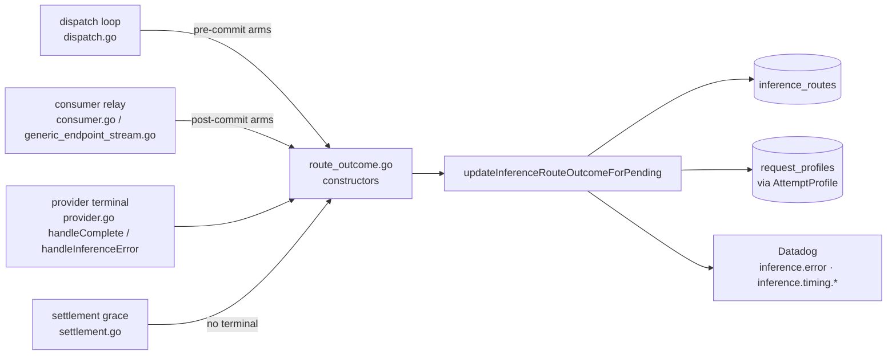

# Request Outcome Observability

> Last updated: 2026-09-04 · commit `6f364e64b`

Every inference request the coordinator dispatches ends in exactly one terminal outcome, and that outcome is recorded three ways: a closed `final_status` / `error_class` / `error_reason` triple on the `inference_routes` row, a per-attempt `request_profiles` row with separate `client_outcome` and `provider_outcome` columns, and a small set of low-cardinality Datadog counters. Requests refused before dispatch land in the `request_rejections` ledger instead. This page explains the taxonomy as the code implements it, where each value is decided, and what is still not modelled.

Scope: `/v1/chat/completions`, `/v1/responses`, `/v1/completions`, `/v1/messages`. All four flow through `dispatchState` (`coordinator/api/dispatch.go`, `coordinator/api/consumer.go`), so all four write route rows and profile rows.

## Context

A single success flag cannot describe a streamed inference request. The client connection, the provider job, and the money can each end differently: a provider can complete after the client has gone (billed, paid, not a provider fault); a stream can commit an HTTP 200 and then die (partial output delivered, refunded); a client can hang up while the request is still queued (nothing dispatched, nothing charged). The taxonomy below keeps those dimensions apart while still giving dashboards one compact `final_status` to group by.

Two design rules follow from that:

- Outcome strings are closed enums chosen in Go. Raw provider error text stays in logs; the route row and every metric tag carry only a value from the tables below.
- The commit point (first content-bearing chunk written to the client) is a transition, not a terminal. Anything that happens after commit is reported as `partial_success` with an `_after_commit` class, never left as `success`.

## Mechanism

### One funnel for route outcomes

Every terminal goes through `coordinator/api/route_outcome.go`. The constructors there (`completeRouteOutcome`, `preCommitProviderErrorOutcome`, `postCommitProviderErrorOutcome`, `preResponseTimeoutOutcome`, `noTerminalAfterCancelOutcome`, `clientGoneBeforeResponseOutcome`, `speculativeLoserOutcome`, and friends) build a `store.InferenceRouteOutcome`; `updateInferenceRouteOutcomeForPending` claims the attempt once (`PendingRequest.MarkRouteOutcomeFinalized`), copies the status into the attempt profile (`AttemptProfile.SetOutcome`), and `updateInferenceRouteOutcomeWithModel` emits the `inference.error` and `inference.timing.*` metrics before submitting the Postgres update on the telemetry worker (`submitTelemetry`). Because the claim is per attempt, provider-terminal, consumer-relay, disconnect-cleanup and settlement-grace paths can race without producing two terminals.

### `final_status`

The five persisted values are constants in `coordinator/api/route_outcome.go` (`finalStatusSuccess` … `finalStatusTimeout`).

| `final_status` | Meaning | `error_code` | `completion_tokens` |
|---|---|---|---|
| `success` | Response committed, provider completed, client still connected at completion. | `0` | provider-reported count, written even when `0` (`CompletionTokensSet`) |
| `partial_success` | Response committed; the stream, the provider, or the client connection then ended abnormally. Includes every post-commit client disconnect. | provider status or synthetic `502`/`504` | provider `attempt_usage` when the terminal carried it, else the count from `handleComplete` |
| `cancelled` | Terminal before any content reached the client and nobody is at fault: client gone, or the losing side of a speculative race. | `0` | forced `0` (`terminalForcesCompletionTokens`) |
| `error` | No content reached the client and a provider or coordinator error won before a timeout class applied. | provider status, `4xx` for client-shape faults, `0` for pre-dispatch failures | forced `0`, or provider `attempt_usage` |
| `timeout` | No content reached the client before a coordinator deadline. | `504` (the HTTP response may still be a `429`, see below) | forced `0` |

`request_profiles.final_status` carries the same five values plus `rejected`, used for queued or undispatched attempts that ended in `429`/`503`/`504` before a route row existed (`coordinator/api/profiler_dispatch.go`); `inference_routes` never carries `rejected`.

### `error_class`

`error_class` is the specific, closed classification. Every literal below is set in Go; none is copied from a provider. The table groups them by the `final_status` they are written with.

| `final_status` | `error_class` | Decided in | When |
|---|---|---|---|
| `cancelled` | `client_gone` | `dispatch.go` (`r.Context().Done()` arms while waiting for accept/first chunk, queued-wait exit) | client disconnected before the first content chunk |
| `cancelled` | `client_gone_before_response` | `consumer.go` non-streaming and generic relays (`clientGoneBeforeResponseOutcome`) | client disconnected while the coordinator was still waiting for the full response |
| `cancelled` | `speculative_loser` | `dispatch.go` (`speculativeLoserOutcome`) | the other attempt of a speculative/backup race won |
| `error` | `provider_error` | `preCommitProviderErrorOutcome`; `dispatchErrorClass` for a failed send | provider terminal before commit that is not otherwise classified |
| `error` | `provider_disconnect_pre_commit` | `preCommitProviderErrorOutcome` when the synthetic terminal carries `CoordinatorCause = provider_disconnected` (a Go-only field, `json:"-"`, never on the wire) | provider session dropped before commit (`registry.Disconnect` injects the terminal) |
| `error` | `provider_error_before_response` / `provider_disconnect_before_response` | `preResponseProviderErrorOutcome` (non-streaming relay) | provider error or disconnect while a non-streaming response was pending |
| `error` | `provider_incomplete_before_response` | `preResponseProviderIncompleteOutcome`, `error_code = 502` | provider channel closed without a terminal frame before response |
| `error` | `client_error` | `preCommitProviderErrorOutcome` (`isTerminalClientErrorCode`, `isNonProviderFaultErrorReason`), `dispatchErrorClass` for an oversized body | deterministic request-shape fault: provider `4xx`, `jinja_*` template failure, or `tool_noncompliance`; no reputation penalty, `admitted_but_failed = false` |
| `error` | `deadline_unreachable` | `preCommitProviderErrorOutcome` when `error_reason = deadline_unreachable` | provider refused because the remaining first-content budget could not be met; health-neutral |
| `error` | `insufficient_funds`, `encryption_missing`, `encryption_error` | `dispatchErrorClass` | dispatch could not start: provider-price reservation, no E2E-capable provider, key/encrypt failure |
| `error` | `ttft_too_slow` | queued-wait exit (`queuedExitOutcome`), HTTP `429` | the live first-content budget cannot be met by any candidate; also a `request_rejections` row (stage `queue` or `dispatch`) |
| `timeout` | `queue_timeout` | queued-wait exit, HTTP `429` | queued request never got a provider; also a rejection row |
| `timeout` | `first_chunk_timeout` | `first_token_clock.go`, `dispatch.go` first-chunk waits and speculative timeouts | dispatched but no first content before the live first-content deadline |
| `timeout` | `accepted_timeout` | `dispatch.go` accepted-wait arm | provider sent `inference_accepted` (or a cold load) but no content in time |
| `timeout` | `preamble_liveness_timeout` | `dispatch.go` preamble-liveness arm | provider emitted only role/lifecycle preamble, then stalled |
| `timeout` | `usage_timeout_before_response`, `response_timeout_before_response` | `consumer.go` non-streaming relay (`preResponseTimeoutOutcome`) | non-streaming response or its usage frame did not arrive in time |
| `partial_success` | `provider_error_after_commit` / `provider_disconnect_after_commit` | `postCommitProviderErrorOutcome` (streaming relays, `generic_endpoint_stream.go`) | provider error or disconnect after the client had content |
| `partial_success` | `provider_incomplete_after_commit` | `postCommitProviderIncompleteOutcome`, `502` | provider channel closed mid-stream with no terminal |
| `partial_success` | `stream_timeout_after_commit` | `postCommitStreamTimeoutOutcome`, `504` | idle-stream timer expired mid-stream |
| `partial_success` | `client_gone_after_commit_provider_completed` | `provider.go` `handleComplete` when `consumerGone` (`completeRouteOutcome`) | client left after commit; provider completed; consumer charged and provider paid |
| `partial_success` | `client_gone_after_commit_provider_error` / `client_gone_after_commit_provider_cancelled` | `provider.go` `handleInferenceError` when `consumerGone` | client left after commit; provider then errored (refund, `admitted_but_failed = true`) or acknowledged the cancel |
| `partial_success` | `no_terminal_after_cancel` | `settlement.go` grace-expiry callback (`noTerminalAfterCancelOutcome`), `504` | client left after commit and no provider terminal arrived within the settlement grace; reservation refunded, provider unpaid |

Two pairings deserve a note. `dispatchErrorClass` maps the dispatch loop's own first-content expiry to `first_chunk_timeout` with `final_status = error` (via `dispatchFailedPendingRouteOutcome`), so that class appears under both `timeout` and `error`. And an exhausted dispatch whose only failure was an untyped coordinator `504` is returned to the HTTP client as `429` with reason `first_chunk_timeout` (`classifyExhaustedStatus`), while the route row keeps its `timeout` status.

### `error_reason`

`error_reason` is the durable, low-cardinality reason used as the `reason` tag on `inference.error`. It is derived by `inferenceErrorReason` in `route_outcome.go`: a provider-supplied `error_reason` wins if it is in the allowlist below, otherwise the coordinator derives one from status, class, code and (allowlisted substrings of) the message, and anything unrecognised becomes `unknown`.

| `error_reason` | Origin |
|---|---|
| `jinja_channel_tags`, `jinja_null_bridge`, `jinja_template` | provider chat-template render failure (deterministic; classed `client_error`, reason preserved) |
| `model_load` | provider load failure; also starts the load-failure cool-down (`registry.RecordDispatchLoadFailure`) |
| `capacity_timeout`, `queue_full`, `capacity_busy` | provider capacity/queue terminals; `queue_timeout` and `queue full` messages fold to these |
| `token_budget_exhausted`, `request_exceeds_context`, `request_exceeds_node`, `request_exceeds_node_budget`, `request_exceeds_batch_token_budget` | provider servability terminals (the dispatch backstop reclassifies these `5xx` to `429`) |
| `deadline_unreachable` | provider pre-content deadline refusal |
| `cancelled` | any `cancelled` status, `error_code = 499`, or a `client_gone*` class |
| `provider_error` | every `provider_*`, `*_incomplete*`, `stream_timeout`, `first_chunk_timeout`, `accepted_timeout`, `preamble_liveness_timeout` class, or any `5xx` code without a better reason |
| `client_error` | `client_error` class |
| `tool_noncompliance` | provider `422` for a broken forced `tool_choice` contract |
| `unknown` | nothing above matched |

`request_profiles.error_reason` uses a different rule (`profileErrorReason`): it carries the route row's `error_class` when one was recorded and falls back to `error_reason` only when it was not, so profiles speak the more specific vocabulary.

### Per-attempt dimensions in `request_profiles`

The profiler keeps the two dimensions the route row folds together. Both are closed sets set by the coordinator only.

| Column | Values | Set by |
|---|---|---|
| `client_outcome` | `completed`, `client_gone`, `error_response` | `dispatchState.finalizeProfile` (`coordinator/api/profiler_dispatch.go`) once the dispatch loop returns; `client_gone` when the request context is cancelled, `error_response` when nothing was committed |
| `provider_outcome` | `completed`, `error`, `not_dispatched`, `no_terminal` | `handleComplete` / `handleInferenceError` (`coordinator/api/provider.go`), `closeUndispatchedAttempt`, and the 31 s fallback timer in `coordinator/registry/attempt_profile_finalize.go` |
| `terminal_cause` | the `inference_error.terminal_cause` enum, verbatim | `handleInferenceError` |

The full column list, retention and export rules are in [system-profiler.md](./system-profiler.md); the `terminal_cause` vocabulary is in [protocol-messages.md](../reference/protocol-messages.md).

### Pre-dispatch rejections

A request that never reaches a provider has no route row. `recordRejection` (`coordinator/api/rejection_telemetry.go`) writes a `store.RejectionRecord` with `stage`, `reason_code`, `http_status`, the request shape (token estimates, flags, non-content params) and a counterfactual servability snapshot (`could_have_served = candidate_count > 0` when evaluated; `null` when skipped, plus `warm_provider_existed` and `best_ttft_ms`).

Routing-saturation shedding sets `skipServability` so the telemetry worker does
not run another fleet scan under overload. `could_have_served` is then SQL NULL
and JSON `null`, or an empty CSV cell. The admin `could_have_served=true|false`
filters exclude unknown samples (`coordinator/api/admin_telemetry.go`,
`filterRejectionRecords`, `csvOptionalBool`). Count only non-NULL values when
computing the false-rejection rate; unknown is not a necessary rejection.

| `stage` | `reason_code` values written today |
|---|---|
| `validation` | `bad_param`, `messages_required`, `payload_too_large`; media fetch failures `media_blocked`, `upstream_timeout`, `upstream_error` (`mediaRejectionReason`, `coordinator/api/media_resolve.go`) |
| `model_resolution` | `model_not_found`, `model_unavailable` |
| `model_shed` | `model_shed` |
| `balance` | `insufficient_funds`, `insufficient_quota` |
| `preflight_capacity` | `machine_busy`, `model_too_large`, `no_provider`, `routing_saturated`, and the servability verdicts `context_exceeded`, `prompt_too_long` (`coordinator/api/servability_gate.go`) |
| `routing_ttft` | `ttft_too_slow` |
| `queue` | `queue_full`, `queue_timeout`, `ttft_too_slow`, `model_capability_unsupported` |
| `dispatch` | `ttft_too_slow`; the exhausted-dispatch verdicts from `resolveDominantExhaustedStatus` / `classifyExhaustedStatus`: `dispatch_exhausted` (default), `first_chunk_timeout` (untyped `504` reclassified to `429`), `client_error`, `payload_too_large`, `template_render_failed`, `oversized_request`, `routing_saturated`, `deadline_unreachable`, and `unservable_token_budget` (the servability backstop) |

The `RejectionRecord` comment also names `auth` and `rate_limit` stages; no code path writes them at this commit. `401`s, drain-gate and per-key rate-limit `429`s, and the vision/tools fail-fast exits return before `recordRejection` runs, so they leave no row. The servability gate is on unless `EIGENINFERENCE_SERVABILITY_GATE` parses as `false` (`servabilityGateEnabled`); its `429`s tag `routing.decisions` with `outcome:unservable_429`.

### Datadog counters

All counters go through `ddIncr`/`ddHistogram`, which are no-ops when Datadog is not configured. Names are shown without the Datadog namespace prefix; the prefix and the full metric inventory are owned by [telemetry-inventory.md](../reference/telemetry-inventory.md#coordinator-derived-datadog-metrics).

| Metric | Tags | Emitted from | Semantics |
|---|---|---|---|
| `inference.request_outcome` | `model`, `class`, `kv_backend`, `kv_backend_fallback` | `recordRequestOutcome` (`coordinator/api/or_uptime.go`), called from `dispatch.go` at the streaming commit, in `writeCommittedResponse` for non-streaming bodies, and at the exhausted tail of `run()`; from `recordRejection` for every non-`dispatch` stage | exactly one per client request. `class` ∈ {`success`, `provider_5xx`, `mid_stream`, `timeout`, `rate_limited`, `client_error`} from `classifyOutcomeByCode`. Uptime = `success / (success + provider_5xx + mid_stream + timeout)`; `rate_limited` and `client_error` are excluded. Commit-time approximation: a stream that fails after commit counts as `success`. `/v1/completions` and `/v1/messages` contribute only their rejections. |
| `inference.error` | `reason`, `model` | `emitInferenceErrorMetric` | one per non-success terminal with a reason |
| `inference.timing.{parse_ms,reserve_ms,route_ms,encrypt_ms,queue_wait_ms,dispatch_ms,total_duration_ms}` | `model`, `final_status` | `emitTimingDecompositionMetric` (`coordinator/api/timing_metrics.go`) | histograms of the same values persisted on the route row; zero segments are skipped |
| `inference.partial_success` | `model`, `error_class` | `handleComplete` when `consumerGone` (`coordinator/api/partial_success_metrics.go`) | subset of `inference.completions`; `error_class` is always `client_gone_after_commit_provider_completed` |
| `inference.no_terminal_after_cancel` | `model` | `settlement.go` grace expiry | payout gap: refunded, provider unpaid |
| `routing.client_gone` | `model`, `prompt_bucket`, `chip_family`, `phase`, `deadline_bucket` | `emitClientGone` (`coordinator/api/prompt_buckets.go`) from pre-commit arms (`phase:before_first_token`) and from `handleComplete`, `handleInferenceError`, settlement expiry (`phase:after_commit`) | at most one per request; `chip_family` uses the fixed vocabulary in `coordinator/api/chip_family_tags.go`; `deadline_bucket` distinguishes early aborts from cancellations at the first-content deadline |
| `inference.ttft_ms`, `inference.decode_tps` | `model`, `kv_backend`, `kv_backend_fallback` | `handleComplete` (`coordinator/api/kv_backend_metrics.go`) | the same values written to `inference_routes.actual_ttft_ms` / `actual_decode_tps`; skipped when unmeasurable |
| `routing.unservable_reclassified` | `model` | dispatch-exhausted backstop in `dispatch.go` | a provider token-budget/KV/context `5xx` turned into an uptime-neutral `429` |

`kv_backend` uses the heartbeat vocabulary (`paged`, `contiguous`, `unspecified`, `other`, `unknown`) and `kv_backend_fallback` the slot's `kv_backend_fallback_reason` (`none` is a real value). Attribution follows the slot that served, is sticky for the provider session (`coordinator/registry/kv_backend.go`), and is never coerced: a request that never reached a slot is `unknown`/`unknown`. Nothing consults `kv_backend` for routing, admission, scoring or shedding.

`inference.attempt_outcome{model,class}` counts dispatched attempts only.
Queued exits carry the transient `QueueExit` marker and instead increment
`inference.queue_outcome{model,class}`; queue deadline expiry uses
`queue_deadline`, while a provider silent after dispatch uses
`first_chunk_timeout`. Typed drain refusals count as capacity, never faults
(`coordinator/api/attempt_outcome_metrics.go`, `emitAttemptOutcomeMetric`;
`coordinator/api/dispatch.go`, `queuedExitOutcome`).

`inference.request_outcome_or_view{model,class}` also counts a TTFT rejection
on the first reservation scan as `rate_limited`, even though that branch does
not write a retry rejection row. The request-level outcome is independent of
the retry-only ledger/legacy dispatch metrics
(`coordinator/api/dispatch.go`, `dispatchPrimary`).

`inference.cancel_sent{cause,model}` counts cancels accepted by the provider
writer; a full/stopped writer increments `inference.cancel_send_failed{reason}`.
`inference.cancel_to_terminal_ms{terminal,model,cause}` starts at the first
successful enqueue, excluding failed-enqueue retry delay. It uses a terminal
frame, or the last subsequent stray chunk for an expired entry. A cancel that
was never accepted contributes only to `inference.cancel_unresolved` on expiry,
even if stray chunks arrived. `inference.cancelled_terminal` includes
`delivered:true|false` for correlated terminals. Successful enqueue marking and terminal resolution share the tracker lock,
so an immediate terminal cannot observe an unmarked accepted cancel.
Enqueue acceptance does not prove a frame reached the provider (`coordinator/api/cancel_lifecycle.go`,
`sendRecordedCancel`, `resolveCancelledTerminal`, `emitExpiredCancelEntries`).
The zombie tracker keeps at most `zombieCancelMaxEntries = 4096` entries.
Insertions at the cap evict one least-recently-active ID with constant-time
list operations; they do not force an expiry scan. TTL and warning-state
cleanup remain rate-limited to `zombieSweepEvery`
(`coordinator/api/zombie_eviction.go`, `makeRoomLocked`;
`coordinator/api/zombie_stream.go`, `sweepLocked`).

### Read surfaces

| Surface | Contents |
|---|---|
| `GET /v1/admin/routes` (`handleAdminRoutes`) | `store.InferenceRouteRecord`: the decision snapshot plus the merged outcome fields (`final_status`, `error_code`, `error_class`, `error_reason`, token counts, `cost_micro_usd`, `actual_ttft_ms`, `dispatch_to_first_chunk_ms`, `total_duration_ms`, the six timing segments, `actual_decode_tps`, `admitted_but_failed`, `used_backup`, `backup_won`). Filters: `since`, `limit`, `provider`, `model`, `outcome`, `final_status`. |
| `GET /v1/admin/routes/export?format=csv|ndjson` | same fields; `routeCSVHeader` in `coordinator/api/admin_telemetry.go` is the column order |
| `GET /v1/admin/rejections`, `/v1/admin/rejections/export` | `RejectionRecord` rows |
| `GET /v1/admin/profiles`, `GET /v1/admin/snapshots` (each with `/export`) | per-attempt profiles and fleet snapshots ([system-profiler.md](./system-profiler.md)) |

All admin reads require the admin key (`requireAdminKey`).

## Invariants

- **Closed vocabularies.** `final_status`, `error_class`, `error_reason`, `client_outcome`, `provider_outcome`, rejection `stage`/`reason_code`, and every metric tag value are Go constants or allowlisted strings. `normalizeInferenceErrorReason` turns any provider value outside `validInferenceErrorReasons` into `unknown`.
- **Commit is not success.** `committedRouteOutcome` writes telemetry fields only; `final_status = success` is written by `completeRouteOutcome` at the provider's `inference_complete`, and only when the consumer is still connected.
- **One terminal per attempt.** `MarkRouteOutcomeFinalized` and the attempt profile's `sync.Once` halves make provider, relay, disconnect and grace paths idempotent; a late terminal after a grace-expiry refund is a no-op on money and outcome (`coordinator/api/settlement_clientgone_test.go`).
- **Fault attribution is separate from outcome.** `isProviderHealthNeutralErrorReason` exempts `jinja_*`, `tool_noncompliance` and `deadline_unreachable` from reputation, breakers and capacity trackers; `client_gone*` classes never count as provider failures (`RecordJobSuccess` with `FailedJobs == 0` for a completed-after-disconnect request).
- **Metadata only.** Route rows, profiles, rejections and tags carry no prompt or completion text, raw IP, raw user agent, media bytes or raw API keys; client identity is `store.HashKey` output and key/account ids already used for billing. Provider error text is sanitized before it reaches a client and never persisted on a row.
- **Observability never steers.** Nothing reads `inference_routes` outcomes, `request_profiles`, `request_rejections` or the `kv_backend` tags to make a routing, admission or billing decision.

## Failure modes

| Condition | Effect | Where visible |
|---|---|---|
| Postgres slow or down | route outcome updates are best-effort on the telemetry worker; the request is unaffected, the row keeps its committed or decision-time state | `inference_routes outcome update failed` in slog with `request_id`, `attempt`, `final_status`, `error_class` |
| Negative raw TTFT (attempt mix-up regression) | clamped to `0`, `InvalidTTFT` set, never persisted | `routing.invalid_ttft{reason:negative}` |
| Provider terminal for an unknown or expired request | no outcome update; counted separately | `inference.unknown_request_frames{kind}` |
| Client leaves after commit, provider never terminates | settlement grace expires, reservation refunded, provider unpaid | `no_terminal_after_cancel` row, `inference.no_terminal_after_cancel` |
| Datadog unconfigured | every metric in this page is skipped before tag construction | none; rows still written |
| Speculative backup wins | both attempts have rows: the winner with `used_backup`/`backup_won`, the loser `cancelled` / `speculative_loser` | `GET /v1/admin/routes?final_status=cancelled` |

## Not modelled at this commit

- `inference_routes` has no `client_outcome`, `provider_outcome`, `billing_outcome`, `response_committed`, `terminal_source` or client-request correlation columns; the client/provider split exists only in `request_profiles`, and billing settlement is visible through `cost_micro_usd` and the `error_class` rather than a dedicated column.
- `request_rejections` receives no `auth` or `rate_limit` rows; those exits return before `recordRejection` runs.
- Per-provider aggregate counters for cancellations, disconnects and no-terminal drops are not exported; `RecordJobSuccess`/`RecordJobFailure` remain the only provider aggregates.
- No `request_events` timeline table exists; point-in-time reconstruction uses the microsecond stamps in `request_profiles`.

## Code map

| Concern | Files |
|---|---|
| Outcome constructors, `final_status` constants, `error_reason` derivation | `coordinator/api/route_outcome.go` |
| Pre-commit arms, dispatch error classes, exhausted-status reclassification, `request_outcome` emit | `coordinator/api/dispatch.go`, `coordinator/api/first_token_clock.go`, `coordinator/api/or_uptime.go` |
| Post-commit and pre-response relay arms | `coordinator/api/consumer.go`, `coordinator/api/generic_endpoint_stream.go`, `coordinator/api/dispatch_terminal_write.go` |
| Provider terminals, consumer-gone handling | `coordinator/api/provider.go`, `coordinator/api/inference_error_sanitize.go` |
| Settlement grace and no-terminal refund | `coordinator/api/settlement.go` |
| Client-gone and partial-success counters | `coordinator/api/prompt_buckets.go`, `coordinator/api/partial_success_metrics.go` |
| Timing histograms, KV-backend attribution | `coordinator/api/timing_metrics.go`, `coordinator/api/kv_backend_metrics.go`, `coordinator/registry/kv_backend.go` |
| Rejection ledger and servability gate | `coordinator/api/rejection_telemetry.go`, `coordinator/api/inference_admission.go`, `coordinator/api/servability_gate.go` |
| Per-attempt profile outcomes | `coordinator/api/profiler_dispatch.go`, `coordinator/registry/attempt_profile.go`, `coordinator/registry/attempt_profile_finalize.go` |
| Storage types and admin reads | `coordinator/store/interface.go` (`InferenceRouteRecord`, `InferenceRouteOutcome`, `RejectionRecord`), `coordinator/api/admin_telemetry.go` |
| Regression pins | `coordinator/api/route_outcome_test.go`, `coordinator/api/settlement_clientgone_test.go`, `coordinator/api/nonfault_outcome_generic_test.go`, `coordinator/api/dispatch_speculative_outcome_test.go`, `coordinator/api/rejection_classify_test.go` |

## Related

- [system-profiler.md](./system-profiler.md) — `request_profiles` and `fleet_snapshots`, the per-attempt `client_outcome` / `provider_outcome` home.
- [telemetry.md](./telemetry.md) — how counters reach Datadog and what the allowlists forbid.
- [telemetry-inventory.md](../reference/telemetry-inventory.md) — every metric, table and retention period.
- [protocol-messages.md](../reference/protocol-messages.md) — `inference_error` fields (`error_reason`, `failure_code`, `terminal_cause`, `attempt_usage`) and the wire-invisible `CoordinatorCause`.
- [routing.md](./routing.md) — gate reasons behind the `preflight_capacity` rejections; [scheduling.md](./scheduling.md) — slot semantics behind `machine_busy`.
- [billing.md](./billing.md) — reservation, charge and refund rules that the `client_gone_after_commit_*` classes describe.
- [../design/routing-telemetry-and-calibration.md](../design/routing-telemetry-and-calibration.md) — the original design note this page supersedes for outcome semantics.
