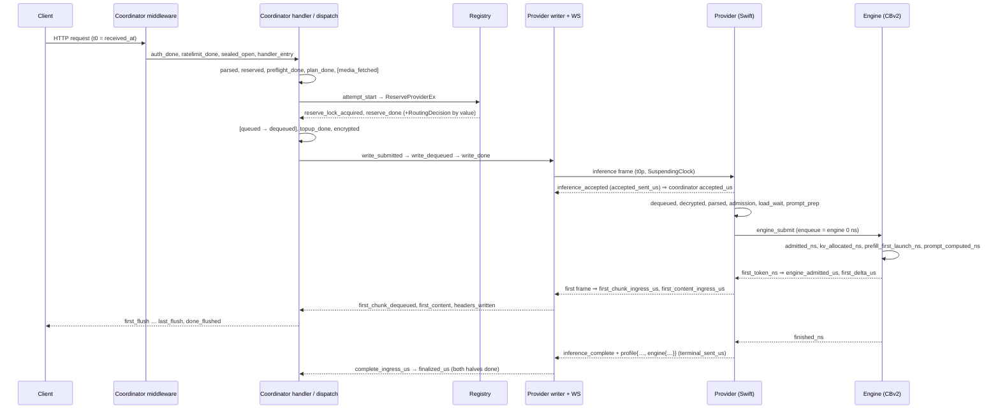

# System profiler

> Last updated: 2026-09-04 · commit `4a08f2a44`

The profiler answers "where did the time go, and what did the router know when
it chose?" for one request, without carrying a single prompt-derived byte. It
writes one prompt-free row per dispatched attempt (`request_profiles`), one
fleet row per provider slot per minute plus one coordinator row
(`fleet_snapshots`), and reads the provider's own per-attempt `profile` object
off the existing terminal frames. Postgres is the system of record; Datadog
gets only pipeline-health counters. Wire shapes of the heartbeat sub-objects:
[`../reference/protocol-messages.md`](../reference/protocol-messages.md); the
outcome vocabularies the rows carry:
[`request-outcome-observability.md`](request-outcome-observability.md).

## Context

Before the profiler, request timing existed as a handful of `inference_routes`
millisecond columns and the `X-Timing` header, and fleet state existed only in
memory. Percentiles per segment, routing regret, and "was there an idle warm
alternative" were unanswerable after the fact. The profiler landed in three
slices — coordinator record and fleet snapshots, provider `profile` on the
wire with Go ingress validation, and engine (`CBv2RequestTiming`) stamps — with
the constraint that none of it may add a channel, a lock under `r.mu`, a
per-token cost, or a free-form provider string to storage.

| Artefact | Grain | Producer | Sink | Retention |
|---|---|---|---|---|
| `request_profiles` row | dispatched attempt (pre-dispatch rejections never produce one) | stamps on `registry.RequestProfile` / `AttemptProfile`, flattened by `buildProfileRecord` (`coordinator/api/profiler_record.go`) | `profileSink` (`coordinator/api/profiler_sink.go`) → multi-row INSERT | `profileRetainProfiles` — value in [`../reference/telemetry-inventory.md#coordinator-per-request-records-postgres`](../reference/telemetry-inventory.md#coordinator-per-request-records-postgres) |
| `fleet_snapshots` row | (provider session, slot) per 60 s + one `provider_id = 'coordinator'` row | `registry.FleetSample`, `CoordinatorSample` (`coordinator/registry/fleet_sample.go`) | sampler goroutine, `pgx.CopyFrom` (`coordinator/store/postgres_profiles.go`) | `profileRetainFleet` — same page |
| `X-Timing` additive keys | committed response | `writeTimingHeaderWithProfile` (`coordinator/api/profiler_dispatch.go`) | response header ([`../reference/api-contracts.md#headers`](../reference/api-contracts.md#headers)) | n/a |
| Datadog counters | process | [Operations](#operations) | DogStatsD / HTTPS series | n/a |

## Mechanism

### Request lifecycle

Request-level stamps live on `RequestProfile` (`coordinator/registry/request_profile.go`),
attempt-level stamps on `AttemptProfile` (`coordinator/registry/attempt_profile.go`).
Every coordinator stamp is microseconds from `t0` (middleware start, the
monotonic clock); `received_at = t0` is the single wall-clock anchor. A stamp
is one clock read plus one compare-and-swap, first write wins. Chat and the
generic paths (`/v1/completions`, `/v1/messages`, `/v1/responses`) share the
attempt stamps.

| Column | Taken at | Segment since the previous stamp |
|---|---|---|
| `auth_done_us`, `auth_kind`, `auth_db_read` | `stampAuth` (`coordinator/api/profiler.go`) from the auth middleware | header read + API-key or Privy auth; `auth_db_read` = a key lookup hit the store |
| `ratelimit_done_us` | rate-limit middleware (`coordinator/api/server.go`) | rate limiter |
| `sealed_open_us`, `sealed_body_bytes` | `sealedTransport` (`coordinator/api/sender_encryption.go`) | sealed-transport body decrypt; absent for plain HTTPS |
| `handler_entry_us` | inference handler entry (`coordinator/api/consumer.go`) | remaining middleware + mux (= `X-Timing.pre_handler_us`) |
| `parsed_us`, `db_us`, `db_calls` | handler; DB accumulator `profileDBCall` | body read, JSON decode, model resolve, registry read |
| `reserved_us` | handler | balance reservation |
| `preflight_done_us`, `preflight_us`, `preflight_outcome` ∈ {`passed`, `handled`} | handler | admission preflight |
| `plan_done_us`, `first_content_budget_ms` | handler | second registry read + cache-route plan |
| `media_fetched_us` | handler, only when media was inlined | remote media fetch |
| `attempt_start_us` | direct path (`consumer.go`) / queued path (`coordinator/api/dispatch.go`) | retry/backup loop overhead before this attempt |
| `reserve_lock_acquired_us` | derived: `attempt_start_us + LockWaitUS` (`AttemptProfile.SetDecision`) | wait for `r.mu`, measured from `ReserveProviderEx` entry (`coordinator/registry/scheduler.go`) |
| `reserve_done_us` | after `ReserveProviderEx` returns; the `RoutingDecision` is copied by value here | candidate scan + selection + admit re-check (`scan_us`, `admit_us`) |
| `queued_us`, `dequeued_us` | queued path | enqueue; pure queue wait (= `X-Timing.queue_pure_us`) |
| `topup_done_us` | handler | provider-specific surcharge reservation |
| `encrypted_us` | handler / dispatch | session key + body encryption |
| `write_submitted_us`, `write_dequeued_us`, `write_done_us` | dispatch, from the provider writer's `DequeuedAt` | frame build + submit; writer queue wait (= `writer_us`); socket write (= `socket_us`) |
| `accepted_us` | `handleInferenceAccepted` (`coordinator/api/provider.go`) | provider ack round trip (= `provider_ack_us`) |
| `first_chunk_ingress_us`, `chunks_in`, `decrypt_us_total` | chunk ingress on the WS read loop (one clock read + two atomic adds per chunk) | provider dequeue → prefill → first frame → transport |
| `first_content_ingress_us` | read loop | preamble frames before the first content-bearing chunk |
| `first_chunk_dequeued_us`, `first_content_us`, `held_preamble_chunks` | dispatch goroutine (`profiler_dispatch.go`) | channel hand-off + commit decision |
| `headers_written_us` | `stampCommitted` for streams; `writeNonStreamBody` for JSON bodies | `X-Timing` computed, headers written |
| `first_flush_us`, `last_flush_us`, `done_flushed_us`, `chunks_out`, `bytes_out`, `max_chunk_gap_us`, `client_write_err` | `relayStamps` from the chat, Responses and generic SSE relays; non-stream bodies stamp the same fields once | relay to the client; a failed or short write sets `client_write_err` and leaves `done_flushed_us` absent |
| `client_gone_us`, `client_gone_phase` ∈ {`before_first_token`, `after_commit`} | dispatch / consumer / `finalizeProfile` | client disconnect |
| `cancel_sent_us` | dispatch, after the relay returns | cancel frame to the provider |
| `complete_ingress_us` | terminal frame ingress (`provider.go`; parked, complete and error sites) | provider terminal received |
| `finalized_us` | `buildProfileRecord` | both halves done → row built |

Outcome columns are written first-wins by `AttemptProfile.SetOutcome`: provider
complete (`handleComplete`), provider error with `terminal_cause`
(`handleInferenceError`), consumer-side synthetic terminals
(`coordinator/api/route_outcome.go`), never-dispatched attempts
(`closeUndispatchedAttempt`, class from `dispatchErrorClass`), and grace expiry
→ `provider_outcome = 'no_terminal'` (`armFallback`,
`coordinator/registry/attempt_profile_finalize.go`).

### The provider `profile` object

Go `protocol.InferenceProfile` (`coordinator/protocol/profile.go`) ↔ Swift
`InferenceProfile` (`provider-swift/Sources/ProviderCore/Protocol/InferenceProfile.swift`),
built by `RequestProfileBuilder` (`provider-swift/Sources/ProviderCore/Telemetry/RequestProfileBuilder.swift`)
and attached to `inference_complete` and `inference_error`. Every numeric is a
Go pointer with `omitempty` and a Swift optional; absent = did not happen, and
inside a present object an absent numeric reads as 0. `_us` offsets are from
`t0p` = WS frame receipt on the provider's `SuspendingClock`
(`mach_absolute_time`, the engine's `DispatchTime` domain); `slept_us` =
continuous Δ − suspending Δ. Encoded size ≤ `MaxInferenceProfileBytes`
([`../reference/protocol-messages.md#inference_complete`](../reference/protocol-messages.md#inference_complete));
Swift encodes through `saturatedToWireRanges()` so values already sit inside
the coordinator's ranges.

| Group | Keys |
|---|---|
| Header | `schema` (= `InferenceProfileSchema = 1`), `wall_ms` (untrusted wall anchor) |
| Ingress | `dequeued_us`, `decrypted_us`, `parsed_us` |
| Admission | `admission_us`, `accepted_sent_us`, `deadline_mode`, `budget_remaining_at_admit_us`, `projected_service_us`, `running_at_admit`, `waiting_at_admit`, `queued_prefill_tokens_at_admit`, `kv_bytes_in_use_at_admit`, `kv_bytes_capacity` |
| Load | `load_wait_start_us`, `load_wait_end_us`, `load_cold`, `load_parked` |
| Prompt preparation | `task_spawned_us`, `prompt_prep_start_us`, `prompt_prep_end_us`, `tool_constraint_us`, `vision_prep_us`, `ssd_stage_us`, `prompt_tokens`, `projected_prefill_tokens`, `projected_decode_tokens`, `partial_prefill_cap` |
| Engine hand-off | `engine_submit_us`, `engine_admitted_us`, `kv_reserve_us`, `steps_at_submit`, `steps_at_finish` |
| Streaming | `first_delta_us`, `first_frame_us`, `last_delta_us`, `frames_emitted`, `bytes_emitted`, `usage_recovered` |
| Terminal | `terminal_built_us`, `terminal_sent_us`, `flush_us`, `se_sign_us`, `total_us`, `slept_us` |
| Cancel | `cancel_received_us`, `cancel_aborted_us`, `cancel_stage`, `tokens_after_cancel` |
| Host posture at finish | `mlx_active_bytes_at_finish`, `mlx_peak_bytes`, `mtp_active`, `low_power_mode`, `thermal_state` |
| `engine` sub-object (`EngineProfile`) | ns from `SchedulerV2.enqueue`: `admitted_ns`, `kv_allocated_ns`, `prefill_first_launch_ns`, `prompt_computed_ns`, `first_token_ns`, `finished_ns`; counters `readmissions`, `preemptions`, `capacity_requeues`, `prefill_chunks`, `packed_prefill_chunks`, `vision_chunks`, `solo_stripe_chunks`, `prefill_chunk_tokens_max`, `decode_steps`, `chained_decode_steps`, `batch_rows_sum`, `batch_rows_min`, `batch_rows_max`, `step_latency_ns_sum`, `step_latency_ns_max`, `mtp_rounds`, `mtp_proposed`, `mtp_accepted`, `paused_ns`, `pause_count`, `detok_delay_first_ns`, `prefix_lookup_ns`, `prefix_adoption_ns`; `finish_reason` |

Closed enums, all with `Valid()` and a fold to `EnumOther = "other"`
(`""` also passes as absent):

| Enum | Values |
|---|---|
| `deadline_mode` (`DeadlineMode`) | `none`, `projected`, `legacy`, `other` |
| `thermal_state` (`ThermalState`) | `nominal`, `fair`, `serious`, `critical`, `other` |
| `cancel_stage` (`CancelStage`) | `none`, `pre_accept`, `pre_engine`, `prefill`, `decode`, `post_terminal`, `other` |
| `engine.finish_reason` (`EngineFinishReason`) | `stop`, `length`, `stop_sequence`, `cancelled`, `error`, `other` |
| `memory_pressure_level` (`MemoryPressureLevel`, heartbeat `CapacityTelemetry`) | `normal`, `warning`, `critical`, `other` |

Engine stamps come from `CBv2RequestTiming`
(`libs/mlx-swift-lm/Libraries/MLXLMCommon/ContinuousBatchingV2/CBv2RequestTiming+Stamps.swift`),
copied into the wire `engine` object by `EngineV2Bridge+Profile.swift`. On a
prefix-cache adoption at enqueue, `kv_allocated_ns` is raised to `admitted_ns`
so the exported chain stays ordered; adoption itself shows as
`prefix_adoption_ns > 0`. `detok_delay_first_ns` is measured for the first
token only, inside the stream lock. The cumulative engine counters
`step_wall_ns_total` and `decode_rows_total` travel on the heartbeat
`slots[].telemetry` object instead and land in `fleet_snapshots`.

Both sides load `coordinator/protocol/testdata/profiler_wire_fixture.json`
(Go writes it, Swift reads it) and assert the key sets.

### Ingress validation

The WS read loop does one thing with `profile`: `SetProviderProfileRaw`
(`coordinator/registry/attempt_profile.go`) length-checks it against
`maxProviderProfileBytes` (the same bound as `MaxInferenceProfileBytes`) and
retains the bytes on the attempt, first
profile wins. Everything else runs on the profile-sink worker
(`decodeInferenceProfile`, `applyProviderProfile`, `coordinator/api/profiler_provider.go`)
after the terminal has been fully processed.

| Step | Rule | Outcome (`provider_profile_invalid_reason`) |
|---|---|---|
| 1 | no object on the terminal | `absent` (`providerProfileAbsent`, `profiler_record.go`) |
| 2 | `len(raw) > maxProviderProfileBytes` | `size` |
| 3 | second profile for the attempt; profile after finalize | `duplicate`; `late` (`ProviderProfileStatus`) |
| 4 | decode into the pointer-typed struct fails (unknown keys are ignored) | `decode` — stored `NULL` |
| 5 | `schema != 1` | `schema` — stored `NULL` |
| 6 | `_us` ∉ [0, `maxProfileUS` = 3.6e9], `_ns` ∉ [0, `maxProfileNS` = 3.6e12], counts ∉ [0, `maxProfileCount` = 1e9], bytes ∉ [0, `maxProfileBytes` = 2^48], `wall_ms` more than `maxProfileWallSkew` = 24 h from `received_at` | `range` — negatives clamp to 0, overs to the limit; the clamped JSONB is kept for forensics, `valid = false`, hot columns not filled |
| 7 | order over **present** stamps: `dequeued ≤ decrypted ≤ parsed ≤ admission ≤ engine_submit ≤ engine_admitted ≤ first_delta ≤ last_delta ≤ terminal_built ≤ terminal_sent ≤ total`; `load_wait_start ≤ load_wait_end`; `prompt_prep_start ≤ prompt_prep_end`; `cancel_received ≤ cancel_aborted`; `steps_at_submit ≤ steps_at_finish`; engine `admitted ≤ kv_allocated ≤ prefill_first_launch ≤ prompt_computed ≤ first_token ≤ finished`; `mtp_accepted ≤ mtp_proposed`; `batch_rows_min ≤ batch_rows_max`; `step_latency_ns_max ≤ step_latency_ns_sum` (`storedProfileOrdered`) | `order` — same treatment as `range` |
| 8 | unknown enum value | folded to `other`; record stays valid; `profiler.provider_profile{valid:true, reason:enum}` |
| 9 | `frames_emitted` vs `chunks_in`, `prompt_tokens` vs terminal usage | `provider_profile_consistent` (`NULL` when neither is checkable); never invalidates |
| 10 | persist | `provider_profile` JSONB re-encoded from the coordinator's own struct; hot columns (`prov_*`, `eng_*`, `slept_us`, `transport_est_us`) filled only when valid |

`provider_profile_invalid_reason` ∈ {`absent`, `size`, `decode`, `schema`,
`range`, `order`, `late`, `duplicate`}. A missing terminal is
`provider_outcome = 'no_terminal'` (set by the fallback timer), not an invalid
reason. `transport_est_us = (complete_ingress_us − write_done_us) −
prov_total_us` is "both network legs + WS reader wake + coordinator ingress,
including provider `slept_us`" — the only cross-hop arithmetic the profiler
performs, and it is a difference of two same-domain spans, never a subtraction
of a provider stamp from a coordinator stamp.

### Routing decision context

Filled by value under `r.mu` from fixed-size `candidateScan` fields
(`coordinator/registry/scheduler.go`), returned on `RoutingDecision`, copied
into the attempt after the lock is released (`CopyPreDispatchFrom`), and
JSON-encoded on the sink worker.

| Column(s) | Definition | Where |
|---|---|---|
| `scanned` | providers the candidate loop visited. Since the per-model provider index (`coordinator/registry/model_index.go`) the loop visits only providers **advertising** the requested model, so `scanned` is the advertising count, not the fleet size, and `gate_rejections.not_serving_model` is 0 unless an advertiser still fails the catalog rule (off-catalog model on a public route); the `allowlist` / `excluded` tallies likewise count only advertisers. Records written before the index landed have `scanned == fleet size`; fleet size is available from `fleet_snapshots` | `ReserveProviderEx` |
| `candidate_set_size` | `scanned − gate_rejections.not_serving_model` (unchanged in meaning by the index); exclude/allowlist drops happen before the catalog check and count as advertising | `scheduler.go` |
| `gate_rejections` JSONB `{reason: count}` | per-`GateReason` tally, uint16-saturating; keys are `gateReasonNames` (`coordinator/registry/gate_reason.go`): `offline`, `untrusted`, `trust_floor`, `private_only`, `runtime_unverified`, `private_text`, `challenge_stale`, `trait_floor`, `dedicated`, `dispatch_load_cooldown`, `error_cooldown`, `capacity_cooldown`, `breaker`, `ejection`, `slot_crashed`, `slot_reloading`, `thermal_critical`, `no_headroom`, `model_too_large`, `free_memory`, `vision`, `ttft_ceiling`, `excluded`, `allowlist`, `not_serving_model`. `allowlist` absorbs exclusive self-route-not-owned and serial allowlist misses; `excluded` is the caller's exclude list. Meaning of each gate: [`routing.md`](routing.md) | `buildCandidateInto` |
| `candidates` JSONB (≤ 4 rows) | `Top[0]` is the winner, then the lowest-cost other candidates ascending; each row is a `CandidateSummary` (cost + terms, `ttft_ms`, `effective_tps`, `effective_queue`, `total_pending`, `backend_running/waiting`, `active_token_budget_used/max`, `queued_prefill_tokens`, folded `slot_state`, `hb_age_ms`) | `CandidateSummary` (`gate_reason.go`) |
| `runner_up_provider_id`, `runner_up_cost_ms` | lowest-cost candidate of the narrowed pool other than the winner; absent with one candidate | `lowestCostOther` |
| `best_idle_provider_id`, `best_idle_ttft_ms` | lowest-TTFT candidate with the model resident and `backend_running + backend_waiting == 0`, computed over every gate-passing candidate before pool narrowing | `scheduler.go` |
| `near_tie_pool_size`, `selection_path` | candidates within `nearTieCostWindowMs` of the minimum; branch of `selectRoutingCandidate`: `none`, `unique_min`, `tie_queue`, `tie_pending`, `cache_tiebreak`, `random` (`selectionPathNames`) | `selectRoutingCandidate` |
| `snapshot_age_ms`, per-candidate `hb_age_ms` | `now − LastHeartbeat` when the routing snapshot was taken; observability only | `heartbeatAgeMs` |
| `predicted_ttft_ms`, `raw_ttft_ms`, `ttft_calibration_ratio`, `prefill_decode_ratio`, `predicted_decode_tps` | calibrated vs raw estimate, the (model, chip) ratio applied, the decode→prefill fallback multiplier, `projectedPerRequestDecodeTPS` | `scheduler.go` |
| `pending_for_model`, `total_pending` | winner's coordinator-side pending counts before this reservation | `scheduler.go` |
| `capacity_rate_ms`, `cache_discount_ms` | gray-box capacity-503 penalty; exact-cache discount | `scheduler.go` |
| `shadow_would_shed`, `shadow_idle_alternative` | `NULL` unless the TTFT shadow evaluator ran | `profiler_record.go` |
| `lock_wait_us`, `scan_us`, `admit_us` | the three phases of `ReserveProviderEx`; `lock_wait_us` is measured from function entry | `scheduler.go` |
| `queue_position_at_enqueue`, `queue_depth_at_enqueue`, `drain_trigger` | queue path only; `drain_trigger` ∈ {`heartbeat`, `idle`, `challenge`, `load`, `disconnect`, `kick`, `unknown`} (`DrainTrigger*`, `foldDrainTrigger`, `coordinator/registry/queue.go`) | `queue.go` |
| `slot_state` | `SlotStateFold` → {`running`, `idle`, `idle_shutdown`, `crashed`, `reloading`, `other`}; `other` includes the coordinator's own "unknown" cold candidate. Slot semantics: [`scheduling.md`](scheduling.md) | `gate_reason.go` |

### Tables

`request_profiles` (DDL `requestProfilesTableDDL`, `coordinator/store/postgres.go`;
column order pinned by `requestProfileColumns`, `coordinator/store/profile_records.go`):

| Group | Columns |
|---|---|
| identity + outcome | `id`, `coord_request_id`, `request_id` (attempt UUID, joins `inference_routes`), `attempt`, `backup_of`, `winning`, `endpoint` (mux pattern via `httpPathLabel`), `stream`, `model`, `public_model`, `provider_id` (session id), `provider_version` (`ProviderVersionFold`: `^\d{1,3}\.\d{1,3}\.\d{1,4}(-[a-z0-9.]{1,16})?$` or `invalid`, `''` unreported), `chip_family` (`foldChipFamily`: `m1`…`m9` prefixes, else `other`), `kv_backend`, `final_status` (`success`, `partial_success`, `error`, `cancelled`, `timeout`, or `rejected` for 429/503/504 attempts that never dispatched — a value `inference_routes` never carries), `error_reason` (the route row's closed `error_class` when recorded, else its normalized reason), `terminal_cause`, `client_outcome` ∈ {`completed`, `client_gone`, `error_response`}, `provider_outcome` ∈ {`completed`, `error`, `not_dispatched`, `no_terminal`}, `client_gone_phase`, `first_content_budget_ms`, `admission_mode`, `received_at` |
| request shape | `estimated_prompt_tokens`, `requested_max_tokens`, `requires_vision`, `has_tools` |
| coordinator offsets (BIGINT µs, `NULL` = did not happen) | the `*_us` columns above plus `settle_db_us`, `db_us`, `db_calls` |
| counts / context | `body_bytes`, `sealed_body_bytes`, `auth_kind`, `auth_db_read`, `reserve_mode`, `media_items`, `media_bytes`, `preflight_outcome`, `plan_outcome`, `chunks_in`, `chunks_out`, `bytes_out`, `decrypt_us_total`, `max_chunk_gap_us`, `held_preamble_chunks`, `client_write_err`, `attempts_total`, `failed_attempts`, `failed_attempts_us`, `backup_launched`, `backup_won`, `transport_est_us`, `slept_us`, `timing_anomaly` |
| routing context | the columns of the previous section, `gate_rejections` JSONB, `candidates` JSONB |
| provider profile | `prov_total_us`, `prov_first_delta_us`, `prov_engine_submit_us`, `prov_engine_admitted_us`, `prov_prompt_prep_us`, `prov_load_wait_us`, `prov_load_cold`, `prov_running_at_admit`, `prov_waiting_at_admit`, `prov_kv_bytes_in_use_at_admit`, `prov_cancel_stage`, `eng_queue_wait_ns` (= `engine.admitted_ns`), `eng_first_token_ns`, `eng_prompt_computed_ns`, `eng_prefill_chunks`, `eng_decode_steps`, `eng_mtp_accepted`, `eng_finish_reason`; `provider_profile` JSONB; `provider_profile_valid BOOL NOT NULL`, `provider_profile_invalid_reason TEXT NOT NULL`, `provider_profile_consistent BOOL` (nullable) |

Nullability mirrors Go pointer-ness: pointer and `json.RawMessage` fields are
nullable, everything else `NOT NULL DEFAULT` zero. `id BIGSERIAL PRIMARY KEY`,
`UNIQUE (request_id, attempt)` (a backup attempt has a fresh UUID and the same
`attempt`, so `backup_of` separates primary from backup),
`idx_request_profiles_created (created_at DESC)`,
`idx_request_profiles_coord (coord_request_id)`,
`idx_request_profiles_provider (provider_id, created_at DESC)`. Both tables use
`autovacuum_vacuum_scale_factor = 0.02`, `autovacuum_analyze_scale_factor = 0.01`.

`fleet_snapshots` (`fleetSnapshotsTableDDL`; `fleetSnapshotColumns`):

| Group | Columns |
|---|---|
| key | `id`, `sampled_at`, `provider_id` (`'coordinator'` for the coordinator row), `model` (`''` for a provider with no resident slot; non-catalog ids fold to `uncatalogued`), `eligibility_reason` (first failing `GateReason` for a 500-token / 256-max-token text probe with `RequestID = "fleet-sample"`, or `eligible`), `slot_state` (folded) |
| slot capacity | `num_running`, `num_waiting`, `queued_prefill_tokens`, `partial_prefill_rows`, `active_token_budget_used`, `active_token_budget_max`, `kv_bytes_in_use`, `kv_bytes_capacity`, `observed_decode_tps`, `observed_prefill_tps`, `isolated_prefill_tps`, `ewma_initialized`, `max_concurrency`, `pending_count`, `effective_cap`, `cooldown_active`, `breaker_open`, `clamp_active`, `ejected` |
| host posture | `gpu_memory_active_gb`, `gpu_memory_peak_gb`, `free_for_load_gb` (nullable: `NULL` = provider never reported it), `memory_pressure`, `cpu_usage`, `thermal_state` (folded), `low_power_mode`, `memory_pressure_level`, `steps_executed`, `step_wall_ns_total`, `decode_rows_total`, `prefill_tokens_total`, `mtp_*_total`, `heartbeat_age_ms`, `wedge_suspected`, `eval_in_flight_ms` |
| `HeartbeatStats` (lifetime merge) | `requests_served` … `usage_gaps`, `cancel_stage_*_total`, `tokens_after_cancel_total`, `cancel_abort_ns_sum` |
| coordinator row only | `queue_depth_total`, `queue_depth_by_model` JSONB, `inflight_requests`, `reserve_lock_wait_p95_us`, `profile_sink_depth`, `profile_sink_dropped_total`, `route_sink_dropped_total`, `unknown_request_frames_total`, `goroutines` |
| capability gating (provider rows) | `provider_version`, `model_vision` (`ModelInfo.IsVision`), `template_render_ok` (`ModelInfo.TemplateRenderOK`; `NULL` = no opinion) — what the tools floor, vision gate and template-render gate compare |

Indexes `idx_fleet_snapshots_sampled (sampled_at DESC)`,
`idx_fleet_snapshots_provider (provider_id, sampled_at DESC)`. INT columns are
saturated to int32 by `ClampFleetRowInts`. The sampler's lock discipline: one
short `r.mu.RLock` copies the provider list; phase A reads each provider under
`p.mu` only; phase B takes a brief `r.mu.RLock` per provider for breaker,
ejection, cooldown, clamp and eligibility through the real routing gates
(`snapshotProviderIntoLockedEx`, `buildCandidateInto`); a provider
replaced between phases is dropped. `registry/routingsim`
(`coordinator/registry/routingsim/fleet_ndjson.go`, `LoadFleetNDJSON`) rebuilds
a fleet from these rows, capability columns included.

Columns declared but not produced at this commit — read `NULL`/0 as "not
produced", never as a measurement: `reserve_mode`, `media_items`,
`media_bytes`, `plan_outcome`, `admission_mode`, and on the coordinator fleet
row `reserve_lock_wait_p95_us` (inserted and scanned, never assigned). All
`prov_*`, `eng_*`, `provider_profile*`, `settle_db_us`, `body_bytes`,
`kv_backend`, `transport_est_us`, `slept_us`, the request-shape columns and the
heartbeat-derived fleet fields are `NULL`/0 for a provider older than the
profiler build.

### Sampling, sink, retention

| Rule | Value |
|---|---|
| Keep an attempt when `alwaysRecord(rec)` or `sampled(coord_request_id)`; otherwise `profiler.records{status:sampled_out}` | `profiler_record.go` |
| `sampled` | FNV-1a 32 of the minted `coord_request_id` / 2^32 `< rate`; rate ≥ 1 or empty id ⇒ keep; all attempts of one logical request land together (`profiler.go`) |
| always recorded | `final_status != "success"`; `first_content_us > profileSlowFirstContent = 5 s`; `finalized_us > profileSlowTotal = 30 s`; `attempts_total > 1`; `backup_launched`; `timing_anomaly`; `client_gone_phase` set; `provider_profile_valid = false` with a reason other than `absent` |
| `timing_anomaly` | any decreasing pair along `handler_entry_us, parsed_us, reserved_us, attempt_start_us, reserve_done_us, encrypted_us, write_submitted_us, write_dequeued_us, write_done_us, first_chunk_ingress_us, first_content_us, complete_ingress_us` (`profileTimingAnomaly`); never rejects the row |
| finalize | two halves (handler, terminal) under `sync.Once`; a fallback timer `profileFallbackGrace = defaultTerminalSettleGrace + 1 s` = 31 s arms when the handler half completes first and on expiry sets `provider_outcome = no_terminal`; a provider frame that owns the terminal claim completes the terminal half itself, the route-outcome funnel completes it only when no frame owns it (`CompleteTerminalUnlessClaimed`) |
| sink | own channel of `defaultTelemetrySinkCapacity = 4096`, one worker, non-blocking submit; drop ⇒ `telemetry.sink_dropped{sink:profile}` and a warning at powers of ten; batches of `profileBatchMax = 64` or `profileBatchWait = 250 ms` |
| store write | multi-row INSERT padded to `profileInsertShapes = {1, 8, 64}`, `ON CONFLICT (request_id, attempt) DO NOTHING`, 5 s context (`RecordRequestProfiles`, `coordinator/store/postgres_profiles.go`) |
| fleet write | never on the sink: one `CopyFrom` per 60 s tick, 10 s context; row-count mismatch is an error |
| retention | `PruneTelemetry`: per table, `cutoff = MAX(id) WHERE time < before` via the time index, then `DELETE … WHERE id >= lo AND id < hi` in `profilePruneBatch = 5000` windows, each its own transaction with `SET LOCAL lock_timeout = '2s'`; hourly (`profilePruneInterval`), 10 min context; **runs even when the profiler is off** so old rows stay bounded |
| memory store | implements the same `TelemetryStore` methods and prunes its slices (`coordinator/store/interface_domains.go`; `TestMemoryPruneCapsProfilerSlices`) |
| `request_waterfall` view | not in the boot migrations; apply by hand with `psql "$EIGENINFERENCE_DATABASE_URL" -f coordinator/store/migrations/request_waterfall.sql`; explicit column list, `LEFT JOIN inference_routes ON (request_id, attempt)`; re-run after adding a column (`TestRequestWaterfallViewListsEveryProfileColumn`) |

### Operations

The only two knobs are the kill switch `EIGENINFERENCE_PROFILER` and the
sample rate `EIGENINFERENCE_PROFILE_SAMPLE_RATE` (`newProfilerFromEnv`,
`coordinator/api/profiler.go`; values and defaults in
[`../reference/configuration.md#telemetry-datadog-and-profiling`](../reference/configuration.md#telemetry-datadog-and-profiling)).
`off` (trimmed, case-insensitive) means no `RequestProfile` is created, no
sink, no fleet sampler and no provider-profile decode — the retention sweep
still runs; any other value is on. The sample rate is clamped to [0, 1], an
unparseable value falls back to the default (`defaultProfileSample`), and the
always-record predicates bypass it.

Admin endpoints (`requireAdminKey`; `coordinator/api/profiler_admin.go`):

| Endpoint | Returns | Query |
|---|---|---|
| `GET /v1/admin/profiles` | `{"object":"list","count":N,"data":[RequestProfileRecord]}` newest first | `since` (Go duration or RFC 3339, default 24 h), `limit` (default 1000, max 50 000), `provider`, `model` (matches `model` or `public_model`), `final_status`, `coord_request_id` — pushed into the store query (`RequestProfilesSinceFiltered`) before the 50 000-row cap |
| `GET /v1/admin/profiles/export` | NDJSON | same filters; `limit` default unbounded up to the store cap |
| `GET /v1/admin/snapshots` | list of `FleetSnapshotRow` | `since`, `limit`, `provider`, `model` (exact, filtered in memory after the store read) |
| `GET /v1/admin/snapshots/export` | NDJSON | same |

CSV is not offered for these tables; `?format=` is ignored and exports always
set `application/x-ndjson` with filename `<profiles|snapshots>-<RFC3339>.ndjson`.

The profiler's Datadog counters (`profiler.*`, `telemetry.sink_dropped`,
`telemetry.sink_depth`, `inference.unknown_request_frames`) are listed once,
with types and tags, in
[`../reference/telemetry-inventory.md#coordinator-derived-datadog-metrics`](../reference/telemetry-inventory.md#coordinator-derived-datadog-metrics);
their tags never include a request id, a provider id or a provider-authored
string.

Percentiles come from Postgres, never from Datadog: the prod VM may run no
DogStatsD agent, and histograms do not survive the HTTPS series path
([`telemetry.md`](telemetry.md)).

Migration window (DMS / Cloud SQL): both tables are created with
`CREATE TABLE IF NOT EXISTS` and carry a primary key, so logical replication
carries their DELETEs, but logical CDC does not replicate DDL. Inside a DMS
window the operator creates the two tables and indexes on the target, adds them
to the replication set, and accepts the hourly retention DELETE volume.

## Invariants

1. **No new channel.** Per-request provider data rides the existing terminal
   frames as `json.RawMessage`; system data rides the heartbeat as pointer
   sub-objects plus counters on `HeartbeatStats`. Raw profile bytes are only
   length-checked and retained on the read loop; decode is a sink-worker job.
2. **Closed by construction.** Every persisted string is a coordinator-minted
   id or a closed enum; provider strings are folded (`foldChipFamily`,
   `foldThermalState`, `foldProviderVersion`, `SlotStateFold`,
   `ThermalStateFold`); unknown enum values fold to `other`; invalid outcomes
   are a bounded reason set. `TestRequestProfileRecordHasNoFreeFormProviderBytes`
   (`coordinator/store/profile_records_test.go`) checks the record type
   reflectively.
3. **Clock domains never mix.** Coordinator µs from `t0` (monotonic), provider
   µs from `t0p` (`SuspendingClock`), engine ns from enqueue (`DispatchTime`).
   `transport_est_us` is the only cross-hop figure and is a difference of spans.
4. **Hot-path budget.** Profile allocated lazily at handler entry, never in
   middleware; stamps are one clock read + one CAS; routing context is
   returned by value from fixed-size fields inside the existing scan loops (0
   allocations, no new lock under `r.mu`; `BenchmarkReserveProviderEx_350x2`,
   `coordinator/registry/reserve_bench_test.go`); per chunk on the WS read loop
   = 1 clock read + 2 atomic adds; provider ≤ 30 lock ops per request, no
   per-token lock; engine ≤ 8 clock reads per step and no added allocation.
5. **Two knobs only.** Kill switch and sample rate; retention, cadence, batch
   sizes and always-record thresholds are constants.
6. **Mixed fleet.** Presence of `profile` / `telemetry` is the "profiler-aware
   provider" sentinel; inside them absent numeric == 0 and order checks skip
   absent stamps; old provider → provider columns `NULL`; new provider + old
   coordinator → unknown keys ignored; no `minProviderVersion` bump.
7. **Write once, exactly once.** Two-halves finalize under `sync.Once`;
   `ON CONFLICT (request_id, attempt) DO NOTHING`; attempts that never reach a
   provider get their terminal half at the failure site
   (`closeUndispatchedAttempt`) and their handler half in `finalizeProfile`.
8. **Identity.** `coord_request_id` is coordinator-minted (the client's
   `X-Request-ID` is echoed and logged, never persisted); `request_id` is the
   attempt UUID; `provider_id` is the session id; no serial, stable identity,
   Secure Enclave key or account id column exists in either table; `endpoint`
   is the mux pattern; CSV cells elsewhere pass through `csvCell`.
9. **The profile never influences anything.** Routing, health breakers,
   billing, deadlines and client bytes are identical with a max-clamped
   profile, a malformed profile, or none.

## Failure modes

| Condition | Effect | Evidence |
|---|---|---|
| Profile sink full | row dropped, request unaffected | `telemetry.sink_dropped{sink:profile}`, `profile_sink_dropped_total` on the coordinator fleet row |
| Store slow or down | batch write fails after 5 s; rows lost; `profiler.records{status:write_failed}` | Datadog, slog |
| Handler half completes, terminal never arrives | after 31 s the fallback timer closes the attempt with `provider_outcome = no_terminal` | row present, `complete_ingress_us NULL` |
| Consumer-side cleanup removes the pending request between completion ingress and off-loop settlement | terminal counted in `inference.unknown_request_frames{kind:complete}`; a frame that passed the pending lookup owns the claim and closes the record itself with `provider_outcome = completed` | counter + row |
| Provider sends two terminals (protocol violation) | second frame dropped as `duplicate_complete` / `duplicate_error`; billing settles once. Two narrow windows remain: a duplicate terminal can win a parked settlement while the owner closes its record `completed` without billing; an on-time empty completion followed by late content waits for the request deadline instead of failing immediately | `inference.unknown_request_frames{kind:duplicate_*}` |
| Provider profile malformed | `valid = false` with the reason above; `size`/`decode`/`schema` store `NULL`, `range`/`order` store the clamped copy | `profiler.provider_profile{valid:false, reason}` |
| Non-monotonic coordinator stamps | `timing_anomaly = true`, row always recorded | column |
| Prune window blocked | `lock_timeout = '2s'` aborts that window; sweep stops at the first error and retries next hour | slog |
| Sampler holds `r.mu` too long | not possible by design: phase A is `p.mu`-only, phase B is per-provider brief read locks | — |
| `request_waterfall` view stale after a new column | `TestRequestWaterfallViewListsEveryProfileColumn` fails until the SQL is updated and re-applied | CI |

## Not built

Stated so nobody reads a `NULL` as a defect: full-pool candidate sample
(top-4 + runner-up + near-tie size answer regret); rejection-stage timing
(pre-dispatch rejections get only `request_rejections`); per-request
provider-side cancel detail for already-abandoned requests (the cumulative
`HeartbeatStats` cancel counters cover it); per-step engine ring; MLX GPU-busy
counters; per-token ITL arrays; deadline-survival canary; metallib/git
provenance; expert-reduction posture; stable provider identity (if ever needed:
`HMAC-SHA256(coordinator_secret, stable_identity)[:16]`, never an unsalted
hash of a low-entropy serial); Datadog APM spans (only after an agent is
confirmed on prod, ids stay out of tags regardless); provider-local profile
ring or `DaemonState` mirror.

## How to extend safely

| Rule | Checked by |
|---|---|
| One key, one meaning; add a key only with its producer; omission means unknown | mixed-fleet contract; [`../reference/telemetry-schema.md`](../reference/telemetry-schema.md) |
| Every new string is a closed enum with a named Go type, `Valid()`/fold and `other`; never copy a provider string verbatim | `TestRequestProfileRecordHasNoFreeFormProviderBytes` |
| Add the field to both mirrors (`coordinator/protocol/profile.go`, `provider-swift/Sources/ProviderCore/Protocol/InferenceProfile.swift`) and the shared fixture, with the round-trip / omitted / explicit-zero test triplet | `coordinator/protocol/testdata/profiler_wire_fixture.json` |
| New `GateReason` / `SelectionPath` / `DrainTrigger` values go before the `*Count` sentinel or into the fold; never reorder persisted enums | `TestGateReasonNamesComplete` (`coordinator/registry/routing_context_test.go`) |
| New column: append at the end of the Go struct, the DDL and `requestProfileColumns` / `fleetSnapshotColumns` in one change | `TestRequestProfileColumnsStayAligned` |
| Never `ALTER` a hot table in the boot loop; new indexes are built `CONCURRENTLY` outside it | `coordinator/store/postgres.go` migration slice |
| Anything read under `r.mu` is a fixed-size value copy — no maps, slices, pointers or JSON | `BenchmarkReserveProviderEx_350x2` shows 0 added allocs |
| Nothing on the WS read loop beyond a length check and atomic adds | `SetProviderProfileRaw`; decode in `profiler_provider.go` |
| Tags: only `stage`, `model`, `status`, `valid`, `reason`, `sink`, `kind`; never an id | [Operations](#operations) |
| Re-run `request_waterfall.sql` after adding a column the view should expose | `TestRequestWaterfallViewListsEveryProfileColumn` |

## Code map

| Concern | Path |
|---|---|
| Knobs, constants, sampling, middleware stamps | `coordinator/api/profiler.go` |
| Row builder, folds, always-record, anomaly | `coordinator/api/profiler_record.go` |
| Provider profile decode and validation | `coordinator/api/profiler_provider.go` |
| Sink | `coordinator/api/profiler_sink.go`, `coordinator/api/telemetry_sink.go` |
| Fleet sampler, retention loop, metrics | `coordinator/api/profiler_fleet.go`, `coordinator/registry/fleet_sample.go` |
| Dispatch hooks, `X-Timing`, relay stamps | `coordinator/api/profiler_dispatch.go` |
| Admin endpoints | `coordinator/api/profiler_admin.go`, `coordinator/api/admin_telemetry.go` |
| Profiles and attempts | `coordinator/registry/request_profile.go`, `coordinator/registry/attempt_profile.go`, `coordinator/registry/attempt_profile_finalize.go` |
| Routing context and folds | `coordinator/registry/scheduler.go`, `coordinator/registry/gate_reason.go`, `coordinator/registry/queue.go` |
| Wire types and fixture | `coordinator/protocol/profile.go`, `coordinator/protocol/testdata/profiler_wire_fixture.json` |
| Store | `coordinator/store/profile_records.go`, `coordinator/store/postgres_profiles.go`, `coordinator/store/postgres.go`, `coordinator/store/migrations/request_waterfall.sql` |
| Fleet replay | `coordinator/registry/routingsim/fleet_ndjson.go` |
| Provider side | `provider-swift/Sources/ProviderCore/Telemetry/RequestProfileBuilder.swift`, `provider-swift/Sources/ProviderCore/Protocol/InferenceProfile.swift`, `provider-swift/Sources/ProviderCore/Inference/EngineV2Bridge+Profile.swift` |
| Engine side | `libs/mlx-swift-lm/Libraries/MLXLMCommon/ContinuousBatchingV2/CBv2RequestTiming+Stamps.swift` |

## Related

- [`../reports/2026-09-03-perf-pr-b-body.md`](../reports/2026-09-03-perf-pr-b-body.md) — the routing-scan landing (per-model provider index) that changed the meaning of `scanned` above.

- [`../reference/protocol-messages.md`](../reference/protocol-messages.md) — `profile` row, heartbeat `telemetry` sub-objects
- [`request-outcome-observability.md`](request-outcome-observability.md) — `final_status`, `error_class`, `terminal_cause` vocabularies
- [`telemetry.md`](telemetry.md) — Datadog transport, sinks, invariants shared with the rest of telemetry
- [`../reference/telemetry-inventory.md`](../reference/telemetry-inventory.md) — where the profiler sits among every other datum
- [`scheduling.md`](scheduling.md), [`routing.md`](routing.md) — the decisions the routing context records
- [`../reference/api-contracts.md#headers`](../reference/api-contracts.md#headers) — `X-Timing`
- [`../operations/profiler-queries.md`](../operations/profiler-queries.md) — copy-paste SQL for the recurring latency, routing and fleet questions
