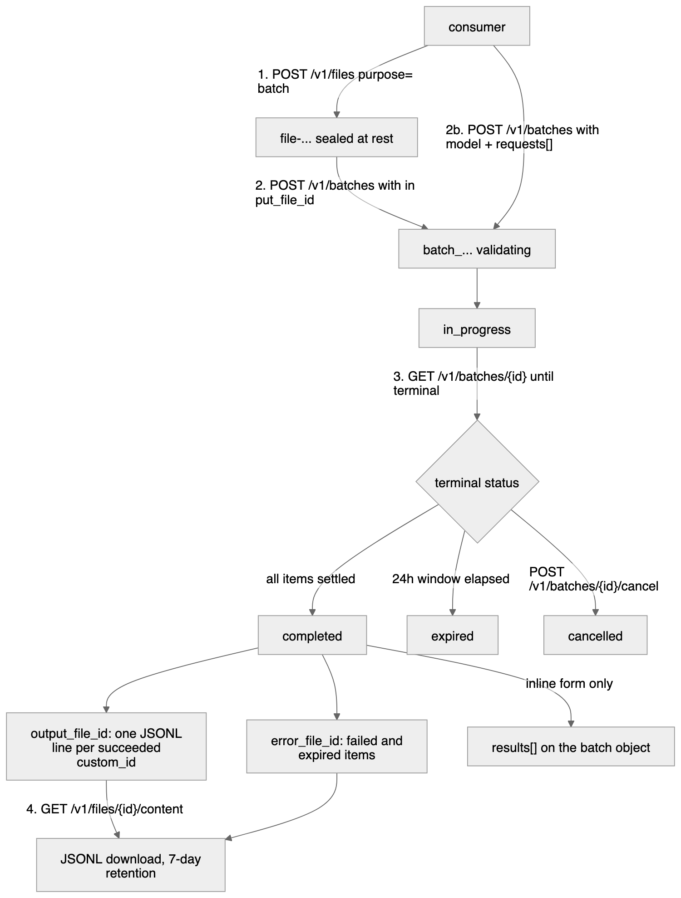

# Batch API

> Last updated: 2026-09-04 · commit `a0a03dca8`

Send a large set of chat completions on a 24-hour deadline instead of one at a
time. Batch work runs only on provider slots the online quality cap is already
leaving empty, so it is cheaper and it never competes with interactive traffic.
The wire shape is OpenAI's Batch API, so an OpenAI SDK works by changing the
base URL. For how the lane works inside the coordinator see
[`../architecture/batch-lane.md`](../architecture/batch-lane.md).



## Prerequisites

- An API key (`sk-db-…`) — see [`authentication.md`](authentication.md).
- Base URL `https://api.darkbloom.dev`.
- A model from [`models.md`](models.md). It is resolved to a concrete build at
  submission time, so an alias that moves later does not change what runs.
- The coordinator must have the batch lane configured. Without it every route
  below answers `503` `batch_unavailable`
  ([`../reference/configuration.md`](../reference/configuration.md#batch-lane)).

## Steps

### 1. Upload the input file

One JSON object per line. `custom_id` is how you match a result back to a
request; `url` must equal the endpoint the batch will target.

```bash
cat > requests.jsonl <<'EOF'
{"custom_id":"a1","method":"POST","url":"/v1/chat/completions","body":{"model":"qwen3.5-0.8b","messages":[{"role":"user","content":"Summarise: ..."}]}}
{"custom_id":"a2","method":"POST","url":"/v1/chat/completions","body":{"model":"qwen3.5-0.8b","messages":[{"role":"user","content":"Summarise: ..."}]}}
EOF

curl -s https://api.darkbloom.dev/v1/files \
  -H "Authorization: Bearer $DARKBLOOM_API_KEY" \
  -F purpose=batch \
  -F file=@requests.jsonl
```

```json
{"object":"file","id":"file-…","purpose":"batch","filename":"requests.jsonl","bytes":412,"created_at":1757000000,"status":"processed"}
```

Every line is validated before a byte is stored, so a malformed file is a `400`
and no file id is minted. The accepted file is written to coordinator disk
sealed (`coordinator/api/batch_files.go`, `handleBatchFileUpload`).

### 2. Create the batch

```bash
curl -s https://api.darkbloom.dev/v1/batches \
  -H "Authorization: Bearer $DARKBLOOM_API_KEY" \
  -H "Content-Type: application/json" \
  -d '{"input_file_id":"file-…","endpoint":"/v1/chat/completions","completion_window":"24h","metadata":{"job":"nightly"}}'
```

The response reports `status: "validating"`; the batch is admitted to
`in_progress` immediately and the next `GET` sees that. The input file's
content is deleted as soon as the per-item copies exist, and its row is marked
purged.

### 3. Poll until terminal

```bash
curl -s https://api.darkbloom.dev/v1/batches/batch_… \
  -H "Authorization: Bearer $DARKBLOOM_API_KEY"
```

Poll on the order of a minute, not a second. Full object shape:
[`../reference/api-contracts.md`](../reference/api-contracts.md#batch-object).

### 4. Download the results

```bash
curl -s https://api.darkbloom.dev/v1/files/file-…/content \
  -H "Authorization: Bearer $DARKBLOOM_API_KEY" > results.jsonl
```

`output_file_id` holds one line per succeeded request, in input order;
`error_file_id` holds one line per failed or expired request. Either is `null`
when it would be empty. Both survive 7 days after the batch completes and are
never deleted on retrieval, so a failed download is retryable.

```json
{"id":"bitem_…","custom_id":"a1","response":{"status_code":200,"request_id":"…","body":{ /* the OpenAI response */ }},"error":null}
```

### Python (OpenAI SDK)

```python
from openai import OpenAI

client = OpenAI(base_url="https://api.darkbloom.dev/v1", api_key=DARKBLOOM_API_KEY)

f = client.files.create(file=open("requests.jsonl", "rb"), purpose="batch")
b = client.batches.create(
    input_file_id=f.id,
    endpoint="/v1/chat/completions",
    completion_window="24h",
)

while b.status not in ("completed", "failed", "expired", "cancelled"):
    time.sleep(60)
    b = client.batches.retrieve(b.id)

if b.output_file_id:
    print(client.files.content(b.output_file_id).text)
```

### Inline form (OpenRouter shape)

Skip the file. Send the model once and the requests in the body; read the
results off the batch object.

```bash
curl -s https://api.darkbloom.dev/v1/batches \
  -H "Authorization: Bearer $DARKBLOOM_API_KEY" \
  -H "Content-Type: application/json" \
  -d '{"endpoint":"/v1/chat/completions","completion_window":"24h","model":"qwen3.5-0.8b",
       "requests":[{"custom_id":"a1","body":{"messages":[{"role":"user","content":"hi"}]}}]}'
```

Create answers `202`. Once the batch is terminal, `GET /v1/batches/{id}`
carries `results[]` alongside the usual `output_file_id` / `error_file_id` —
both surfaces are always populated, and both read the same stored results.

| | File form | Inline form |
|---|---|---|
| Request body field | `input_file_id` | `model` + `requests[]` |
| `source` on the batch | `"file"` | `"inline"` |
| Create status code | `200` | `202` |
| Per-request `model` | required on every line | optional; the body's value wins over the top-level one |
| Results | `output_file_id` / `error_file_id` | those **and** `results[]` on the batch object |
| Cap | 50 000 lines | 10 000 requests |

Exactly one of `input_file_id` and `requests` may be present; both, or
neither, is a `400`.

### One synchronous request on the batch lane

Add `"service_tier": "batch"` to an ordinary `POST /v1/chat/completions`. The
request is placed only in slot headroom, never queued and never hedged, and is
priced as batch. When no slot has headroom you get an immediate refusal rather
than a wait:

```
HTTP/1.1 429 Too Many Requests
Retry-After: 5

{"error":{"code":"no_capacity","type":"rate_limit_exceeded","message":"…"}}
```

Retry after the advertised interval. Every other `service_tier` value is
ignored. Details: [`../reference/api-contracts.md#service-tier`](../reference/api-contracts.md#service-tier).

## Optional: hide the upload from intermediaries

`POST /v1/files` and `POST /v1/batches` accept the coordinator's sealed
envelope, the same one the inference routes accept
([`../reference/api-contracts.md#sealed-transport-wire-shape`](../reference/api-contracts.md#sealed-transport-wire-shape)).
Seal `{"purpose":"batch","filename":"…","content_base64":"…"}` to the key from
`GET /v1/encryption-key` and send it with
`Content-Type: application/eigeninference-sealed+json`.

This hides the upload from anything terminating TLS in front of the
coordinator. It does not hide it from the coordinator, which must parse and
route every request — see
[`../architecture/security/encryption.md`](../architecture/security/encryption.md).

The sealed path carries a smaller file than multipart does. `sealedTransport`
caps the whole outer sealed body at 16 MiB
(`coordinator/api/sender_encryption.go`), and that budget also pays for the
NaCl-Box overhead and two layers of base64, so this path enforces its own
8 MiB file cap (`maxSealedEnvelopeFileBytes`) and answers `413`
`file_too_large` with `param: "content_base64"` above it. Use multipart for
larger files — it accepts the full 16 MiB.

## Optional: seal the results to your own key

Pass `result_public_key`, a base64 32-byte X25519 public key, when you create
the batch. The batch then reports `"sealed_to": "consumer"` and every result is
sealed to that key before it is stored.

| | `sealed_to: "coordinator"` (default) | `sealed_to: "consumer"` |
|---|---|---|
| What is on coordinator disk | ciphertext under the coordinator's batch-store key | ciphertext under **your** key |
| Can the coordinator read a stored result? | yes | no |
| Output line `response.body` | the plain OpenAI response JSON | `{"ephemeral_public_key":"…","ciphertext":"…"}` |
| To read a result | use it directly | NaCl-box open with your private key |

The key is validated strictly: anything that is not exactly 32 bytes of base64
is a `400` `invalid_result_public_key`, never a silent fallback to coordinator
sealing. This guarantees results *at rest*; the coordinator still sees each
request in memory while it routes it.

## Limits

| Rule | Value | Enforced in |
|---|---|---|
| Input file size | 16 MiB (`maxFileBytes`) multipart, 8 MiB (`maxSealedEnvelopeFileBytes`) through the sealed envelope → `413` `file_too_large` | `coordinator/api/batch_jsonl.go`, `coordinator/api/batch_files.go` |
| Input file lines | 50 000 (`maxFileLines`) → `400` `batch_too_large` | `coordinator/api/batch_jsonl.go` |
| Inline requests | 10 000 (`maxInlineRequests`) → `400` `batch_too_large` | `coordinator/api/batch_jsonl.go` |
| `custom_id` | required, `^[A-Za-z0-9_-]{1,64}$`, unique within the batch | `validateCustomID` |
| `metadata` | ≤ 16 keys, key ≤ 64 chars, value ≤ 512 chars | `validateBatchMetadata` |
| `completion_window` | must be `"24h"` | `parseCreateBatch` |
| `endpoint` | `/v1/chat/completions` or `/v1/completions` | `batchEndpoints` |
| `stream` | absent or `false` | `validateBatchBody` |
| `n` | absent or `1` | `validateBatchBody` |
| Content parts | text only — image, audio, video and file parts are refused | `validateTextOnlyContent` |
| `model` | must resolve through the alias table **and** be in the catalog | `batchModelResolver` (`coordinator/api/batch_files.go`) |
| Completion window | 24 h from creation; open items then become `expired` | `batchCompletionWindowDuration` |
| Output retention | 7 days after the batch completes (`BatchOutputRetention`) | `coordinator/api/batch_assembler.go` |
| Feasibility | refused when the fleet's observed rate cannot finish the batch in 80% of the window | `checkBatchFeasible` |
| Listing | `GET /v1/batches?limit=` defaults to 20, caps at 100 | `handleBatchList` |

## Status lifecycle

| Status | Meaning | Next |
|---|---|---|
| `validating` | Created; items sealed and stored. Only ever seen on the create response | `in_progress` |
| `in_progress` | Items are being dispatched into slot headroom | `completed`, `expired`, `cancelling` |
| `cancelling` | You called `/cancel`; open items are cancelled and in-flight ones are being drained | `cancelled` |
| `completed` | Every item settled; output and error files attached | terminal |
| `cancelled` | Cancellation drained | terminal |
| `expired` | The 24-hour window elapsed with items still open | terminal |
| `failed` | Reserved for a batch that could not be admitted at all | terminal |

`request_counts` moves only on a real outcome: `{total, completed, failed}`,
where expired and cancelled items move neither counter, so
`completed + failed ≤ total`.

## Pricing

Batch is metered at half the list price with no per-request minimum charge; the
constants, the formula and the exact `/v1/pricing` fields are in
[`../reference/pricing-model.md#batch-lane`](../reference/pricing-model.md#batch-lane).
Per model, `GET /v1/pricing` carries `batch_input_price`, `batch_output_price`,
`batch_input_usd` and `batch_output_usd` alongside the online prices, and the
response carries `batch_discount` plus the `fallback_batch_*` rates. The batch
figures are derived from the list price, so they cannot drift from it.

One caveat: the balance **reservation** taken before dispatch is still computed
at the full online price, and the excess is refunded at settlement — so a batch
briefly holds more of your balance than it will finally cost.

## Verify

- `POST /v1/files` returns `{"object":"file","id":"file-…"}`.
- `GET /v1/batches/{id}` reports `request_counts.total` equal to your line count.
- The batch reaches `completed` and `output_file_id` is non-null.
- `GET /v1/files/{output_file_id}/content` returns one JSONL line per succeeded
  `custom_id`.

## Troubleshooting

| Symptom | Cause | Fix |
|---|---|---|
| `503` `batch_unavailable` on every batch route | The coordinator has no key to seal batch inputs with, so the lane is off | Operator: set `MNEMONIC` (see [`../reference/configuration.md#batch-lane`](../reference/configuration.md#batch-lane)) |
| `400` `batch_infeasible` | At the fleet's currently observed completion rate the batch cannot finish inside the window | Split it, or resubmit when the fleet is less loaded |
| `400` `invalid_line` naming a line number | That line failed validation. The offending value is never echoed back | Read the `param` field — it names the offending field |
| `400` `model_not_found` | The model is unknown or not in the routable catalog | Check [`models.md`](models.md) |
| `400` `unsupported_content` | An image/audio/video/file content part | Batch is text-only; use a synchronous request |
| `404` `not_found` on a batch or file you own | The id belongs to another account, or does not exist | Both answer the same 404 by design |
| `404` `file_content_purged` | Past the 7-day retention window, or an input file already fanned out into a batch | Metadata remains; the content is gone |
| `409` `batch_not_cancellable` | The batch is already terminal | Nothing to do |
| Batch sits at `in_progress` with no progress | No provider slot has headroom yet — the lane only uses capacity online traffic is not using | Wait; a batch escalates on its own as its slack runs out |

## Related

- [`../architecture/batch-lane.md`](../architecture/batch-lane.md): how the lane picks slots, backs off, and seals at rest.
- [`../reference/api-contracts.md`](../reference/api-contracts.md): exact routes, JSON shapes and error codes.
- [`../design/tidal-batch-lane.md`](../design/tidal-batch-lane.md): the design record and its status.
- [`privacy-expectations.md`](privacy-expectations.md): what a consumer can and cannot assume.
