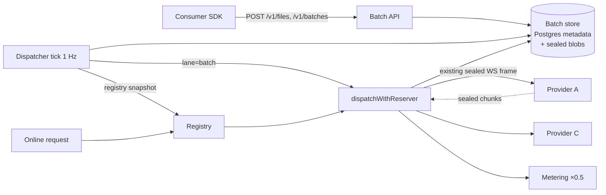

# Tidal batch lane: co-serving online and batch traffic on the idle fleet

> Last updated: 2026-09-05 · commit `2838c3fbf`

**Status: In progress** — 2026-09-05. The store, the sealed blob store, the
Batch API, the lane trait and reservation filter, the 1 Hz dispatcher and the
half-price metering have landed; the co-serving benchmark has not. As-built
description:
[`../architecture/batch-lane.md`](../architecture/batch-lane.md); consumer
how-to: [`../consumer/batch-api.md`](../consumer/batch-api.md).

As-built deviation from §3.3: scrub triggers were not added to the batch
tables; the accepted mitigation is `T-052` in
[`../threat-model.yaml`](../threat-model.yaml) — the three tables carry no
content column at all, asserted by `TestNoContentColumnsInBatchTables`.

Original status: **Proposed** — 2026-09-05; evidence: fleet utilization of 12–19% and a
99.94% free token budget recorded in [`routing-v2.md`](routing-v2.md), and the
`base-rewards.md` observation that a 64 GB Mac needs ~35% sustained batched
utilization to earn its own floor from real traffic.

This record proposes an OpenAI-wire Batch API (`/v1/files`, `/v1/batches`,
24-hour completion window, 50% of list price) implemented entirely inside the
coordinator. A dispatcher fills provider slots that the online quality cap
leaves empty, throttled per slot by an AIMD controller that backs off on any
sign of online pressure, and escalates late batches by laxity rather than age.
Batch inputs and outputs wait on the coordinator sealed at rest, so the
privacy claim in
[`../architecture/security/encryption.md`](../architecture/security/encryption.md)
is unchanged. The design ports the gateway technique from
[Tidal: Co-Serving Online and Batch LLM Traffic under Deadline Contracts](https://doi.org/10.5281/zenodo.22076918)
(v2.4) to Darkbloom's control plane. No provider or wire-protocol change is
required in phase 1.

## 1. Problem

Supply exceeds demand. In the routing-v2 baseline snapshot 137 providers were
routable, 90 had a model warm, 16 were active, none were queued, and the
fleet token budget was 99.94% free. A warm provider serving nobody still
holds weights in memory and a GPU powered, and earns nothing. The proposed
answer so far, [`base-rewards.md`](base-rewards.md), is a flat uptime floor
that costs roughly $7.6k–9.5k a month and, by its own arithmetic, does not
self-liquidate.

The headroom is perishable. A CBv2 engine step with an empty row is throughput
lost at that step; it cannot be banked. Tidal's paper measured that a node
serving only chat emits about a third of the tokens per second it sustains
saturated, and that a gateway sidecar recovers 69–78% of the offline ceiling
on GPU nodes while holding online p99 at 1.18–1.23× an online-only node.

## 2. Goals and non-goals

Goals:

- Sell idle provider capacity as a batch tier: 24 h window, 50% of the
  online list price, OpenAI Batch API wire shape so existing SDKs work.
- Never let batch work push an online request past the quality cap the
  router already enforces (decode floor 15 tok/s, `rate(B) = solo/(1+k·B)`).
- Persist batch inputs and outputs only as ciphertext; keep Postgres free of
  prompt content, hashes or prefixes, matching today's `inference_routes`.
- Pay providers for batch tokens at the discounted rate; keep the platform
  fee model untouched.
- Measure the result on real Apple Silicon: batch harvest, online p99 ratio,
  provider earnings per hour, before and after.

Non-goals for phase 1:

- Changing the provider binary or the WebSocket protocol. The provider does
  not learn that a request is batch.
- In-engine token-budget packing or preemption (Tidal technique B). The CBv2
  scheduler lives in `mlx-swift-lm` and is deferred to phase 2.
- Console UI work beyond exposing batch prices on `/v1/pricing`.
- Multi-coordinator dispatcher ownership. Production runs one coordinator;
  the design documents the single-dispatcher assumption.

## 3. Architecture



Everything new lives in the coordinator. The dispatcher consumes the registry
snapshot that heartbeats already keep fresh and calls the same dispatch funnel
online requests use. The only routing difference is a candidate filter.

### 3.1 Components

| Component | Package | Responsibility |
|---|---|---|
| Batch store | `store/` (interface, memory, postgres) + `batchblob/` | Files, batches, items as metadata rows; sealed item bodies and results as blobs on the userdata disk; atomic claim; idempotent terminal transitions; purge. |
| Batch API | `api/batch_*.go` | `/v1/files`, `/v1/batches`, JSONL validation, admission feasibility, output and error file assembly, cancel, retrieval. Behind `requireAuth` and the consumer rate limiter. |
| Dispatcher | `batchlane/` | Tick loop: EWMA of slot signals, AIMD per provider·slot, laxity and priority, claim, dispatch, expiry sweep. Pure control functions with an injected clock. |
| Metering | `payments/` + `store/` | Lane multiplier on price resolution; `lane` column on `inference_routes` and earnings; batch prices on `/v1/pricing`. |
| Evaluation | `e2e/` | Co-serving benchmark condition; markdown report. |

### 3.2 Data model

Postgres tables (metadata only; no column may carry content):

```
batch_files      id, account_id, purpose, filename, size_bytes,
                 created_at, blob_ref, purged_at
batches          id, account_id, input_file_id, endpoint, status,
                 completion_window, created_at, expires_at, in_progress_at,
                 completed_at, cancelled_at, counts_total, counts_completed,
                 counts_failed, output_file_id, error_file_id,
                 result_public_key, sealed_to, source ('file'|'inline'), model, metadata_json
batch_items      id, batch_id, custom_id, line_no, state, attempts, last_error_code,
                 prompt_tokens, completion_tokens, submitted_at, finished_at,
                 request_id, blob_ref, result_blob_ref
                 UNIQUE (batch_id, custom_id)
```

State machines follow the Tidal store exactly. Batch:
`validating → in_progress → completed | expired | cancelling → cancelled`, or
`validating → failed`. Item: `pending → inflight → succeeded | failed`, or
`→ expired | cancelled`. `counts_completed` counts only `succeeded`;
`counts_failed` counts only `failed`; expired and cancelled items count in
neither, so `completed + failed ≤ total` (OpenAI semantics).

Claiming is one atomic `UPDATE … WHERE state='pending' … RETURNING` bounded by
the tick's headroom. Terminal transitions are idempotent so a duplicate or late
result never moves the counts twice. Attaching an output file is
first-writer-wins.

### 3.3 Sealed at rest

The threat model assumes prompts never touch coordinator disk; a batch lane
must hold items for hours. Three rules keep the lane inside the accepted model:

1. Content never enters Postgres. Blobs live under
   `/mnt/disks/userdata/batch/` (dev: a configurable directory), mode 0600,
   named by item id. The scrub-trigger idiom already used for
   `cache_affinity_key` is attached to any column that could carry content.
2. Every blob is ciphertext. Each uploaded file and each item is NaCl-boxed
   with a fresh ephemeral key to a **batch-store** X25519 key derived like the
   e2e key: HKDF over the coordinator mnemonic with the domain string
   `eigeninference-coordinator-batchstore-v1`. A consumer may seal the upload
   in transit with the existing sender-side sealing (a sealed JSON envelope to
   the key from `GET /v1/encryption-key`); it is unsealed in memory and
   re-sealed per item, never stored as received. Results are boxed to
   `result_public_key` when the consumer supplied one at batch creation (the
   key is validated as 32 bytes, else the batch is rejected, and the batch
   object reports `sealed_to: consumer`), otherwise to the batch-store key.
   With a consumer key the coordinator cannot read outputs after assembly.
3. Plaintext exists only in Confidential-VM memory for one dispatch: open the
   item, hand it to the existing funnel which boxes it to the provider's
   attested key, zero the buffer.

Retention: item input blobs are deleted as soon as the batch is finalized;
result blobs and output files are deleted seven days after completion, at
expiry, or on cancel, never on retrieval, so a failed download is retryable.
`custom_id` is limited to 64 characters of `[A-Za-z0-9_-]`, `metadata` to 16
short keys, and neither appears in logs, metrics, or file names. Error-file
messages are fixed strings per code, never provider text. `threat-model.yaml` gains an asset (batch inputs
and outputs at rest) and a trust boundary (coordinator local disk) with these
mitigations. Stated limit: the batch-store key derives from the same mnemonic
as the e2e key, is not KMS-managed, rotates by redeploy, and is readable by
root on the CVM host exactly as the e2e key is today.

When no mnemonic is configured (local dev), the store refuses to accept
batches unless `EIGENINFERENCE_BATCH_DEV_INSECURE_KEY=true` sets a
process-local random key, and logs that outputs will not survive restart.

### 3.4 Dispatcher

Runs one goroutine under `saferun`, period 1 s, single instance per
coordinator. Each tick:

1. **Observe.** For every provider·slot in the registry snapshot read
   `NumRunning`, `NumWaiting`, `ActiveTokenBudgetUsed/Max`,
   `ObservedDecodeTPS`; smooth each with an EWMA, α = 0.5. Derive
   `kv = ActiveTokenBudgetUsed / ActiveTokenBudgetMax`.
2. **AIMD per slot.** With `target` the allowed batch in-flight count:

   ```
   if waiting > 0 or decodeTps < decodeFloor or kv > 0.85:
       target = max(floor, target / 2)          # multiplicative decrease
   elif kv < 0.70 and target < maxPerSlot:
       target = target + 1                      # additive increase
   ```

   `decodeFloor` is the model's quality floor from `registry/concurrency_cap.go`
   (default 15 tok/s). `maxPerSlot` is the router's own quality-concurrency
   number for that provider and model minus one, so one row is always
   reserved for online traffic and batch can never be the request that pushes
   a slot past the cap. The decrease rule fires on any waiting row, whichever
   lane it belongs to.
3. **Laxity and priority.** Per batch:

   ```
   rate     = observed items/s over 60 s (fallback: global rate; cold start: slack only)
   laxity   = (expires_at − now) − remaining_items / rate
   urgency  = clamp(1 − laxity / 6h, 0, 1)
   priority = round(100 − urgency × 99)      # 100 lowest … 1 highest
   ```

   Above urgency 0.9 a per-batch token bucket (refill 0.2 items/s) grants a
   progress floor of one in-flight item so a late batch is never starved to
   expiry. Priority orders claims; it never bypasses the AIMD target.
4. **Claim and dispatch.** Claim `Σ(target − inflight)` items ordered by
   priority then line number, open each in memory, and call the existing
   dispatch funnel with `Lane = LaneBatch`. The reservation path's candidate
   filter for `LaneBatch` admits only providers with `NumWaiting == 0` and
   `NumRunning` below the batch row allowance; batch never takes the
   coordinator wait queue, never triggers hedges, and never feeds provider
   reputation or TTFT calibration, so co-serving cannot distort the router's
   model of a provider. A claim that finds no capacity is released without
   counting an attempt. Batch attempts use their own first-content deadline
   (120 s).
5. **Settle.** On success store the sealed result, record tokens on the item,
   meter at the batch rate. On provider error retry up to 3 attempts, then
   `failed`. On coordinator restart, in-flight items are requeued.
6. **Sweep.** Expire batches past `expires_at`; finalize batches with no open
   items into output and error files; purge blobs past retention.

Admission feasibility at batch creation: reject with 400 if
`items / globalCompletionRate(1 h) > 24 h × 0.8` and a rate is known.

### 3.5 Metering

Price resolution is unchanged (provider custom → platform → fallback). A lane
multiplier of 0.5 is applied for `LaneBatch` before the minimum-charge rule;
batch items have no per-request minimum. Provider payout is the discounted
cost minus the platform fee. `inference_routes` and `provider_earnings` gain a
`lane` column so earnings can be reported by lane. `/v1/pricing` lists
`batch_input_per_million` and `batch_output_per_million` per model.

### 3.6 API contract

```
POST /v1/files            multipart, purpose=batch, ≤ 16 MiB, ≤ 50 000 lines
GET  /v1/files/{id}       file object
GET  /v1/files/{id}/content
POST /v1/batches          OpenAI form:     {input_file_id, endpoint, completion_window:"24h", metadata?, result_public_key?}
                          OpenRouter form: {endpoint, model, requests:[{custom_id, body}], completion_window?, result_public_key?}
GET  /v1/batches/{id}     batch object; inline batches also carry results[] once completed
GET  /v1/batches?limit&after
POST /v1/batches/{id}/cancel
```

Two consumer shapes, one implementation. The OpenAI form is what every
OpenAI SDK sends. The OpenRouter form matches OpenRouter's beta Batch API
(`POST /api/beta/batches` with an inline `requests` array and inline
results), so OpenRouter can front Darkbloom's batch tier without a translation
layer. OpenRouter has no provider-side batch contract and paces batch jobs as
ordinary synchronous calls; those reach the discounted lane through
`service_tier: "batch"` on a synchronous request, which routes only to
headroom slots, never queues or hedges, is metered at the batch rate, and
returns 429 with `Retry-After` when no slot has headroom.

Accepted `endpoint` values: `/v1/chat/completions`, `/v1/completions`. Each
JSONL line is `{custom_id, method:"POST", url, body}`; `body.stream` must be
absent or false, `body.n ≤ 1`, and `body.model` must resolve in the catalog.
Output line: `{id, custom_id, response:{status_code, request_id, body}, error:null}`;
error line: `{id, custom_id, response:null, error:{code, message}}` with codes
`request_failed`, `batch_expired`.

## 4. Evaluation

A new e2e condition runs three phases on one machine with one provider and
one small CBv2 model: online-only baseline, co-serving, and offline-only
ceiling. Reported: batch harvest as a percentage of the offline ceiling,
online p50 and p99 ratio to baseline, and provider earnings per hour by lane.
The online latency bound is asserted against the in-session baseline, not a
fixed number. Multi-provider placement is exercised in
`registry/routingsim` with synthetic providers.

## 5. Phase 2 (not in this record's scope)

A `lane` field on the inference frame lets the provider order batch rows
behind online rows in its waiting queue, and lets the coordinator cancel and
requeue batch rows when an online request arrives at a saturated slot. That
is a cheap approximation of Tidal's in-engine technique without touching the
CBv2 scheduler.

## 6. Delivery

Developed on the fork `rajagurunath/d-inference`, integration branch
`tidal/main`, one PR per component in the order store → API → dispatcher →
metering → evaluation → docs and threat model. Each PR carries a before/after
Mermaid diagram and tests against both store backends, per
[`../../CONTRIBUTING.md`](../../CONTRIBUTING.md).
