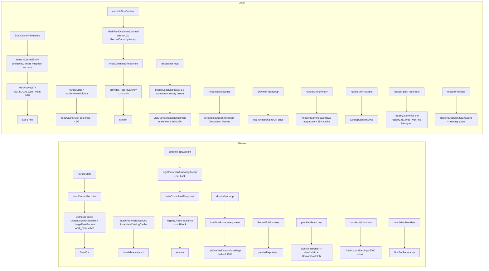

# Coordinator Performance Tier 1 Rollout

> Last updated: 2026-09-04 · commit `fcecc3675`

Operator companion to the `perf/coordinator-tier1-2026-09-03` branch (the
code items 1.1, 1.3–1.8 of the 2026-09-03 coordinator performance proposal).
Follows [`coordinator-deploy.md`](coordinator-deploy.md) for the mechanics of
every container swap and env refresh; this document adds the branch's
human-only steps (`GOGC`), the Tier 0 environment knobs the proposal asks an
operator to set, and the before/after picture of what the branch changes.

Everything under **Human-only** mutates production and is executed only by a
human operator or a human-approved agent with per-action approval. The agent
that prepared this branch has **not** added any env line to any prod file.

Canonical code (code wins over this doc; find declarations by symbol):

| Behavior | Code |
|---|---|
| Bounded usage history with lazy allocation | `coordinator/payments/payments.go` (`Ledger.RecordUsage`, `usageHistoryGrowth`) |
| Shared cache refresh and cold-miss coalescing | `coordinator/api/cache_refresher.go` (`StartCacheRefreshers`, `getCachedEntry`, `refreshCachedEntry`, `computeCachedEntry`) |
| Stats / network totals computation | `coordinator/api/stats.go` (`computeStats`, `handleStats`); `coordinator/api/network_totals.go` (`computeNetworkTotals`, `handleNetworkTotals`) |
| Analytics transaction and query errors | `coordinator/store/postgres_analytics.go` (`withAnalyticsTx`, `UsageLocationBuckets`, `UsageFlowBuckets`, `NetworkTotals`) |
| Verification poller cadence + busy floor | `coordinator/api/mdm_scheduler_exec.go` (`shouldLoadDueRows`, `nextDispatchDelay`) |
| Dashboard rolling windows | `coordinator/store/postgres_dashboard.go` and `coordinator/store/memory_dashboard.go` (`AccountEarningsWindows`); `coordinator/api/me_summary_cache.go` (`accountEarningsWindows`) |
| Batched reputation reads | `coordinator/store/postgres_dashboard.go` and `coordinator/store/memory_dashboard.go` (`GetReputations`); `coordinator/api/me_handlers.go` (`attachStoredReputations`) |
| Capacity accept off the first-byte path | `coordinator/api/dispatch.go` (`commitFirstContent`); `coordinator/registry/capacity_cooldown.go` (`RecordCapacityAcceptObserved`) |
| Throttled reputation persist | `coordinator/registry/registry.go` (`RecordJobSuccess`, `Disconnect`); `coordinator/registry/persistence.go` (`persistReputationThrottled`) |
| Single provider-frame decode | `coordinator/api/provider.go` (`providerReadLoop`) |
| Cancel only when generation still needs stopping | `coordinator/api/dispatch.go` (`writeCommittedResponse`); `coordinator/api/provider.go` (`handleChunk`, synthesized-error cancellation) |
| No shed-path fleet walk | `coordinator/api/inference_admission.go` (`runInferenceAdmission`, `skipServability`) |
| Lock-wait histogram by call site | `coordinator/registry/lock_wait.go` (`lockWrite`); `coordinator/api/server.go` (`NewServer`) |
| Scan counter | `coordinator/registry/scheduler.go` (`RoutingDecision.ScanCount`); `coordinator/api/dispatch.go` (`recordRoutingDecisionFor`) |
| Contention profiles | `coordinator/cmd/coordinator/main.go` (`enableContentionProfiling`) |

## Prerequisites

- The branch is merged and the image built by the repository trigger
  (`coordinator-deploy.md` §1). Nothing below applies to an image without it.
- The pprof listener is configured on the prod container
  (`EIGENINFERENCE_PPROF_ADDR=127.0.0.1:6060`, loopback only). Every
  verification step reads `/debug/pprof/` on the VM over that loopback
  address; with the branch deployed the listener also enables the mutex and
  block profiles.
- Read access to Datadog for the new series `d_inference.registry.mu.write_wait_ms`
  (tag `site`), `d_inference.routing.scans`, `d_inference.cache.refresh_failed`
  (tag `key`).

## Steps — code items (deploy only)

Items 1.1, 1.3–1.8 need no configuration: they are live as soon as the
container runs the merged image. The only operator decision they introduce
is when to apply `GOGC=400` (below), which is gated on 1.1 being verified.

### Verification after the swap

Run 30–60 min after the swap, then again at 24 h:

```bash
# 1. Heap: the usage ledger must be flat (it was +442 MB/day before 1.1).
#    payments.(*Ledger).RecordUsage should hold at most a few MB in-use.
#    The VM has no Go toolchain: use the symbolized text profile (debug=1),
#    or copy the binary profile off-box and run `go tool pprof -top
#    -inuse_space` on a workstation.
curl -s 'http://127.0.0.1:6060/debug/pprof/heap?debug=1' | grep -B1 -A3 'RecordUsage' | head -20

# 2. Stats refresher: one statement set per 30 seconds, never per request.
#    The pipelines were ~1,950/h before 1.3; expect ~120/h (locations + flows)
#    and ~240/h network totals (4 windows x 60/h).
sudo docker logs coordinator --since 10m 2>&1 | grep -c 'cache refresh'   # failures only; 0 is the healthy answer

# 3. Verification poller: the durable table is read ~1/s, not ~34/s
#    (pg_stat_user_tables.seq_scan on provider_verification_jobs, read-only).

# 4. Lock waits and scans are now measured directly:
#    d_inference.registry.mu.write_wait_ms by site, d_inference.routing.scans.
```

Acceptance for the branch as a whole (from the proposal's validation plan):
`registry.mu.write_wait_ms` p50 for `site:capacity_accept` should be
irrelevant to TTFT (it no longer sits on the first-byte path), and
`routing.scans` per attempt is the number the two disagreeing instruments
must now agree on.

## Human-only — `GOGC=400` (item 1.2)

[INFERENCE] After bounding the ledger, the proposal estimates a live heap
of ~0.2–0.3 GB instead of the measured 1.1 GB and growing. Verify this gate
on the deployed build; these are estimates, not post-deploy measurements.
`GOGC=400` cuts the GC cycle rate by 4x for a heap goal of ~1.25 GB (about
today's RSS). It must **not** be applied before 1.1 is verified live for 24 h:
`GOGC` multiplies the heap goal, so retained growth would allow a larger
heap before each collection; it does not change the rate of that growth.

### Gate (24 h after the swap)

```bash
# On the VM (no Go toolchain): the text profile lists in-use bytes per
# allocation site, symbolized. The first two numbers of each record are
# in-use objects and in-use bytes.
curl -s 'http://127.0.0.1:6060/debug/pprof/heap?debug=1' -o /tmp/heap-24h.txt
grep -B1 -A3 -E 'RecordUsage|literalStore' /tmp/heap-24h.txt | head -40
# Or off-box: curl the binary profile to a workstation and run
#   go tool pprof -top -inuse_space -nodecount=30 heap-24h.pprof
```

Proceed only if `payments.(*Ledger).RecordUsage` is at most a few MB in-use
and `encoding/json.(*decodeState).literalStore` reached from
`providerReadLoop` is well under 100 MB. `HeapInuse` alone is not the gate; it
swings with the GC cycle.

### Where the line goes

`GOGC` reaches the process only through `--env-file /etc/d-inference/env` on
a **new** `docker run`. Docker does not reread the env file on restart
(`coordinator-deploy.md`, "Exact-cache promotion gate").

1. Add the key to **both** release manifests in the same release
   (`deploy/gcp/prod/refresh-env.sh` reads both):

   ```text
   # deploy/gcp/prod/release-env-defaults — append
   # Go GC target after the in-memory usage ledger was bounded (perf Tier 1.1).
   # Do not raise further without re-checking RecordUsage in-use bytes.
   GOGC=400
   ```

   ```text
   # deploy/gcp/prod/required-env-keys.txt — append
   GOGC
   ```

   Listing a brand-new key in both is supported. The required-key pass that
   runs against the live env *before* the merge exempts every key the
   defaults file supplies (`deploy/gcp/prod/refresh-env.sh`,
   `require_existing_values` with `allow_defaults=1`), so a host with no
   `GOGC` is not failed for lacking it. The defaults merge appends the key
   and prints `ADD GOGC=400`. The post-merge `require_existing_values` call
   enforces the whole manifest without exemption, before the `--check` exit.
   `EIGENINFERENCE_MODEL_SOLO_TPS_SEED` shipped this way.

   The manifest entry is what makes a blank value fail closed. The merge adds
   only *absent* keys, so a host carrying an empty `GOGC=` line keeps it.
   Without the manifest entry that host passes `--check`, and the Go runtime
   treats an empty `GOGC` as unset (`runtime.readGOGC` falls back to 100): the
   default GC rate is silently restored while the env file looks configured.
   With the entry, `--check` and `--apply` both stop with
   `required existing variables are missing or empty: GOGC`, and the operator
   fixes the line by hand before the swap.

2. Mirror the key in the sanitized reference `deploy/environments/prod.env`
   so the file keeps matching the live env (it seeds nothing; see the
   `EIGENINFERENCE_MODEL_SOLO_TPS_SEED` note in `coordinator-deploy.md`).

3. On the VM, follow `coordinator-deploy.md` §3 (refresh env and capture
   rollback) and §4 (swap). The refresh writes `/etc/d-inference/env`; the
   swap's `docker run … --env-file /etc/d-inference/env` picks it up.

   ```bash
   sudo /usr/local/sbin/darkbloom-refresh-env --check    # expect: ADD GOGC=400
   sudo /usr/local/sbin/darkbloom-refresh-env --apply
   sudo grep -E '^GOGC=' /etc/d-inference/env            # expect: GOGC=400
   # then the §4 container swap
   ```

Optional guard: `GOMEMLIMIT=12GiB` goes in the same file the same way. It does not waive the preceding 24 h verification gate for `GOGC=400`.

### Verification

Two samples 60 s apart from the pprof listener:

```bash
for i in 1 2; do
  curl -s 'http://127.0.0.1:6060/debug/pprof/heap?debug=1' | grep -E '^# (NumGC|NextGC|HeapAlloc) '
  sleep 60
done
```

- `NumGC` per minute must be about one quarter of the pre-`GOGC` rate
  (~4.7 cycles/s measured on the fresh process at `GOGC=100`).
- `NextGC` should sit at about 5x the post-GC `HeapAlloc` (`GOGC=400` means
  the goal is live heap + 4x live heap).
- Confirm in the container env: `sudo docker exec coordinator env | grep -E '^GOGC='`.

### Rollback

Remove the `GOGC` line from `/etc/d-inference/env` and the key from the three
repo files (`release-env-defaults`, `required-env-keys.txt`,
`deploy/environments/prod.env`), then run the §4 swap again; there is no
in-place way to change it. Drop the manifest entry in the same change as the
default: a manifest that requires a key the defaults no longer supply fails
every later `--check` on a host where the line was removed.

## Human-only — Tier 0 environment knobs

Each is one env line taking the same path as `GOGC` above (`release-env-defaults`
→ `refresh-env.sh --apply` → `/etc/d-inference/env` → new `docker run`).
Whether to list a knob in `required-env-keys.txt` as well is decided per key:
do it when a blank value must fail closed (the `GOGC` reasoning), leave it out
when the knob's absence is the intended default. Every one is read once at
process start.

| # | Knob | Value | Effect (from the proposal) |
|---|---|---|---|
| 0.1 | `EIGENINFERENCE_MIN_PROVIDER_VERSION` | `0.7.5` today → `0.8.12`, then `0.8.15` | Deroutes the ~4 % of the fleet on old builds that produce a large share of `first_chunk_timeout`; staged so no more than that share drops at once. The floor is manual by design (`coordinator/api/server.go`, `SetMinProviderVersion`). |
| 0.3 | `EIGENINFERENCE_MODEL_FIRST_CONTENT_BASES` | `qwen3-vl-30b-a3b-instruct=off` | Removes the hardcoded 4 s first-content cutoff for that model (`0`/`off` deletes the built-in entry so the model uses the global base; parsed by `main` in `coordinator/cmd/coordinator/main.go`). Risk removal for the 2026-08-31 class of incident. |
| 0.5 | `EIGENINFERENCE_PROFILE_SAMPLE_RATE` | operator decision, `0..1` (default `0.1`) | Today ≈53 % of successes are recorded because every non-success / slow / retried request bypasses sampling (`coordinator/api/profiler.go`, `profiler.sampled`). Decide whether ~9 GB/day of `request_profiles` is intended before touching it; `EIGENINFERENCE_PROFILER=off` is the kill switch. |

Commands for one knob (repeat per key; values are the ones from the table):

```bash
# 1. repo: append the line to deploy/gcp/prod/release-env-defaults and mirror it in deploy/environments/prod.env
# 2. VM (human-only):
sudo /usr/local/sbin/darkbloom-refresh-env --check     # expect ADD <KEY>=<value>
sudo /usr/local/sbin/darkbloom-refresh-env --apply
sudo grep -E '^EIGENINFERENCE_(MIN_PROVIDER_VERSION|MODEL_FIRST_CONTENT_BASES|PROFILE_SAMPLE_RATE)=' /etc/d-inference/env
# 3. coordinator-deploy.md §4 swap, then:
sudo docker logs coordinator --since 5m 2>&1 | grep -E 'first-content deadline bases|min provider version|profile'
```

For a key that already exists in the live env with a different value,
`refresh-env.sh` preserves the live value: edit `/etc/d-inference/env`
directly (root-only, timestamped backup first, as in §3) instead of relying
on the defaults merge.

Items with no env knob:

| # | Item | Note |
|---|---|---|
| 0.2 | Evict the wedged `gpt-oss` session (28.6 % of first dispatches, 0 served) | There is no admin endpoint that disconnects a provider session. Identify the session with the utilization-research query, then use the operator's existing channel to the provider (restart/reconnect). A durable "narrow wedge skip" is a separate code change. Human-only. |
| 0.4 | `deploy/environments/prod.env` says `EIGENINFERENCE_TTFT_HARD_REJECT=true`; the live container runs `false`. `CLAUDE.md` still says the prod database is AWS RDS; it is Cloud SQL PG 17. | Hygiene: fix the sanitized copy to match the live env and the doc to match the infrastructure. No prod mutation. |
| 0.6 | Orphaned Cloud SQL instance `d-inference-prod` (PG 16, RUNNABLE, idle) | Confirm nothing references it (`gcloud sql instances describe d-inference-prod --project darkbloom-mainnet`, then check every env file and Secret Manager DSN for its connection name), then `gcloud sql instances patch d-inference-prod --activation-policy NEVER` before any delete. Human-only. |

## Before / after

### Behaviour

```mermaid
flowchart LR
  subgraph Before
    direction TB
    B1[provider registers] -->|Invalidate stats:v1| B2[every /v1/stats request<br/>runs 2 multi-second statements<br/>~1,950 pipelines/h, temp spill]
    B3[/v1/network/totals timeout/] --> B4[zero row cached 60 s, served as data]
    B5[provider first content] --> B6[RecordCapacityAccept<br/>r.mu.Lock wait ~190 ms p50] --> B7[first client byte]
    B8[completion] --> B9[reputation UPSERT + cancel frame<br/>every request; ledger grows forever]
    B10[verification job due, workers busy] --> B11[1 ms wake -> table scan<br/>34/s, 4,096-row page each]
    B12[/v1/me/summary] --> B13[5,000-row page summed in Go<br/>7 d figure truncated]
    B14[routing_saturated shed] --> B15[fleet walk on the telemetry worker]
  end
  subgraph After
    direction TB
    A1[stats tick 30 s / totals tick 60 s] --> A2[stats:v1 + network_totals:*<br/>one query per family, 5 min safety TTL<br/>last good value kept on timeout]
    A3[provider registers] -.->|no eviction| A2
    A5[provider first content] --> A7[first client byte]
    A5 -.->|goroutine| A6[RecordCapacityAccept]
    A8[completion] --> A9[reputation persist <= 1/30 s,<br/>no cancel after terminal,<br/>ledger capped at 100/consumer]
    A10[verification job due, workers busy] --> A11[250 ms wake, no table read;<br/>durable rows re-read 1/s, initial page capacity <= 256]
    A12[/v1/me/summary] --> A13[one FILTER aggregate over 7 d,<br/>coalesced 15 s per-account cache]
    A14[routing_saturated shed] --> A15[rejection row with unknown servability]
  end
```

### Code flow



## Rollback

The code items roll back with the container swap in `coordinator-deploy.md`
§6; none of them keeps state that outlives the process (the read cache and
the usage ledger are in-memory). `GOGC` and the Tier 0 knobs roll back by
removing the env line and swapping again.
