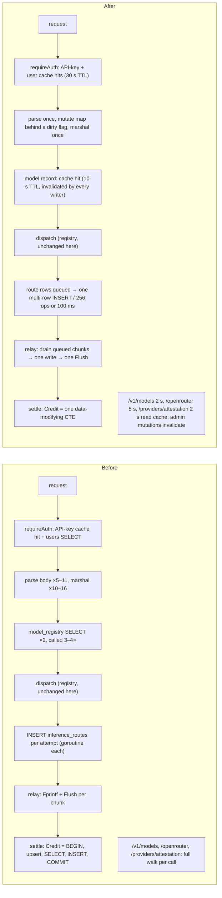
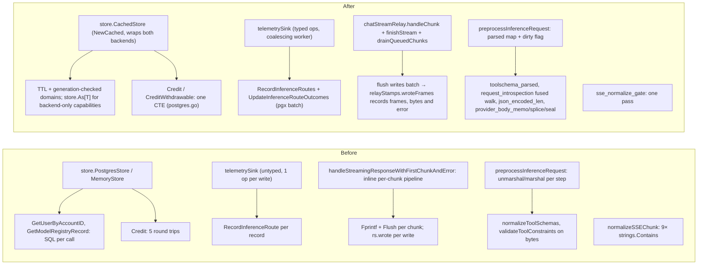

# PR body — coordinator performance program, PR A: `store/` + `api/` (2026-09-03)

> Last updated: 2026-09-04 · commit `bda995368`

_Branch `perf/coordinator-store-api-2026-09-03`. Merge after
`perf/coordinator-tier1-2026-09-03`; before `perf/coordinator-registry-scan-2026-09-03`._

The measurements retain their original 2026-09-03 context. Shutdown and relay
instrumentation notes were corrected during review on 2026-09-04 against
`bda995368`.

## Summary

Lands the store and API half of the 2026-09-02 coordinator performance program
(`docs/reports/2026-09-02-coordinator-performance-program.md`, §4.1, §4.3,
§4.4, §4.6) on current master. The registry half (§4.2 routing scan, §4.5
aggregate paths, fleet-scale bench) is PR B; `coordinator/registry/` in this
branch is byte-identical to master.

Per inference request this PR removes the per-request database round trips
(user + model record become read-through cache hits), parses the request body
once instead of 5–11 times, batches route telemetry into one multi-row insert
per 100 ms, collapses `Credit`/`CreditWithdrawable` from five statements to one,
coalesces already-queued streamed chunks into one write + one flush, decides
SSE normalization in one pass, and serves the public read endpoints from a TTL
cache. Provider-visible bytes and the client byte stream are pinned by identity
and golden tests against the pre-change output.

## Before / After — behaviour

## Before / After — code

## What is in this PR

| Slice | Files | Effect |
|---|---|---|
| §4.1 store read-through cache | `store/cached*.go`, `store/as.go`, `cmd/coordinator/main.go` | user (30 s) / model record + manifest (10 s) / not-found (5 s) cached; invalidated by every mutator; deep copies; generation counter; bounded domains; `store.As[T]` keeps `codeAttestPushBudgetStore` and `verificationDuePageStore` reachable through the decorator; `store.cache.*` gauges |
| §4.3 route-telemetry batching | `api/telemetry_sink*.go`, `api/route_telemetry_submit.go`, `store/*route_telemetry*.go`, `store/write_errors.go` | one worker, ≤256 ops / 100 ms groups, one multi-row `INSERT … ON CONFLICT` + one pgx pipeline per group, per-key order preserved, transient-error classification, post-close rejection, bounded 2 s flush in `Server.Close` |
| §4.3 Credit collapse | `store/postgres.go`, `store/ledger_credit_test.go` | `Credit`/`CreditWithdrawable` 5 → 1 round trip; tracer test asserts byte-identical ledger rows and balances vs the legacy sequence |
| §4.4 streaming relay | `api/chat_stream_relay.go`, `api/stream_coalesce.go`, `api/consumer.go`, `api/generic_endpoint_stream.go`, `api/responses_stream.go` | chat/Responses/generic relays drain already-queued chunks per wake-up (never waiting), identical transforms in order, one flush; goldens: 200-chunk burst 203 → 9 flushes, bytes identical; queued chunks always precede an in-band error |
| §4.4 SSE gate + read cache | `api/sse_normalize_gate.go`, `api/models_cache.go`, `api/models_endpoints.go`, `api/openrouter_endpoint.go`, `api/server.go` | `normalizeSSEChunk` 915 → 191 ns; `/v1/models`, `/v1/models/{id}` (2 s), `/v1/models/openrouter` (5 s), `/v1/providers/attestation` (2 s) cached; `SyncModelCatalog`/`SyncModelAliases` invalidate |
| §4.6 body pipeline | `api/inference_preprocess.go`, `api/provider_body_{memo,seal,splice}.go`, `api/toolschema_parsed.go`, `api/request_introspection.go`, `api/json_encoded_len.go`, `api/tool_constraints.go`, `api/reasoning_request_policy.go` | parses 5 → 1, marshals 10 → 1 (chat); 11 → 4 / 16 → 3 with tools on Responses; identity tests against independent oracles for every rewrite |
| harness | `api/perf_e2e_test.go` | gated (`EIGENINFERENCE_PERF_E2E=1`): real HTTP + in-process WebSocket providers, memory store; knobs `PERF_E2E_{PROVIDERS,REQUESTS,CONCURRENCY,BODY_KB,CHUNKS}` |
| docs | `docs/operations/coordinator-deploy.md`, `AGENTS.md`, `docs/reports/2026-09-02-*` | runbook row for cache staleness after manual SQL edits; AGENTS invariant for the store cache; the program report and its PR-body draft |

## Merge resolution against master (#799, #809, #816)

Source: perf branch `worktree-bridge-cse_01TuyfD42fkRyG4ZqSTmeN4U` (75 commits,
tip `5508b4f84`, based on `a1f51ea4c`), merged onto `ac60c5ada` with
`coordinator/registry/` reset to master and the 26 registry files the branch
added removed. Conflicts and the semantic hazards from
`docs/reports/2026-09-03-coordinator-perf-proposal/05-port-feasibility.md`:

| Where | Master side | Resolution |
|---|---|---|
| `api/consumer.go` (3 hunks), `api/generic_endpoint_stream.go` (1 hunk) | #809 `rs.wrote(n, werr)` after every client write, `rs.done()` after the terminal `[DONE]`, `profileClientGone(pr, phaseAfterCommit)` on every `Context().Done()` arm; #799 `writeChatStreamProviderError` + in-band `ErrorCh` select | perf's `chatStreamRelay` + `finishStream()` structure kept. `chatStreamRelay.flush` writes the batch and calls `relayStamps.wroteFrames` with its frame count, accepted bytes, and write error, so `chunks_out` keeps meaning SSE frames delivered (not flushes), `bytes_out` counts only accepted bytes, and a failed/short write sets `client_write_err`. `rs.done()` runs once after the terminal flush on the non-Responses success path (as on master). `profileClientGone` is on every relay `Context().Done()` arm including the generic relay's `finishStream`. #799's error writer, in-band select, `maxFirstChunkTimeoutRetries`, `errRoutingScanSaturated`, `errClientGoneBeforeScan` and the `dispatchOneProvider`/`dispatchWithReserver` arities are master's. `TestStreamRelay_ChatBurstByteIdentical` now also reads back the persisted request profile: `chunks_out` = 53 frames (a flush-count implementation would read ~9), `bytes_out` = the golden's length, `done_flushed_us` stamped, `client_write_err` false. |
| H7 — six #809 `store.Store` methods | `RecordRequestProfiles`, `RequestProfilesSince[Filtered]`, `RecordFleetSnapshots`, `FleetSnapshotsSince`, `PruneTelemetry` | `CachedStore` embeds `Store` and overrides none of them; `TestCachedStoreForwardsProfilerMethods` writes through the wrapper and reads back from the inner store. `profiler_sink.go` is its own goroutine, so the route sink's post-close rejection cannot drop profile writes. |
| H9 — independent sink shutdown | #809 `profileSink` | `Server.Close` waits up to 2 s for `routeTelemetry.closeAndWait`, then signals `profiler.close()`. The route sink gets a bounded drain-and-wait; the profile sink is best-effort, with no queue drain or worker wait guaranteed. Although `main.go` defers pool closure until after `Server.Close`, queued profile records can still be discarded or outlive that closure. |
| H10 — `api/profiler_sink.go` calls `isPowerOfTen` | perf's sink rewrite deleted it (kept `crossesPowerOfTen(before, after)`) | one call site switched to `crossesPowerOfTen(n-1, n)`: identical throttle (fires at 1, 10, 100, …), no duplicated helper. The walk now stops at 10^18 (`p > 0` guard) instead of overflowing near `math.MaxInt64`; cases added to `TestCrossesPowerOfTen`. |
| H11 — `store/memory.go` `strconv` | #809 kept one `strconv.Itoa` use; perf dropped the import | import restored. |
| `api/server.go`, `cmd/coordinator/main.go` | #816 rewrote the runtime manifest loading in both | auto-merged; perf's hunks (bounded sink flush in `Close`, catalog-cache invalidation, `emitStoreCacheGauges`, `store.NewCached` wiring) do not overlap. |
| `AGENTS.md` | — | the perf branch's "per-model provider index" invariant (a `registry/model_index.go` contract) is dropped here; it returns with PR B. |

Profiler semantics note (for the system-profiler docs): the held finish/usage
frames now count in `chunks_out` and `bytes_out` (master's #809 wrote them
without an `rs.wrote`, stamping only the extras and `[DONE]` frames — an
undercount this fixes). For the chat relay, `first_flush_us` /
`max_chunk_gap_us` are stamped per actual flush. Responses, completions, and
messages emitters call `relayStamps.wrote` for each event write while using
`deferredFlusher`; their timestamps precede the outer relay's coalesced flush
and describe event-write timing, not wire-flush timing. See
`relayStamps.flushedFrames` in `coordinator/api/profiler_dispatch.go`.

## Measurements

The program report's numbers (registry benchmarks, helper-level body
benchmarks, e2e at load ≈ 13) are in
`docs/reports/2026-09-02-coordinator-performance-program.md` §5. The e2e
harness was re-run on the merged tree against master on the same machine,
interleaved master → PR A per round, **at load average 265–340 on 16 cores**
(other sessions' builds and benchmarks were running); absolute numbers are
therefore ~10× below the report's and only the paired comparison is meaningful.
Memory store, 100 providers, 400 requests, 16 concurrent, 40 chunks:

| Body | Rounds | master `ac60c5ada` | PR A | Δ throughput |
|---|---|---|---|---|
| 16 KB | 2 | 167.2 / 157.6 req/s (median 162.4); TTFB p50 33.9 / 38.8 ms, p95 168.9 / 196.7 ms | 195.9 / 201.4 req/s (median 198.7); TTFB p50 36.8 / 33.5 ms, p95 111.1 / 152.0 ms | **+22 %** (both rounds ahead); p95 TTFB −28 % |
| 60 KB | 5 | 117.2 / 105.6 / 50.0 / 98.9 / 103.6 req/s (median 103.6); TTFB p95 median 238 ms | 127.5 / 75.7 / 133.9 / 111.1 / 138.4 req/s (median 127.5); TTFB p95 median 216 ms | **+23 %** median (ahead in 4 of 5) |

With master's registry the reserve/preflight scans are unchanged, and the
memory store hides the database wins, so this is the relay + body-pipeline
share of the program. The database share is measured directly: tracer-backed
tests pin 50 route records + 50 outcome updates at 1 statement + 1 pipeline
(was 100 statements), `Credit` at one statement (was five), and the
`requireAuth` user lookup plus the 3–4 registry-record lookups per request at
zero statements after the first hit. Re-measure on a quiet box before quoting
absolute numbers (feasibility plan step 3).

## Gates run

`gofmt -l` clean; `go build ./...`, `go vet ./...` clean; `golangci-lint
v2.1.6 run ./...` 0 issues. `go test ./store/` against a fresh Postgres 16
(`DATABASE_URL` set, 0 skips, 74 s), `./api/` (131 s), `./cmd/...`,
`./protocol/` all pass. Named suites run verbosely: `TestStreamRelay_*`
(7 goldens + client-disconnect + buffered-error), `TestTelemetrySink*` (16),
`TestServerRouteTelemetry*`, `TestServerCloseFlushesRouteTelemetryBeforeReturning`,
`TestProviderBodyByteIdentity*` (4), `TestSSENormalizeGateMatchesLegacy`,
`TestStoreCacheInvalidatesThroughAdminModelAction`, `TestRelayStamps*`,
`TestChatStreamRelayFlushReportsFramesAndBytes`, `TestCachedStore*` (incl.
`OverPostgres` and `ForwardsProfilerMethods`), `TestInferenceRoute*`,
`TestPostgresCredit*`, `TestCreditSemanticsAcrossBackends`,
`TestConcurrentCreditDebitLedgerConsistency`, `TestPerfE2E_ChatCompletions`.

Independent review (general-purpose agent, read-only) returned PASS on all
four criteria — #799/#809 relay semantics, decorator forwarding, registry
byte-identical, test adequacy — with one should-fix (the profile-row
assertion above) and two nits (the overflow guard; the `flushedFrames`
comment now says the emitter relays stamp per event write, ahead of their
deferred Flush), all applied. staticcheck items it listed in auto-merged perf
files (`S1017` ×2, `ST1008`, `ST1018`, `SA4006`) are pre-existing on the source
branch and out of scope here.

## Notes for reviewers

- The store cache assumes a single coordinator process (documented in
  `store/cached.go`); manual SQL edits take up to the TTL to become visible
  (runbook row in `docs/operations/coordinator-deploy.md`).
- `api/` compiles against master's registry API unchanged; nothing in this PR
  depends on the PR B registry changes.
- Known flakes not touched here: `promptcontract` supervisor tests under load;
  `TestMDMSchedulerDuePagingCannotStarveLiveRowBehindDisconnectedPrefix`.
