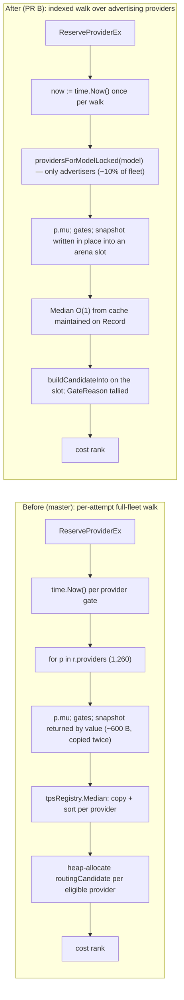
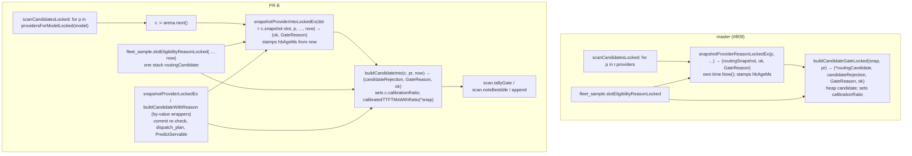

# perf(registry): land the routing-scan half of the 2026-09-02 performance program

> Last updated: 2026-09-03 · commit `99b03a161`

PR B of the landing plan in
`docs/reports/2026-09-03-coordinator-perf-proposal/05-port-feasibility.md`
(on the `coordinator-perf-proposal` worktree branch, not yet on master):
the `coordinator/registry/` slice of the perf branch
`worktree-bridge-cse_01TuyfD42fkRyG4ZqSTmeN4U` (tip `5508b4f84`; program report
§4.2 routing scan, §4.5 aggregate/periodic paths), merged onto master
`ac60c5ada` (#816) with the four conflicted files re-derived by hand so the
#809 system-profiler contract survives the in-place/indexed scan.

**Merge order:** merge after `perf/coordinator-store-api-2026-09-03` (PR A —
`api/` + `store/` + `cmd/`). `perf/coordinator-registry-lock-2026-09-03`
(Tier 3, `Registry.mu` off the request path) stacks on this branch.

**Scope:** 70 files under `coordinator/registry/` plus one documentation
edit outside it — `docs/architecture/system-profiler.md` (the `scanned` /
`candidate_set_size` column definitions, see H4). Zero changes to
`coordinator/api/`, `store/`, `cmd/`, `protocol/`: master's `api/` compiles
and its tests pass against the new registry unchanged.

## What changes

### Behaviour: the per-attempt routing scan

Eligibility gates are unchanged; the index only prunes providers that do not
advertise the model (`index[model] == { p : model ∈ ids(p.Models) }`, pinned
by `TestModelIndexMatchesBruteForceAfterEveryMutation`). Same-walk changes:
the health-ejection kill switch is read once at init, the cache-capability
walk is skipped when hints are impossible, semver segments are memoized and
`{providerID, model}` struct keys replace string concatenation, and the TTFT
calibrator no longer re-sweeps its pending map on every reservation.

### Code: `scanCandidatesLocked` and its helpers

Other registry paths landed with it (program report §4.5): `ListModels`,
`PublicProviderModels` and `evictStale` walks (evictStale now under the read
lock; write lock only to install a changed strike map), three read-only
getters moved from `Lock` to `RLock`, and `model_swap_coalesce.go` (heartbeats
admit at most one swap plan per 250 ms fleet-wide; the api cold-dispatch kick
still plans immediately; the planner's two walks iterate the per-model index).

## Before / after (merged tree vs `origin/master`)

Same M4 Max, same session, `go test ./registry/ -run xxx -bench … -benchtime 2s
-benchmem -count=2`, min of 2. The box was under **load average ~300** (many
concurrent sessions) for both runs, so absolute ns/op are ~5× the quiet-machine
numbers in the program report (reserve 365 µs → 79 µs there); the **ratios and
allocs/op are the load-independent signal**.

| Benchmark (1,260 providers, 15 models) | master ns/op | master B/op | master allocs/op | PR B ns/op | PR B B/op | PR B allocs/op | speed-up |
|---|---:|---:|---:|---:|---:|---:|---:|
| `FleetReserveProviderEx` (scan + commit + release) | 1,897,335 | 194,031 | 815 | **402,588** | 103,400 | **12** | 4.7× |
| `FleetReserveProviderExParallel-16` | 2,177,976 | 245,232 | 1,036 | **394,489** | 127,128 | **12** | 5.5× |
| `FleetQuickCapacityCheck` (preflight RLock walk) | 683,019 | 80,976 | 672 | **164,835** | 1,024 | **1** | 4.1× |
| `FleetPredictServable` | 1,337,510 | 80,976 | 672 | **158,087** | 1,024 | **1** | 8.5× |
| `FleetListModels` (`/v1/models` aggregate) | 888,732 | 249,272 | 1,281 | **469,991** | 3,544 | **19** | 1.9× |
| `FleetHeartbeat` (ingest) | 2,336 | 473 | 6 | 2,239 | 464 | 6 | 1.0× |

`reserve_bench_test` (`BenchmarkReserveProviderEx_350x2`, 350 providers × 2
models, under the same load): 887 µs, 15 allocs/op.

## Conflict resolution and semantic hazards (05 §"Semantic hazards")

Method: `git merge --no-commit --no-ff <perf tip>`; every non-registry path
reset to `origin/master` and the 53 added non-registry files removed. `rerere`
had silently auto-applied an earlier session's resolution of the four
conflicted files (`rerere.enabled=true`, 75-entry cache); it was discarded
(`git checkout --conflict=diff3`) and the files re-derived from the three-way
hunks. That cached resolution took a different H4 route (tallying the
index-pruned providers as `not_serving_model` to keep `Scanned == fleet size`);
this PR instead documents the semantics change (see H4) so the record reports
the work the scan actually did.

| # | Hazard | Resolution |
|---|---|---|
| H1 | `fleet_sample.go` (#809) called the removed `snapshotProviderReasonLockedEx` / `buildCandidateGateLocked` | `slotEligibilityReasonLocked(p, model, probe, now)` builds one stack `routingCandidate` through `snapshotProviderIntoLockedEx` + `buildCandidateInto` and takes the sampler's clock; header/doc comments updated to the new names. The two removed helpers had no other caller. |
| H2 | `buildCandidateInto` holds `snap := &c.snapshot`; master's `calibratedTTFTMsWithRatio` was value-typed and its `calibrationRatio` assignment predated the in-place tail | `calibratedTTFTMs` and `calibratedTTFTMsWithRatio` are both pointer-typed; `buildCandidateInto` reads the ratio once, scores with it, and sets `c.calibrationRatio` on success. `TestReserveProviderExTopRunnerUpAndPath` asserts `TTFTCalibrationRatio == 1.0` after reset (a dropped assignment reads 0). |
| H3 | `snapshotProviderIntoLockedEx` receives `now` but its field list predated `hbAgeMs` | `snap.hbAgeMs = heartbeatAgeMs(now, p.LastHeartbeat)` in the in-place fill; `heartbeatAgeMs` kept. `TestReserveProviderExSnapshotAgeAndPending` asserts `SnapshotAgeMs ≈ 7000` through a real reservation. |
| H4 | Per-model index: the scan only visits advertisers | **Semantics change, documented, not a bug.** `RoutingDecision.Scanned` is now the advertising count (not the fleet size); `GateRejections[not_serving_model]` is 0 unless an advertiser still fails the catalog rule (off-catalog model on a public route); `CandidateSetSize = Scanned − not_serving_model` is unchanged in meaning. The same applies to the pre-snapshot `allowlist` / `excluded` tallies, which now count only advertisers (a serial-allowlist miss used to tally ~fleet size per request) — a consumer trending `gate_rejections.allowlist` sees the magnitude drop at deploy. Comments at `RoutingDecision.Scanned` and at the `candidateSetSize` assignment; `TestGateRejectionTallies/not_serving_model` pins the indexed shape (Scanned 0, no tally) and the brute-force shape (`modelIndexDisabled`); `…/not_serving_model_off_catalog` pins the advertiser-fails-catalog branch (Scanned 1, tally 1, set 0). `docs/architecture/system-profiler.md` column definitions updated. Downstream: the profiler's fleet size is available from the 60 s fleet snapshots. |
| H5 | #799 `routingScanSem` (`NumCPU` slots) shed threshold was calibrated against the old scan cost | Textually orthogonal (the semaphore lives in `api/`). Re-measure `errRoutingScanSaturated` after landing; sizing the semaphore to the container's CPU quota is the Tier-3 follow-up. |
| H8 | #791 `coldTokenBudgetEstimate(…, providerVersion, modelID)` vs the perf branch's pointer-ified budget helpers | Auto-merged; `servability_test.go` takes both (5-arg calls + `snapPtr`). Activation floors untouched. |

Other reconciliations: `routing_eligibility.go` combines `now` and the
reason (`providerSupportsPrivateTextAtLocked(p, now)` → `GatePrivateText`);
`servability.go` `PredictServable` discards the gate reason; the #809 decision
fill passes `&candidate.snapshot` to the now pointer-typed
`projectedPerRequestDecodeTPS`. The 05 "perf side" error list (`registry.go`
`drainQueuedRequestsForModelsWithReason` / `reportedFreeForLoadAdmits` arity,
`gate_reason.go`, `attempt_profile.go` `ScanUS`/`AdmitUS`, `cold_dispatch.go`,
`warm_pool_controller.go`) did not materialise: those callers auto-merged
against master's definitions once `scheduler.go` kept master's profiler
symbols.

## Review

One independent reviewer (Claude general-purpose agent, read-only + `go test`)
over the `scheduler.go` / `fleet_sample.go` diff vs `origin/master`: PASS on
all four items (profiler contract preserved on every drop/success path; index
== brute-force tests present and 13/13 green incl. `-race`; nothing outside
`coordinator/registry/`; bench allocs decomposed with pprof and consistent).
Findings fixed in the follow-up commit: the stale `scanned` definition in
`docs/architecture/system-profiler.md`, the unpinned off-catalog-advertiser
branch of H4, and 13 comments still naming the removed `snapshotProviderLocked`
wrapper. Noted, not changed: `candidateArena.next` and
`snapshotProviderIntoLockedEx` both zero the slot (~600 B memclr per visited
provider; the `next()` zero is needed for reused slots); the branch history is
only safe under squash-merge (master is squash-only — do not rebase-merge).

## Gates

- `gofmt -l .` clean; `go build ./...`; `go vet ./...`; `golangci-lint v2.1.6 run ./...` — 0 issues.
- `go test ./registry/...` green (incl. `routing_context_test`, `fleet_sample_test`, `TestModelIndexMatchesBruteForceAfterEveryMutation`, `TestRoutingWalksIdenticalWithAndWithoutModelIndex`, `TestRoutingWalksIdenticalWithFaultStateWithAndWithoutIndex`, `TestModelIndexOffCatalogSelfRouteStillRoutes`, `reserve_bench_test`).
- `go test ./api/` green — master's api against the new registry, unchanged.
- Known flakes not touched: `promptcontract` supervisor test under load; `TestMDMSchedulerDuePagingCannotStarveLiveRowBehindDisconnectedPrefix` (pre-existing).
