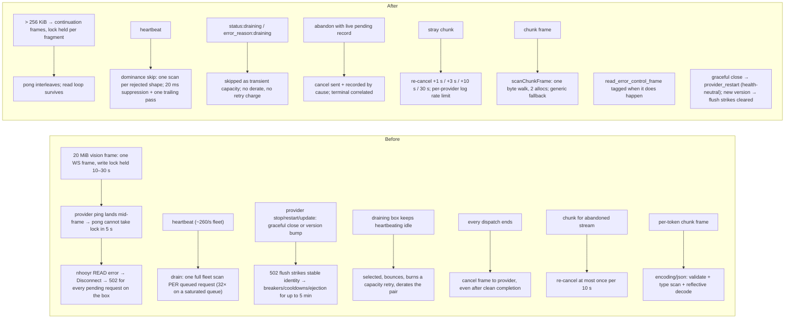
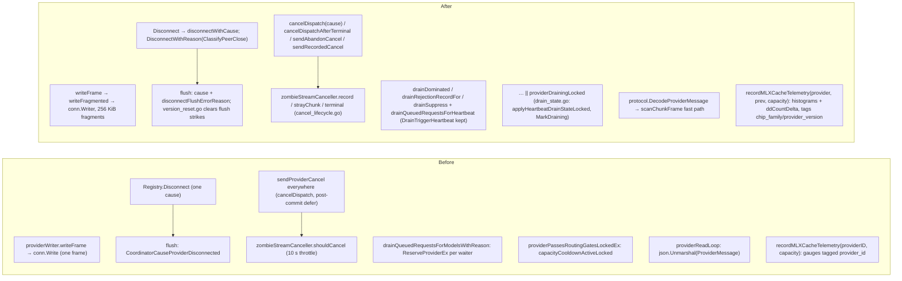

# PR body — coordinator performance program, PR C/D: 2026-09-02 wave fixes (2026-09-03)

> Last updated: 2026-09-04 · commit `637cf48ea`

Branch `perf/coordinator-wave-fixes-2026-09-03`.
**Base: `perf/coordinator-tier2-base-2026-09-03` (PR A + PR B); retarget to master after PR #820 and PR #819 merge; Retry-After policy left for the owner.**

Source: the two coordinator commits of the 2026-09-02 provider/system optimization pass —
`773bee1b3` (wave 1) and `58d7792da` (wave 2) on `worktree-bridge-cse_01SAkmgZHFsFMVXijYt6Czjp`
— ported hunk by hunk onto the Tier 2 base (never cherry-picked whole: the source commits carry
the Tier 5.1 calibration slices, a second Retry-After policy and duplicates of PR A/PR B).
Seven commits, one per item, each with its tests.

## Summary

| Commit | Item | Effect |
|---|---|---|
| `12cfe68b9` | Provider WS write fragmentation (> 256 KiB) | A 20 MiB vision frame no longer holds nhooyr's frame lock for 10–30 s; the provider's ping is answered between continuation frames instead of killing the whole provider session (and 502-ing every request on it). Read errors of that class are tagged `read_error_control_frame`. |
| `eef41426b` | Queue-drain cost bound | One fleet scan per distinct rejected request shape per pass (dominance skip) + 20 ms heartbeat suppression with one trailing pass. Measured on this base at 1,300 providers × 32 queued: heartbeat 44.7 ms → 12 µs amortised (≈1.3 ms per real pass), `SetProviderIdle` 35.7 ms → 1.39 ms. |
| `2dc6ddc91` | Drain-neutral faults + disconnect reasons | Graceful 1000/1001 closes flush pending requests with the health-neutral `provider_restart` cause; a reconnect on a changed binary version clears exactly the disconnect-flush (502) strikes (rate-limited 1/identity/10 min); heartbeat `status:"draining"` / typed `error_reason:"draining"` skip the provider in routing as transient capacity without derating it or charging the request's capacity retries. |
| `4f13be2ad` | Failure classification + cascade metrics | `inference.attempt_outcome{model,class}`, `inference.request_outcome_or_view{model,class}`, `inference.unknown_frames{kind,provider_version}`, `routing.route_latency_ms{model}`, `request_queue.depth_by_model` / `oldest_age_ms{model}`, `deadline_bucket` on `routing.client_gone`; a client leaving between ladder attempts is `client_gone`; a queue-wait first-content expiry is `queue_deadline`, not `first_chunk_timeout`. |
| `359921252` | Cancel hygiene | A cancel frame is sent only when the abandoning path removed a LIVE pending record with no completion ingressed (~140K phantom cancels/h at baseline); cancels are recorded by cause and correlated with the provider's terminal; zombies are re-cancelled on an escalating schedule (+1 s, +3 s, +10 s, then 30 s); control lane 64 → 256. |
| `dccc704f9` | Relay decode | Single-pass hand decoder for `inference_response_chunk` with generic fallback on any shape it is not certain about; `DecodeProviderMessage` skips encoding/json's redundant outer validation. Measured: decode 27.7 µs / 6 allocs → 3.2 µs / 2; read loop per frame 32.3 µs / 15 allocs → 6.3 µs / 5. |
| `74c8bc31d` | MLX cache telemetry re-key | Session-UUID-tagged gauges (~11K churning series) → `{chip_family, provider_version}` histograms and per-heartbeat counter deltas. |

## Before / After — behaviour

## Before / After — code

## Included / excluded

| Slice (source commit) | Decision | Reason |
|---|---|---|
| `registry/provider_writer.go` fragmentation + `provider_writer_fragment_test.go`; `api/provider.go` `readErrorDisconnectReason` (773bee1b3) | **Included** (`12cfe68b9`) | Root cause of self-inflicted provider disconnects. |
| `registry/queue_drain_dominance.go`, `queue_drain_suppress.go` (w2 state, trailing pass), drain hunks in `scheduler.go` / `registry.go`, `queue_drain_test.go`, `queue_drain_bench_test.go` | **Included** (`eef41426b`) | Runs on the provider read loop, outside #799's routing semaphore. Both the heartbeat path and the trailing pass call `drainQueuedRequestsForModelsWithReason(…, DrainTriggerHeartbeat)` so #809's drain-trigger vocabulary is kept. |
| `registry/queue_depth.go`, `queue.go` `DepthFor` / `MaxSizeFor` / `depthCeiling`, `queue_depth_test.go` | Excluded | Capacity-derived queue depth is half of the Retry-After policy (H6) — owner decision. |
| `protocol/messages.go` `HeartbeatStatusDraining` / `InferenceErrorReasonDraining`; `protocol/inference_failure.go` `CoordinatorCauseProviderRestart`, `InferenceErrorReasonProviderRestart`, `IsProviderDisconnect`; `registry/drain_state.go` (w2), `disconnect_reason.go`, `version_reset.go` (w2 rate limit, minus the pooled-budget memo refresh PR B has no equivalent of); `error_cooldown.go` / `health_ejection.go` / `provider_breaker.go` w1 flush-tag hunks; api `provider.go` (`peerCloseStatus`, `DisconnectWithReason`, `SetVersion`), `consumer.go` (`MarkDraining`), `dispatch.go` (draining does not charge a capacity retry; `IsProviderDisconnect`), `route_outcome.go`, `inference_error_sanitize.go`, `inference_failure_class.go`; tests incl. `drain_integration_test.go`, `restart_disconnect_integration_test.go` | **Included** (`2dc6ddc91`) | Behaviour-only edits to the fault trackers (Tier 3 is re-locking them). |
| `registry/warm_pool_controller.go` — w1 `LatestWarmPoolSnapshotFor`, w2 "exclude draining from warm count"; `warm_pool_draining_test.go` | Excluded | Consumers are the excluded Retry-After / queue-depth estimators; changing the warm-pool planner's count is a separate decision. |
| `api/attempt_outcome_metrics.go` (w2), `unknown_frame_metrics.go`, `fleet_gauges.go` (queue gauges only), `prompt_buckets.go`, `route_outcome.go` funnel, `rejection_telemetry.go` OR-view mirror, `server.go` gauge-loop wiring, `dispatch.go` (deadline bucket, OR view, `queue_deadline`, client-gone-between-attempts, `emitRouteLatency`, reclassified reason tag); `attempt_outcome_metrics_test.go`, `queue_deadline_test.go` (with the queued-fleet harness helpers moved in from the excluded `retry_after_test.go`) | **Included** (`4f13be2ad`) | Additive telemetry + two classification fixes. |
| `routing.provider_eligibility{model,state}` (`emitProviderEligibilityGauges`) | Excluded | Needs `registry/eligibility_snapshot.go` (Tier 5.1 slice). |
| `api/retry_after.go`, `retry_after_metrics.go` (`routing.retry_after_seconds`), `retry_after_test.go`, the `retryAfterSeconds` call sites, `estimateTTFTRetryAfter` request-id jitter, `consumer_ttft_test.go` edits | Excluded | Second Retry-After policy vs #799's `estimateRetryAfter` (H6). The base's `estimateRetryAfter` is untouched. |
| `api/routing_estimates.go`, `registry/completion_calibration.go`, `prompt_calibration.go`, `sample_window.go`, `eligibility_snapshot.go`, `api/settlement.go` `observeTokenCalibration`, `servability_gate.go`, `inference_admission.go`, `request_introspection.go`, `dispatch_plan_wiring.go` hunks, `ExpectedCompletionTokens` / `RawPromptTokens` plumbing, `thisReqDecodeTokens`, and their tests (`dispatch_spread_test.go`, `*_calibration_test.go`, `servability_gate_calibration_test.go`, `token_calibration_hook_test.go`, `routing_estimates_test.go`, `deadline_unreachable_integration_test.go` arg) | Excluded | Tier 5.1 — ships later behind shadow logging. |
| `api/cancel_lifecycle.go`, `zombie_stream.go` rewrite, `registry/pending_terminal.go`, `provider_writer.go` control lane 256 + exported errors, `consumer.go` / `dispatch.go` / `provider.go` cancel hunks; `cancel_lifecycle_test.go`, `cancellation_integration_test.go`, `zombie_stream_test.go`, `provider_writer_control_lane_test.go`, `first_token_clock_test.go` | **Included** (`359921252`) | Adapted around #809's terminal-claim logic (see deltas below). |
| `protocol/chunk_scan.go`, `DecodeProviderMessage` + fast path, `api/provider.go` decode switch; `chunk_scan_test.go`, `chunk_decode_bench_test.go`, `api/relay_bench_test.go` | **Included** (`dccc704f9`) | Decode-only; PR A's `chatStreamRelay` / `stream_coalesce` / `generic_endpoint_stream` untouched. |
| `api/provider_mlx_cache_telemetry.go` + test; `provider.go` heartbeat site | **Included** (`74c8bc31d`) | PR B's `provider_heartbeat_bench_test.go` helper adapted to the new signature. |
| `registry/scan_arena.go`, `model_index.go`, `tps_registry.go`, `solo_tps.go`, `pooled_budget_memo.go`, `ttft_shadow.go` scan hunks, `scan_bench_test.go`, `tps_registry_memo_test.go`, `pooled_budget_memo_test.go`, `scan_arena_test.go`, `model_index_test.go`; all `*KeyLocked` fault-map variants; `dispatchLoadCooldowns` struct-key change; w2 test edits to `alias_test.go`, `helpers_shared_test.go`, `provider_capabilities_test.go`, `scheduler_queue_drain_test.go`, `stable_fault_key_test.go` | Excluded | Duplicates of PR B (one implementation lands). |
| `api/telemetry_sink.go` four-lane rewrite, keyed `submitTelemetry`, `telemetry_sink_test.go` | Excluded | Duplicate of PR A's batched route sink. |
| `registry/budget_clamp.go`, `capacity_cooldown.go`, `capacity_rate.go`, `dispatch_plan.go`, `servability_gate.go`, `settlement.go`, `route_outcome.go` (beyond the drain/metric hunks above), `request_introspection.go`, `server.go` (beyond the gauge wiring) | Excluded | Not needed by any ported item. |
| `deploy/datadog/dev-network-dashboard.json`, `docs/architecture/operations/scheduling.md`, `docs/architecture/request-outcome-observability.md` | Excluded | The dashboard widgets reference unported series (eligibility, Retry-After); the excluded dashboard and broad observability doc changes reference unported series. The canonical protocol reference is updated with the shipped drain markers. |

## Semantics deltas against #809 / PR A (intentional, documented here)

1. `request_profiles.error_reason` and the `inference_routes` `error_class` for a request whose first-content clock expires while QUEUED are `queue_deadline`, not `first_chunk_timeout`. `TestQueuedAttemptExitsCarryRouteOutcome` (#809) is updated accordingly. Queue-wait exits dispatch no provider attempt, so they are excluded from `inference.attempt_outcome` and counted on `inference.queue_outcome{model,class}` (`queue_deadline`, `queue_timeout`, `ttft_too_slow`, `client_gone`, `model_capability_unsupported`) instead; the amplification denominator counts dispatched attempts only.
2. `StampCancelSent` is stamped only where a cancel frame is actually sent (`cancelDispatch` send branch, `cancelDispatchForFirstContentTimeout`, the post-commit defer's `sendRecordedCancel`, and the two write-error paths). `cancelDispatchAfterTerminal` never stamps — nothing was sent. The stamp set is otherwise #809's: the two `handleChunk` abort cancels (late content, chunk overflow) send via `sendAbandonCancel` and are not stamped, exactly as on the base.
3. A draining provider fails the routing gate on the capacity-cooldown branch, so #809's routing record tallies it under `GateCapacityCooldown`; no new `GateReason` is introduced.
4. `inference.unknown_frames{kind,provider_version}` (new) counts frames whose id matched no recorded cancel; #809's `inference.unknown_request_frames{kind}` and the in-process `unknownRequestFrames` counter keep counting EVERY frame without a live pending record. The denominators differ by design; the owner can retire one.

## Protocol symmetry

- `HeartbeatStatusDraining = "draining"` and `InferenceErrorReasonDraining = "draining"` are the Go side of wire strings the Swift provider emits from `bcafa19e0` on this branch (`ProviderStatus.draining` in `Protocol/Enums.swift`; `InferenceFailure(code: .capacity, statusCode: 503, errorReason: .draining)` in `Inference/InferenceFailure.swift`; a port of `eb2f84bb3` from the bridge-cse worktree branch, which is not an ancestor of this branch). Both markers ship in the same provider commit and no tagged release carries either — `v0.8.16` sends neither — so a provider that types the reason also reports the status. Additive; legacy providers send neither.
- `CoordinatorCauseProviderRestart` / `InferenceErrorReasonProviderRestart` are coordinator-internal and never on the wire (the ingress sanitizer's allowlists do not emit them).
- `DecodeProviderMessage` / `scanChunkFrame` change no wire type; `58d7792da` has no Swift side for it (its Swift companion `e5461b53d` is the think-probe fix). `TestScanChunkFrameSwiftShapeTakesFastPath` pins the Swift sorted-key wire order.
- `provider-swift/` changes on this branch are the drain-awareness emitter (`bcafa19e0`: `ProviderStatus.draining` in the heartbeat while refusing new work, `error_reason: draining` on the drain rejection) and the heartbeat encode-failure fallback keeping the computed status.

## Measurements (this base, M-series laptop with other load)

| Benchmark | Base | This branch |
|---|---|---|
| `BenchmarkDrain_Heartbeat_1300_SaturatedQueue_Depth32` | 44.7 ms / 1.49 MB / 178 allocs | 12 µs amortised, 1.19 KB, 11 allocs (≈1.3 ms per un-suppressed pass) |
| `BenchmarkDrain_SetProviderIdle_1300_SaturatedQueue_Depth32` | 35.7 ms / 1.49 MB / 165 allocs | 1.39 ms / 52 KB / 75 allocs |
| `BenchmarkChunkFrame_ProviderMessage_Unmarshal` → `_DecodeProviderMessage` | 27.7 µs / 6 allocs | 3.2 µs / 2 allocs |
| `BenchmarkRelay_ReadLoopPerFrame_GenericDecode` → `_ReadLoopPerFrame` | 32.3 µs / 15 allocs | 6.3 µs / 5 allocs |
| `BenchmarkHeartbeatBranchTelemetryOnly[Statsd]` | — | 0.97 µs / 8 allocs (1.9 µs / 11 with statsd) |

`FuzzChunkFrameDecode`: 530K execs in a 10 s smoke, no findings.

## Gates run

Per commit: `gofmt -l .`, `go build ./...`, `go vet ./...`, `golangci-lint v2.1.6 run ./...` (0 issues), then `go test ./registry/... ./protocol/ ./api/` in the foreground. Final tree: all three packages green. One full-`./api/` run mid-port surfaced `TestConstrainedExactNonnegativeIntBoundsAdversarialLiterals` ("parse took 291 ms — superlinear parse regression") in an untouched file; it passes 3/3 in isolation (CPU-load flake, not on the known-flake list).

## Follow-ups noted by the independent review (not in this PR)

- `api/consumer.go` / `api/dispatch.go` write-error paths still cancel through the raw `sendProviderCancel`: the cancel is neither recorded in the zombie tracker nor counted in `inference.cancel_sent{cause}`, so a later terminal for that id classifies as stray/unknown. The source commit left them raw too; routing them through `sendAbandonCancel` with a `write_error` cause is a small follow-up.
- `ClassifyPeerClose(peerCloseStatus, false)` hardcodes `oomSuspected=false` at its only call site (same as the source; outcome-neutral since OOM and read_error both take the abrupt cause).
- The candidate-scan drop path now takes `p.mu` once per dropped provider to read the draining mark (previously only when a capacity cooldown was active) — one uncontended lock per dropped candidate.
- `queue_deadline` is a new value in the rejection-ledger `reason_code`, `inference_routes.error_class` and `routing.first_chunk_timeout_reclassified{reason}` vocabularies; dashboards keyed on `first_chunk_timeout` shift accordingly.

### Addressed from the second review pass (in this PR)

- Queue drain: one pass runs per model at a time (`registry/queue_drain_coalesce.go`). A trigger that lands while a pass holds popped waiters — heartbeat, `SetProviderIdle`, challenge recovery, disconnect — no longer scans an empty queue; it makes the running pass go around once more with fresh fleet state and empty dominance records, attributed to that trigger. Closes the interleaving where a mid-pass capacity change left dominance-skipped waiters requeued on a stale verdict until the next trigger. Pinned by `TestDrainTriggerMidPassRerunsHeldWaiters` through a nil-in-production `drainBeforePop` seam.
- Drain mark ownership removed: a provider's idle/serving heartbeat clears a typed-rejection-set mark too. The typed reason and the heartbeat status ship in the same provider binary (released 0.8.16 sends neither), so no provider types the reason without reporting the status, while the rejection-first ordering is real (the drain announcement is a detached task, dropped while the session is not registered). An aborted update drain is back in routing on its next heartbeat instead of after the 150 s TTL, which stays as the heartbeat-loss fallback. `TestMarkDraining_ClearedByIdleHeartbeat_OrTTL`, `TestDrain_TypedRejectionClearedByIdleHeartbeat` (inverted from the previous round).
- Version-reset throttle follows an identity rebind: `migrateFaultStateLocked` now moves `identityVersionResetAt` with `identityVersions` (later timestamp wins), so a `sekey:` → `serial:` rebind cannot hand the identity a second flush-strike reset inside the 10-minute interval. `TestVersionResetThrottle_FollowsIdentityRebind`, `TestMigrateFaultState_ResetTimestampKeepsLater`.
- `provider_version` tag cardinality: `sanitizeVersionTag` validates strict semver and maps it to the fixed vocabulary `0.6.x`, `0.7.x`, `0.8.x`, `0.9.x`, `other_release`, `prerelease`, `unknown`, or `other`. Exact versions remain in provider metadata; arbitrary patch numbers and prerelease counters do not create new series. Covers `inference.unknown_frames` and the MLX cache histograms.
- Swift heartbeat encode-failure fallback carries the computed status (`draining`/`serving`/`idle`) instead of a literal `idle`; `UpdateDrainAwarenessTests` forces the path with a NaN capacity payload.
- `inference.attempt_outcome`: a typed `draining` refusal (chat `provider_error`, generic `provider_error_before_response`) is `class:capacity`, not `fault` — `isCapacityClassErrorReason` now lists `draining`, matching the health-neutral treatment the same terminal already gets everywhere else. Mapping cases added.
- Cancel lifecycle telemetry counts delivery, not intent: `sendRecordedCancel` and the stray-chunk re-send hand the frame to the provider writer first and mark/count `inference.cancel_sent` only when the enqueue succeeded; a refused enqueue (control lane full, writer stopped) keeps the entry unsent for the next stray-chunk retry, and the first cancel that reaches a writer counts once under the abandon cause. `inference.cancelled_terminal` gains a bounded `delivered:true|false` tag and `inference.cancel_to_terminal_ms` is sampled only for delivered cancels. `TestCancelSendCountsOnlyDeliveredFrames`; the socketless racer fixture now expects no `cancel_sent`.
- CI `Provider Tests` run 33904439872 (`MTPPostureTelemetryTests` ×2, `postureCount() → 1 >= 2`): not caused by the emitter port. The sampler is a self-contained `Task` loop on `EngineV2Bridge` over a plain `Task.sleep` wrapper and the test builds the bridge directly (no `ProviderLoop`, no `CoordinatorClient`); nothing on this branch touches `EngineV2Bridge*`, `TaskSleep.swift`, telemetry, or the test. The failing run shows a process-wide ~5.8 s startup stall (213 of 243 suites "passed after 5.5–6.6 s", including pure tests such as `storeRoundtripsSingleChunk()`), and the two posture tests are the only ones with a hard 5 s deadline. The passing master run f127f43a2 has the same stall (245/253 suites ≥5.5 s) with the posture tests passing at 5.58 s and 5.90 s — no margin. Locally: filter 6/6, full suite 3/3 green for these tests (one unrelated load-sensitive compile-duration guard flaked once). Left as is; the test deadline, not the emitter, is the follow-up.

## Notes for reviewers

- `store/interface.go` adds the transient, non-persisted `InferenceRouteOutcome.QueueExit` marker to keep queued exits out of dispatched-attempt metrics. No store schema or persistence behavior changes. Nothing under `chat_stream_relay.go`, `stream_coalesce.go`, `generic_endpoint_stream.go`, `telemetry_sink.go`, `model_index.go`, `tps_registry.go` or `solo_tps.go` changes.
- The fault-tracker files Tier 3 is restructuring (`capacity_cooldown.go` untouched; `error_cooldown.go` +5, `health_ejection.go` +27/−3, `provider_breaker.go` +11/−1) carry behaviour-only hunks: a flush flag on the health-window outcome and the flush-strike tag on the inference-error strike.
- Retry-After is deliberately untouched everywhere (#799's `estimateRetryAfter` / `estimateTTFTRetryAfter` stay).

## Final review corrections (2026-09-04)

- Late disconnect-flush suppression is checked inside each tracker mutation lock.
  The session-aware health-ejection entrypoint preserves source identity through
  the write, so a reconnect reset cannot race an API-side precheck and reopen
  quarantine. Regression coverage inserts the reset before or between all three
  tracker updates, alongside same-version and throttled-reset controls.
- Both MLX and client-gone chip tags use one fixed vocabulary. Version tags use
  fixed release-family buckets; patch and prerelease rotation cannot create series.
- Cancel latency begins at the first successful enqueue, never at a failed
  initial attempt. An expired unsent cancel is unresolved even when stray chunks
  arrived; only chunks at or after the first successful send contribute latency.
- Canonical protocol, scheduling, telemetry and outcome references now describe
  the wire markers, queue coalescing, reset ordering and metric semantics.
